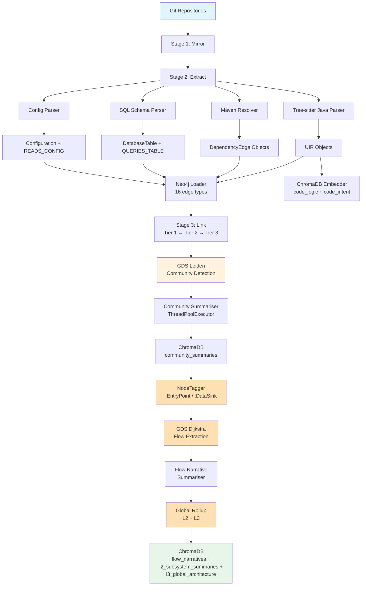
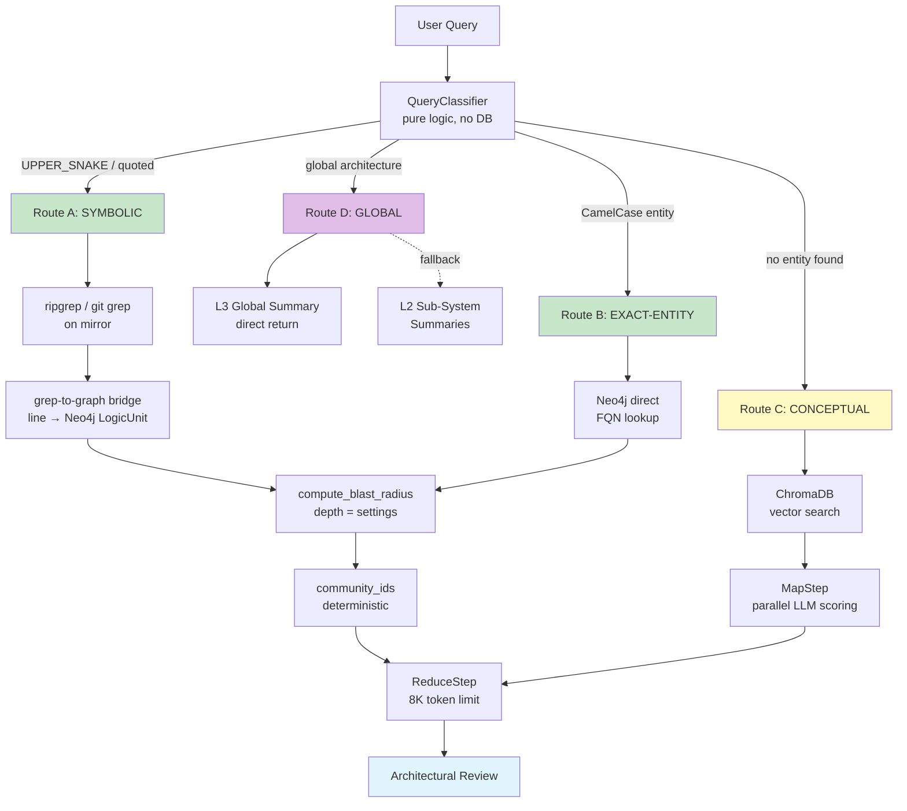
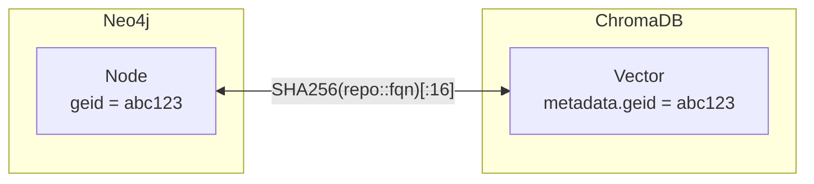

# CodeNexus — Architecture & Workflow Documentation

## Overview

CodeNexus is a **headless GraphRAG knowledge base engine** that compiles Java source code from 100+ Git repositories into a hybrid database — a structural property graph in Neo4j and semantic vector embeddings in ChromaDB. It is the foundational "World Model" for autonomous multi-agent CI/CD pipelines.

### Design Principles

| Principle | Implementation |
|---|---|
| **ZERO hallucinations** (symbolic/exact) | Three-tier deterministic router — Routes A & B never invoke semantic search |
| **Centralised config** | Every constant reads from `config/settings.py` → `.env` — no hardcoding |
| **Resilience** | `tenacity` retry decorators on all Neo4j, GDS, and LLM calls |
| **Scale** | ThreadPoolExecutor for summarisation, batch APOC for Neo4j, settings-driven concurrency |
| **Intent-adaptive token budget** | Reduce step detects 6 query intents and allocates output tokens + prompt template accordingly: 6 000 tokens for `narrative`/`general`, 1 800 for `safety`/`capability`/`impact`/`code` — out of a 32 K context ceiling |
| **Azure OpenAI** | `settings.make_llm_client()` factory switches between `openai.OpenAI` and `openai.AzureOpenAI` based on `LLM_PROVIDER`; all modules call the factory, never construct clients directly |
| **Zero-LLM Map step for questions** | `mode=question` converts ChromaDB cosine distance directly to a 0–100 score — no parallel LLM calls in the map step for user queries |

---

## System Architecture

```
Git Repositories (100+)
      │
      ▼
┌─────────────────────────────────────────────────────────────┐
│             STAGE 1 — Mirror                                │
│  RepositoryMirror (pipeline/mirror.py)                      │
│  git clone / git pull → ./mirror/                           │
└─────────────────────┬───────────────────────────────────────┘
                      │
                      ▼
┌─────────────────────────────────────────────────────────────┐
│             STAGE 2 — Extract                               │
│  JavaParser   → UIR objects (Component + LogicUnit)         │
│  MavenResolver→ DependencyEdge objects                      │
└──────────┬──────────────────────────┬───────────────────────┘
           │                          │
           ▼                          ▼
┌──────────────────┐       ┌─────────────────────────────────┐
│   Neo4j Loader   │       │      ChromaDB Embedder          │
│  (graph/loader)  │       │   (vectorstore/embedder.py)     │
│  Batch via APOC  │       │  code_logic + code_intent       │
│  14 edge types   │       │  settings.embedding_model       │
└──────────┬───────┘       └─────────────────────────────────┘
           │
           ▼
┌─────────────────────────────────────────────────────────────┐
│             STAGE 3 — Link (Cross-Repo, 3 Tiers)           │
│  Tier 1: CALLS, IMPLEMENTS, EXTENDS, DEPENDS_ON            │
│  Tier 2: INJECTS, ANNOTATED_WITH, RETURNS, RECEIVES,       │
│          REMOTE_CALLS (ApiBridgeDetector)                   │
│  Tier 3: THROWS, OVERRIDES, INSTANTIATES, HANDLES_EVENT    │
└─────────────────────┬───────────────────────────────────────┘
                      │
                      ▼
┌─────────────────────────────────────────────────────────────┐
│       POST — Leiden Community Detection (GDS)               │
│  Hierarchical Leiden → community_id on all nodes            │
│  Settings: leiden_gamma, leiden_theta, leiden_max_levels     │
└─────────────────────┬───────────────────────────────────────┘
                      │
                      ▼
┌─────────────────────────────────────────────────────────────┐
│       POST — Community Summarization (Concurrent)           │
│  ThreadPoolExecutor(settings.summarizer_max_workers)        │
│  Azure OpenAI GPT-5 per community → ChromaDB community_summaries │
└─────────────────────┬───────────────────────────────────────┘
                      │
                      ▼
┌─────────────────────────────────────────────────────────────┐
│       POST — EntryPoint / DataSink Tagging (Phase 2)        │
│  NodeTagger (graph/tagger.py)                               │
│  :EntryPoint — API endpoints, servlet handlers              │
│  :DataSink   — DAOs, repositories, SQL-executing classes    │
└─────────────────────┬───────────────────────────────────────┘
                      │
                      ▼
┌─────────────────────────────────────────────────────────────┐
│       POST — GDS Dijkstra Flow Extraction (Phase 2)         │
│  FlowExtractor (graph/flow_extractor.py)                    │
│  EntryPoint → DataSink shortest paths via GDS Dijkstra      │
│  O(E log V) per pair — no brute-force *1..6 expansion       │
└─────────────────────┬───────────────────────────────────────┘
                      │
                      ▼
┌─────────────────────────────────────────────────────────────┐
│       POST — Flow Narrative Generation (Phase 2)            │
│  FlowNarrativeSummarizer (reasoning/flow_summarizer.py)     │
│  Azure OpenAI GPT-5 per flow path → ChromaDB flow_narratives │
└─────────────────────┬───────────────────────────────────────┘
                      │
                      ▼
┌─────────────────────────────────────────────────────────────┐
│       POST — Global GraphRAG Rollup (Phase 2)               │
│  GlobalRollup (community/global_rollup.py)                  │
│  L1 → L2 (11 sub-system summaries) → L3 (master document)  │
│  Azure OpenAI GPT-5: l2_subsystem_summaries + l3_global_architecture │
└─────────────────────┬───────────────────────────────────────┘
                      │
                      ▼
┌─────────────────────────────────────────────────────────────┐
│       QUERY — Four-Tier Deterministic Router                │
│  A: SYMBOLIC  → grep → graph bridge → blast radius → reduce│
│  B: EXACT     → Neo4j lookup → blast radius → reduce       │
│  C: CONCEPTUAL→ ChromaDB → Map-Reduce → reduce             │
│  D: GLOBAL    → L3/L2 summaries → direct return            │
└─────────────────────────────────────────────────────────────┘
```

---

## Four-Tier Deterministic Router

The router (`reasoning/router.py`) classifies every query **before** any LLM
is invoked.  Routes A and B are 100 % deterministic — the LLM receives only
mathematically proven graph data.  Route D handles global architecture questions.

```
               ┌─────────────────────────────────────┐
               │        QueryClassifier               │
               │  (pure logic — no DB, unit-testable) │
               └──┬─────────┬──────────┬────────┬────┘
              global?    symbols?  CamelCase?  neither
                 │           │         │          │
              ROUTE D     ROUTE A   ROUTE B    ROUTE C
              GLOBAL      SYMBOLIC  EXACT      CONCEPTUAL
                 │           │         │          │
           ┌─────▼────┐ ┌───▼────┐ ┌──▼────┐ ┌──▼──────────┐
           │ L3/L2    │ │ripgrep/│ │ Neo4j │ │ ChromaDB    │
           │ summaries│ │git grep│ │ lookup│ │ vector      │
           │ direct   │ │on mirr.│ │by FQN │ │ search      │
           └─────┬────┘ └───┬────┘ └──┬────┘ └──┬──────────┘
                 │          │         │          │
                 │     grep-to-graph  │       MapStep
                 │     bridge (line → │       (parallel LLM
                 │      Neo4j node)   │        scoring)
                 │          │         │          │
                 │    ┌─────▼─────────▼────┐     │
                 │    │ compute_blast_radius│     │
                 │    │ depth=settings.     │     │
                 │    │ blast_radius_depth  │     │
                 │    └─────────┬───────────┘     │
                 │              │                  │
                 │    community_ids (proven)       │
                 │              │                  │
                 │    ┌────────▼──────────────────▼──┐
                 │    │        ReduceStep             │
                 │    │  8K token hard limit          │
                 │    │  Intent-aware prompt selection │
                 │    └──────────────────────────────┘
                 │
                 ▼
           Direct return
           (no ReduceStep needed)
```

### Route Details

| Route | Trigger | Evidence Source | Deterministic? |
|---|---|---|---|
| **A — Symbolic** | `UPPER_SNAKE_CASE`, quoted literals, `--symbols` | ripgrep/git grep → grep-to-graph bridge → blast radius traversal | YES |
| **B — Exact-Entity** | `CamelCase` class/method name | Neo4j direct lookup → blast radius traversal | YES |
| **C — Conceptual** | No entity detected | ChromaDB semantic search → Map-Reduce | No (probabilistic) |
| **D — Global** | "overarching", "global architecture", "full system", "end-to-end" | L3 Global Architecture Summary → L2 Sub-System fallback | YES (pre-computed) |

### Community Score Threshold — Semantic Route

ChromaDB cosine-distance scores for broad queries typically range 30–57 (not 0–100 like LLM scores). The pipeline passes **all** map results to the reduce step on the semantic route; `_build_summaries_text()` applies its own internal filter (`score >= 50`, fallback to top-10).

```
# main.py (semantic route)
reduce_inputs = map_results          # all results passed through
                                     # _build_summaries_text filters >= 50 internally

# Previously (BUG): applied LLM threshold (70) to ChromaDB scores that never exceed 57
# -> communities=0 -> "No relevant code communities" on every semantic query
```

### `_build_summaries_text` — Safety Floor

```python
# Always keeps at least 1 community summary even if it exceeds the token budget
while len(lines) > 1:        # was `while lines:` — could empty the list entirely
    if len(_ENCODER.encode("\n".join(lines))) <= budget:
        break
    lines.pop()
```

### LLM Search Term Extraction

`_llm_extract_search_terms()` in `main.py` uses GPT-5 to generate up to 8 grep-ready Java identifiers before the lexical search phase. GPT-5 is a reasoning model — internal thinking tokens are consumed before visible output appears, so the budget must be large enough:

```
max_completion_tokens = 3 000   (was 1 000 → GPT-5 exhausted budget on reasoning
                                 → returned empty JSON → regex fallback extracted
                                   wrong words like "start" instead of
                                   "AccessControl" / "EntitlementEngine")
```
> **Note**: Route C splits into two modes at the Map Step based on query intent (see Map Step section below).

---

## Query Intent Classification

Every query is classified by `detect_query_intent()` in `reasoning/reduce_step.py` **before** the reduce LLM call. The intent drives three things:
1. Which **system prompt** the LLM receives
2. Which **prompt template** structures the evidence injected
3. How many **output tokens** are reserved for the response

### The Six Intents

| Intent | Trigger (regex / keywords) | System Prompt | Output Tokens |
|---|---|---|---|
| `narrative` | `full story`, `end-to-end`, `walk me through`, `how does X get evaluated`, `how does X handle`, `step by step`, `explain the flow`, `how this implements` | `SYSTEM_NARRATIVE` — 7-section story guide | **6 000** |
| `general` | *(fallback — no other pattern matched)* | `SYSTEM_GENERAL` — cite-only, no speculation | **6 000** |
| `code` | `show me`, `give me`, `how is X implemented`, `source of`, `read the` | `SYSTEM_IMPACT` | 1 800 |
| `safety` | `can I remove`, `is it safe`, `dead code`, `unused`, `safe to delete` | `SYSTEM_SAFETY` | 1 800 |
| `capability` | `does this support`, `is X enforced`, `can X bypass`, `is X required` | `SYSTEM_CAPABILITY` | 1 800 |
| `impact` | `blast radius`, `what breaks`, `what calls`, `impact`, `dependency` | `SYSTEM_IMPACT` | 1 800 |

> **Priority order** (first match wins): `code` → `safety` → `capability` → `impact` → `narrative` → `general`

### Narrative Intent — 7-Section Story Structure

When `intent = narrative`, `SYSTEM_NARRATIVE` requires the LLM to produce exactly these sections grounded in actual class/method names:

1. **Entry Point** — class/method that receives the initial request
2. **Parsing & Validation** — how input is parsed, validated, resolved
3. **Core Logic** — key methods in call order with responsibilities
4. **Data Flow** — how data transforms across layers (DTOs, tokens, maps)
5. **Integration Points** — external systems, databases, services called
6. **Output / Result** — what is produced and how the response is built
7. **Key Design Decisions** — patterns, extension points, notable architectural choices

### Token Budget Per Intent

```
max_context_tokens  = 32 000    (settings.max_context_tokens)
SYSTEM_TOKENS       =    200

not-narrative intents (safety / capability / impact / code):
  OUTPUT_RESERVE    =  1 800
  DATA_BUDGET       = 30 000    (32 000 - 200 - 1 800)
  SNIPPET_BUDGET    = 15 000    (50% of data)
  SUMMARY_BUDGET    = 12 000    (40% of data)

narrative / general:
  NARRATIVE_RESERVE =  6 000
  NARRATIVE_DATA    = 25 800    (32 000 - 200 - 6 000)
  NARRATIVE_SNIPPET = 10 320    (40% of narrative data)
  NARRATIVE_SUMMARY = 12 900    (50% of narrative data)
```

---

## Map Step — Dual-Mode Scoring

`MapStep.run(input_text, mode)` operates in two distinct modes depending on whether the query is a user question or a PR blast-radius analysis.

### Mode: `question` (zero LLM calls — used for all Route C semantic queries)

```
ChromaDB community_summaries.query(
    query_texts=[question],
    n_results=n_candidates,           ← default 20
    include=["documents", "metadatas", "distances"],
)
    │
    ▼
Convert ChromaDB cosine distance directly to score (no LLM):
    score = max(0, round((1.0 - distance / 2.0) * 100))
    (ChromaDB cosine distance: 0 = identical, 2 = opposite)
    │
    ▼
Return MapResult list (score ≤ 57 typical for broad queries)
```

This eliminates the 200 parallel GPT-5 calls that the PR-mode formula (`total // 4`) would generate.  For 2 065 communities that was 516 → capped at 200 LLM calls per query.

### Mode: `pr` (LLM scoring — used for blast-radius impact analysis)

```
ChromaDB community_summaries.query(
    query_texts=[pr_description],
    n_results=min(max(n_candidates, total // 4), 50),  ← capped at 50 (was 200)
)
    │
    ▼
ThreadPoolExecutor → _score_community() per candidate
    │  One LLM call per community, JSON: {"score": 0-100, "reason": "..."}
    ▼
Filter score > 0, sort descending → MapResult list
```

### Key invariant

> Community score from question-mode **never reaches 70** (ChromaDB cosine distances top out at ~57 for typical code queries). The `reduce_inputs` filter in `main.py` therefore passes **all** map results to the Reduce step — not just those above the 70 threshold.

---

## Reduce Step — Intent-Aware Prompt Selection

`ReduceStep.run(map_results, query, primary_targets, code_snippets)` detects the query intent **before** choosing a prompt template and output token budget.  The intent is detected by regex — no LLM call.

### Query Intents

| Intent | Detection regex / keyword | Prompt template | Output tokens |
|---|---|---|---|
| `narrative` | `"story"`, `"how does X get evaluated"`, `"walk me through"`, `"start to end"`, `"how does X work"`, `"explain how"`, `"step by step"` | `TEMPLATE_NARRATIVE` — 7-section story structure | **6 000** |
| `general` | (default fallback) | `TEMPLATE_GENERAL` — cite class/method names | **6 000** |
| `code` | `"show me"`, `"give me"`, `"implementation of"`, `"source code of"` | `TEMPLATE_CODE` | 1 800 |
| `safety` | `"can I remove"`, `"is it safe"`, `"unused"`, `"dead code"` | `TEMPLATE_SAFETY` — YES/NO verdict | 1 800 |
| `capability` | `"does this support"`, `"is it enforced"`, `"can X bypass"` | `TEMPLATE_CAPABILITY` — 4-step reasoning | 1 800 |
| `impact` | `"blast radius"`, `"what breaks"`, `"callers"`, `"what changes"` | `TEMPLATE_IMPACT` | 1 800 |

### `TEMPLATE_NARRATIVE` — 7-section story structure

When intent is `narrative`, the system prompt (`SYSTEM_NARRATIVE`) instructs the model to produce a complete start-to-end story with mandatory sections:

1. **Entry Point** — where the request arrives, what data enters
2. **Parsing & Validation** — how input is parsed and validated
3. **Core Logic** — key methods in call order
4. **Data Flow** — how data transforms across layers
5. **Integration Points** — external systems and databases called
6. **Output / Result** — how the response is built
7. **Key Design Decisions** — architectural patterns, extension points

Every section must cite exact class names, method names, and short code quotes from the evidence.

### Token Budget Architecture

```
MAX_TOKENS = 32 000          (settings.max_context_tokens)
├── SYSTEM_TOKENS  =    200
├── OUTPUT_RESERVE = 1 800   (safety / capability / impact / code)
│   or
│   NARRATIVE_RESERVE = 6 000 (narrative / general)
│
├── DATA_BUDGET = MAX - SYSTEM - OUTPUT_RESERVE
│     ├── SNIPPET_BUDGET  = 50% of DATA_BUDGET
│     ├── SUMMARY_BUDGET  = 40% of DATA_BUDGET   ← never shrinks below 1 community
│     └── EVIDENCE_BUDGET = remainder
│
└── For narrative: NARRATIVE_SNIPPET_BUDGET / NARRATIVE_SUMMARY_BUDGET enlarged
```

### `_build_summaries_text` safety invariant

The token-trimming loop **always keeps at least one community summary** regardless of individual summary size:

```python
while len(lines) > 1:    # ← never pops to empty
    if len(tokens(joined)) <= budget:
        break
    lines.pop()
```

Before this fix, a single community summary larger than `SUMMARY_BUDGET` caused the loop to empty the list, triggering `NO_COMMUNITIES_MESSAGE` on every semantic query.

---

## REST Endpoint Detection — JAX-RS Support

`linker/api_bridge.py` now detects both Spring MVC and JAX-RS REST endpoints, which matters for WSO2 repositories that use JAX-RS (`@Path`, `@GET`, `@POST`) rather than Spring (`@GetMapping`, `@PostMapping`).

### Supported annotation patterns

| Framework | Annotations detected |
|---|---|
| **Spring MVC** | `@GetMapping`, `@PostMapping`, `@PutMapping`, `@DeleteMapping`, `@PatchMapping`, `@RequestMapping(value, method)` |
| **JAX-RS** | `@Path("/route")` paired with `@GET` / `@POST` / `@PUT` / `@DELETE` / `@PATCH` / `@HEAD` / `@OPTIONS` within ±3 lines |

### HTTP client call patterns (for `REMOTE_CALLS` edge detection)

| Client type | Pattern matched |
|---|---|
| Spring RestTemplate | `restTemplate.getForObject`, `.postForObject`, `.exchange` |
| Spring WebClient | `webClient.get().uri("...")` |
| Apache HttpClient | `new HttpGet("url")`, `new HttpPost("url")` |
| JAX-RS client | `.target("url")`, `.setURI(URI.create("url"))` |
| Feign | `@FeignClient` interface method with `@RequestMapping` |

---

## GDS Projection Fix — CALLS Edge Visibility

`graph/gds_client.py` determines which relationship types to include in the GDS in-memory graph by querying which types currently exist in Neo4j.  The previous implementation used:

```cypher
CALL db.relationshipTypes()           -- ❌ stale schema cache
```

This returned a **schema-level cache** that lagged behind newly written edges (e.g. `CALLS` edges written in the same pipeline run).  The fix queries the actual data:

```cypher
MATCH ()-[r]->() RETURN DISTINCT type(r) AS relationshipType  -- ✅ live scan
```

This ensures `CALLS`, `INJECTS`, and other freshly-written edge types are always included in the GDS Leiden projection.

---


```python
{
    "seed_fqns":      [...],   # starting points
    "affected_nodes": [...],   # all reachable nodes within depth
    "community_ids":  [...],   # Leiden communities touched
    "edge_counts":    {...},   # per-type edge breakdown
}
```

---

## Data Ingestion — How Neo4j and ChromaDB Are Populated

### Short answer

**Neo4j and the two code ChromaDB collections (`code_logic`, `code_intent`) are
populated with NO LLM involvement.** Data flows directly from Java source files
via a deterministic Tree-sitter parser.  
The LLM (`gpt-4o-mini`) is called **only once, in the final post-processing
step**, to generate natural-language summaries of Leiden communities, which are
stored in the third ChromaDB collection (`community_summaries`).

---

### Stage 2 — Extract: Tree-sitter → UIR → Neo4j + ChromaDB

```
Java source file  (.java)
        │
        ▼
  JavaParser  (parsers/java_parser.py)
  Tree-sitter grammar — deterministic AST walk
        │
        ├─ builds ──► Project
        │                └─ Module  (pom.xml artifact coordinates)
        │                     └─ Component  (class / interface / enum)
        │                           └─ LogicUnit  (method / constructor)
        │
        │  UIR objects carry:
        │    fqn, geid (SHA256 hash), name, kind,
        │    file_path, start_line, end_line,
        │    docstring (raw Javadoc text), body (raw source text)
        │
        ├─ loads ──► Neo4jLoader  (graph/loader.py)
        │              MERGE node with all properties
        │              No LLM.  No embeddings.  Pure Cypher.
        │
        └─ chunks ─► UIRChunker  (vectorstore/chunker.py)
                       Produces 2 chunks per LogicUnit:
                       ┌───────────────────────────────────────────┐
                       │ code_logic   text = raw method body       │
                       │ code_intent  text = formatted Javadoc     │
                       └───────────────────────────────────────────┘
                              │
                              ▼
                       ChromaEmbedder  (vectorstore/embedder.py)
                         SentenceTransformer("all-MiniLM-L6-v2")
                         384-dim vectors, runs locally — no API call
                         ChromaDB.upsert(ids, documents, embeddings, metadatas)
```

#### What goes into Neo4j (no LLM)

Every property is extracted directly from the parsed AST or `pom.xml`:

| Property | Source |
|---|---|
| `geid` | `SHA256(repo_name + "::" + fqn)[:16]` computed in `parsers/geid.py` |
| `fqn` | Fully-qualified Java name built by `parsers/fqn_builder.py` |
| `name` | Simple identifier from AST node |
| `kind` | `class` / `interface` / `enum` / `method` / `constructor` |
| `file_path` | Absolute path under `./mirror/` |
| `start_line`, `end_line` | AST node position |
| `community_id` | Set later by GDS Leiden — **not by LLM** |

All writes use **idempotent `MERGE`** (safe to re-run).  Every `session.run()`
calls `.consume()` to prevent Neo4j lazy-execution silent drops.

#### What goes into ChromaDB `code_logic` and `code_intent` (no LLM)

| Collection | Text embedded | Purpose |
|---|---|---|
| `code_logic` | Raw method body (Java source) | "What does this code do?" — structural search |
| `code_intent` | Parsed Javadoc (`@param`, `@return`, description lines) | "What was this method intended to do?" — semantic intent search |

Embeddings are computed by **HuggingFace `SentenceTransformer`** running
**locally** inside the container (`all-MiniLM-L6-v2`, 384 dimensions).
No OpenAI API call is made.

Metadata stored alongside each vector:
```python
{
    "geid":       "...",      # links back to Neo4j node
    "fqn":        "...",
    "file_path":  "...",
    "start_line": 42,
    "end_line":   87,
    "repo_name":  "...",
    "chunk_type": "code_logic" | "code_intent",
}
```

---

### Stage 3 — Link: Edges in Neo4j (no LLM)

After all nodes exist, `LinkerGraph` creates 14 relationship types by pattern-
matching against FQNs, annotations, and Maven coordinates already in Neo4j.
Pure Cypher `MATCH / MERGE` — no embedding, no LLM.

---

### Post-processing 1 — Leiden Community Detection (no LLM)

`GDSClient.run_leiden()` projects a **strictly whitelisted** subgraph into
GDS memory and runs the Leiden algorithm on it.

**Whitelisted relationship types** (configurable via `GDS_LEIDEN_RELATIONSHIPS`):

| Projected (architectural) | Excluded (utility fan-out) |
|---|---|
| `CALLS`, `INJECTS`, `IMPLEMENTS`, `EXTENDS` | `THROWS`, `RETURNS`, `RECEIVES` |
| `DEPENDS_ON`, `DECLARES`, `HAS_METHOD` | `INSTANTIATES`, `HANDLES_EVENT` |
| `REMOTE_CALLS`, `OVERRIDES` | `ANNOTATED_WITH` |

Only the **architectural** edges are projected — utility edges like THROWS and
RETURNS create "god nodes" (e.g. `java.lang.Exception`, `java.lang.String`)
that pull unrelated code into a single mega-community.

Node labels projected: `Component`, `LogicUnit`, `Module`.

```cypher
CALL gds.leiden.write('nexus-graph', {
    writeProperty: 'community_id',
    gamma: <settings.leiden_gamma>,       -- default 1.5 (higher = more granular)
    theta: <settings.leiden_theta>,
    maxLevels: <settings.leiden_max_levels>
})
```

This sets `community_id` on every node in Neo4j.  Purely mathematical graph
partitioning — no LLM.

---

### Post-processing 2 — Community Summarization (**only LLM step**)

```
Neo4j: list all community_ids
    │
    ▼
For each community_id  (ThreadPoolExecutor — parallel)
    │
    ├─ GDSClient.get_nodes_by_community(cid)
    │    Fetch all Component AND LogicUnit nodes in this community
    │    (classes/interfaces + methods — full architectural picture)
    │
    ├─ GDSClient.get_community_boundary_edges(cid)
    │    Show how this community connects to other communities
    │    (inter-cluster edge types and counts)
    │
    ├─ build_community_prompt(cid, nodes, boundary_edges)
    │    Assembles a token-budget-capped prompt with:
    │    - Class-level entities listed first (architectural anchors)
    │    - Method-level entities second (implementation detail)
    │    - Inter-community connection summary
    │
    ├─ OpenAI(gpt-4o-mini).chat.completions.create(...)   ◄── ONLY LLM CALL
    │    temperature=0.2
    │    max_tokens=settings.community_summary_max_tokens
    │    Returns: natural-language architectural paragraph
    │
    └─ ChromaDB "community_summaries".upsert(
           id      = "community_{cid}",
           document= summary_text,         ← embedded by ChromaDB automatically
           metadata= {community_id, node_count, top_fqns, ...}
       )
```

The `community_summaries` collection is the **only** ChromaDB collection whose
content was generated by an LLM.  It is used at query time as the
Leiden-proven architectural context layer passed to `ReduceStep`.

---

### Ingestion Data Flow Summary

```
Java files  ──(Tree-sitter)──►  UIR objects
                                    │
                   ┌────────────────┼───────────────────┐
                   │                │                   │
                   ▼                ▼                   ▼
              Neo4j MERGE      code_logic          code_intent
              (graph nodes    (body text,          (Javadoc text,
               + edges)        HF embedding,        HF embedding,
               NO LLM)         NO LLM)              NO LLM)
                   │
                   ▼
              Leiden GDS  ──► community_id on all nodes  (NO LLM)
                   │
                   ▼
              GPT-4o-mini  ──► community_summaries  (← LLM STEP 1)
                   │
                   ▼
              NodeTagger   ──► :EntryPoint / :DataSink labels  (NO LLM)
                   │
                   ▼
              GDS Dijkstra ──► EntryPoint→DataSink execution paths  (NO LLM)
                   │
                   ▼
              GPT-4o-mini  ──► flow_narratives  (← LLM STEP 2)
                   │
                   ▼
              GPT-4o-mini  ──► l2_subsystem_summaries + l3_global_architecture
                                                       (← LLM STEP 3)
```

| Collection / Store | Populated by | LLM used? |
|---|---|---|
| Neo4j nodes | Tree-sitter AST parser | **No** |
| Neo4j edges (16 types) | FQN pattern matching | **No** |
| Neo4j `community_id` | GDS Leiden algorithm | **No** |
| Neo4j `:EntryPoint` / `:DataSink` labels | NodeTagger pattern detection | **No** |
| Neo4j `DatabaseTable` / `Configuration` nodes | SQL DDL + config parsers | **No** |
| ChromaDB `code_logic` | Method body + HF SentenceTransformer | **No** |
| ChromaDB `code_intent` | Javadoc + HF SentenceTransformer | **No** |
| ChromaDB `community_summaries` | GPT-4o-mini summary of each community | **Yes** |
| ChromaDB `flow_narratives` | GPT-4o-mini per GDS Dijkstra execution path | **Yes** |
| ChromaDB `l2_subsystem_summaries` | GPT-4o-mini rollup of L1 communities by domain | **Yes** |
| ChromaDB `l3_global_architecture` | GPT-4o-mini master Global Architecture Document | **Yes** |

---

## Full Query Flow — Evidence Gathering Pipeline

Every call to `query()` in `main.py` passes through a strict, ordered sequence
of evidence-gathering phases before any LLM is invoked.  The key principle is:

> **Grep finds the file.  Neo4j expands the graph.  The LLM only synthesises.**

The LLM never searches — it only receives pre-assembled evidence packages.

---

### Step 1 — Route Classification

`QueryRouter.route(question)` classifies the query into one of six outcomes
**before touching any database**:

| Route value | Meaning | Examples |
|---|---|---|
| `global` | High-level architecture question detected (confidence 0.95) | `"overarching architecture"`, `"full system overview"` |
| `symbolic` | `UPPER_SNAKE_CASE` constant or quoted literal detected | `"TOKEN_TYPE"`, `"act"` |
| `exact` | `CamelCase` class/method **or** deep dotted FQN detected (confidence ≥ 0.70) | `TokenExchangeProcessor`, `org.wso2.carbon.identity.api.server.pdp` |
| `symbolic_no_bridge` | Grep hit found, but no matching Neo4j node for that line | Rarely used internal state |
| `symbolic_fallback` | Grep returned zero hits; falls to semantic search | Misspelled symbol |
| `semantic` | No entity detected, or entity confidence < 0.70 | `"how does X work?"` |

> **Exact-route confidence formula:**
> ```
> confidence = min(1.0,  0.5
>                      + 0.1 × count(entities)
>                      + 0.04 × max_dot_depth)
> ```
> A bare CamelCase token (0 dots) scores 0.60 (→ semantic fallback).
> A fully-qualified package like `org.wso2.carbon.identity.api.server.pdp`
> (6 dots) scores 0.84 (→ deterministic exact route).
> The cutover is at ~3 dots (score 0.72 ≥ threshold 0.70).

---

### Step 2 — Always-On Semantic Code Search (parallel)

Regardless of the route, `_semantic_code_search()` fires immediately against
`ChromaDB.code_intent`.  This collection holds one document per Java method
(FQN + docstring embedding).  Results are used later as a secondary evidence
layer — they do **not** drive routing.

---

### Step 3 — Route-Specific Retrieval

#### Route A — SYMBOLIC (100 % deterministic)

```
LexicalSearcher.search(symbol, max_hits=N)
    │  ripgrep / git grep over ./mirror/**/*.java
    │  Returns: GrepHit(rel_path, line_number, line_text, symbol)
    ▼
grep-to-graph bridge
    │  Queries Neo4j: "find the LogicUnit whose file_path + line range
    │  contains this hit"
    │  Returns: Neo4j node {fqn, community_ids, ...}
    ▼
GraphRetriever.compute_blast_radius(seed_fqns, depth)
    │  Multi-hop Cypher over CALLS, INJECTS, DEPENDS_ON, INSTANTIATES
    │  Returns: affected_nodes[], community_ids[] (mathematically proven)
    ▼
Fetch community summaries directly by ID (no LLM scoring needed)
```

#### Route B — EXACT-ENTITY (100 % deterministic)

```
GraphRetriever._find_in_graph(entity_name)
    │  Cypher: MATCH (n) WHERE n.fqn CONTAINS $name OR n.name = $name
    │  Returns: seed Neo4j nodes
    ▼
GraphRetriever.compute_blast_radius(seed_fqns, depth)
    │  Same multi-hop expansion as Route A
    ▼
Fetch community summaries directly by ID
```

#### Route C — SEMANTIC / CAPABILITY

This is the most complex route.  Evidence is gathered in five ordered phases:

---

### Step 4 — Evidence Phases (Route C: semantic / capability / general)

#### Phase A — Keyword Grep (primary source for capability queries)

Extracts candidate search terms from the raw question text:

| Term type | Example from `"act claim nested"` |
|---|---|
| **Quoted literals** (3-4 char words) | `'"act"'`, `'"sub"'` |
| **Router entity names** (CamelCase from classifier) | `TokenExchangeProcessor` |
| **Plain keywords** (stopwords removed) | `act`, `nested`, `claim` |
| **camelCase bigrams** (consecutive word pairs) | `actClaim`, `claimNested` |

For each term, `LexicalSearcher.search(term)` runs across `./mirror/`.
Results are filtered to **production code only** (`src/main/java`, no `Test`
in path).  `CodeFetcher.fetch_grep_context(rel_path, line_number, context_lines)`
then reads the actual file at that line and returns a surrounding code window:

- **Quoted literal terms** (e.g. `'"act"'`) → 40-line window (captures full
  claim-provider class body, typically 50–100 lines)
- **All other terms** → 15-line window

Up to **6 snippets** are collected before stopping.

**Why grep before semantic search?**
Semantic search finds "methods about claims generally" while grep finds the
*exact* file where the string literal `"act"` is declared.  For capability
queries the grep hit is always more precise.

---

#### Phase A-chain — Generic Constant-Following

After Phase A, all collected code snippets are scanned for `UPPER_SNAKE_CASE`
tokens (regex: `\b[A-Z][A-Z0-9_]{4,}\b`).  Common Java noise constants are
filtered out (`AUTHORIZATION`, `STATIC`, `NULL`, etc.).  The top 3 most specific
constants (ranked by name length) are then grepped across the mirror.

This automatically follows the data:

```
Phase A finds:  ImpersonatedAccessTokenClaimProvider
                  → references constant  IMPERSONATING_ACTOR
Phase A-chain:  grep IMPERSONATING_ACTOR
                  → finds every setter, consumer, and serialiser of that value
```

No domain knowledge is hardcoded — the chain is driven entirely by what
constants appear in the Phase A evidence.

---

#### Phase A-graph — Neo4j Call-Graph Expansion

For each code snippet collected in Phases A and A-chain:

1. **Extract Java class name** from the file path (e.g.
   `ImpersonatedAccessTokenClaimProvider.java` → `ImpersonatedAccessTokenClaimProvider`).
2. **Look up in Neo4j** via `GraphRetriever._find_in_graph(class_name)` → seed FQNs.
3. **Expand via** `GraphRetriever.expand_capability_evidence(seed_fqns, domain_terms)`:
   - **Callees** (up to 6): methods this implementation calls — reveals *what it reads*.
   - **Callers** (up to 5): methods that invoke this implementation — reveals *activation context*.
   - **`code_logic` domain hits** (up to 4): ChromaDB semantic search restricted to
     the `code_logic` collection with the plain keywords — finds structurally
     related methods not directly connected by call edges.
4. **Fetch source bodies** for callees and `code_logic` hits via `CodeFetcher.fetch_method()`.
5. **Callers** are added to `primary_targets` (visible in "FILES TO CHANGE" section)
   but their bodies are not fetched (activation context, not implementation detail).

This phase ensures the LLM sees the **full call tree** of the implementation,
making structural properties (nesting depth, recursion, data propagation) directly
observable in the evidence rather than inferred from type signatures.

---

#### Phase B-1 — Semantic Hit Enrichment (Neo4j line-number resolution)

The semantic code search from Step 2 returns FQNs but no file coordinates.
A batch Neo4j query resolves them:

```
GraphRetriever.find_nodes_by_fqns(fqns[:15])
    │  Cypher: MATCH (n) WHERE n.fqn IN $fqns RETURN n
    │  Returns: {fqn, file_path, start_line, end_line}
    ▼
CodeFetcher.fetch_method(node)
    │  Reads ./mirror/<file_path> lines [start_line, end_line]
    │  Returns: CodeSnippet with exact method body
```

Up to **5 semantic snippets** are added this way, capped at **12 total** across
all phases.

---

#### Phase B-2 — Semantic Hit Fallback Grep

For semantic hits where Neo4j returned no matching node (FQN signature mismatch,
e.g. generic type erasure differences), the system falls back to grep:

1. Extract simple method name from FQN:
   `org.wso2.carbon.identity.oauth.TokenProcessor.validateAudience(List<String>,String)`
   → `validateAudience`
2. `LexicalSearcher.search("validateAudience", max_hits=5)` across the mirror.
3. Filter to `src/main/java`, no `Test`.  Fetch a **25-line context window**.

This ensures no semantic hit is silently dropped due to Neo4j index mismatches.

---

### Step 5 — Intent Detection and Evidence Assembly

`detect_query_intent(question)` classifies the question into one of:

| Intent | Examples | Prompt strategy |
|---|---|---|
| `capability` | `"does X support Y?"`, `"is X possible?"` | SYSTEM_CAPABILITY with anti-hallucination rules |
| `code` | `"show me the code for X"` | CODE intent prompt, seed node bodies fetched first |
| `pr_review` | PR diff context | PR-centric map/reduce prompts |
| `general` | Everything else | Default SYSTEM prompt |

All collected evidence is merged into `primary_targets`:
```
grep_evidence      (Phase A — exact literal hits, line-precise)
semantic_hits      (Step 2 — ChromaDB FQN hits)
seed_nodes         (Route A/B — Neo4j anchor nodes)
affected_nodes     (Route A/B — blast radius results)
```

---

### Step 6 — ReduceStep (LLM Synthesis)

`ReduceStep.run(question, summaries, targets, code_snippets, intent)` assembles
the final prompt under a **hard 8K-token ceiling**:

```
[SYSTEM: intent-aware persona + anti-hallucination rules]
[Community summaries (Leiden-proven architectural context)]
[Code snippets (ordered: grep hits → graph hits → semantic hits)]
[User question]
```

The LLM synthesises — it does not search.  All evidence was pre-assembled
deterministically.

---

### End-to-End Flow Summary

```
User Question
    │
    ▼
Step 1: QueryRouter.route()
    ├─ Route A/B → Skip to Step 4b (deterministic blast radius)
    └─ Route C  ──────────────────────────────────────────────────┐
                                                                  │
Step 2: ChromaDB semantic search (always-on, all routes)         │
                                                                  │
Step 3 (Route C evidence phases):                                │
    │                                                             │
    ├─ Phase A:         grep(question terms)                      │
    │                   → read file at hit line                   │
    │                                                             │
    ├─ Phase A-chain:   scan snippets for UPPER_SNAKE constants   │
    │                   → grep(constant) → read more files        │
    │                                                             │
    ├─ Phase A-graph:   extract class names from hit paths        │
    │                   → Neo4j lookup → callees/callers          │
    │                   → fetch method bodies                     │
    │                                                             │
    ├─ Phase B-1:       semantic FQNs → Neo4j line resolution     │
    │                   → read file by line range                 │
    │                                                             │
    └─ Phase B-2:       for unresolved FQNs → grep(method name)  │
                        → read 25-line context window             │
                                                                  │
Step 5: Merge all evidence into primary_targets + code_snippets  │
    │◄────────────────────────────────────────────────────────────┘
    │
Step 6: ReduceStep LLM call (8K token hard limit)
    │
    ▼
Answer (no hallucination — LLM synthesises only what evidence contains)
```

---

## Complete Graph Schema

### Node Types
| Label | Description |
|---|---|
| `Project` | A Git repository |
| `Module` | A Maven artifact (`pom.xml`) |
| `Component` | A Java class, interface, enum, or annotation type |
| `LogicUnit` | A method or constructor (atomic semantic unit) |
| `AnnotationType` | A Java annotation (e.g. `@Service`, `@Path`) |
| `ExceptionType` | An exception class in a `throws` clause |
| `EventClass` | A WSO2/Spring event handler base class |
| `DatabaseTable` | A SQL table extracted from `dbscripts/` DDL files (Phase 2) |
| `Configuration` | A configuration key from `deployment.toml` / `*.xml` / `*.yml` (Phase 2) |

### Secondary Labels (Phase 2)
| Label | Applied To | Detection Criteria |
|---|---|---|
| `:EntryPoint` | `Component` / `LogicUnit` | `@RequestMapping`, `@Path`, `HttpServlet`, Servlet/Controller/Endpoint/Resource FQN patterns |
| `:DataSink` | `Component` / `LogicUnit` | `@Repository`, DAO/Repository class patterns, `QUERIES_TABLE` edges, SQL execution method indicators |

### Relationship Types (16 total)

#### Structural / OOP
| Edge | From → To | Description |
|---|---|---|
| `CONTAINS` | Project → Module | Repository contains Maven module |
| `DECLARES` | Module → Component | Module declares a Java class |
| `HAS_METHOD` | Component → LogicUnit | Class contains a method |
| `EXTENDS` | Component → Component | Class inherits from parent |
| `IMPLEMENTS` | Component → Component | Class implements interface |

#### Execution / Flow
| Edge | From → To | Description |
|---|---|---|
| `CALLS` | LogicUnit → LogicUnit | Direct method call (intra-service) |
| `OVERRIDES` | LogicUnit → LogicUnit | Method overrides parent (`@Override`) |
| `THROWS` | LogicUnit → ExceptionType | Method declares a checked exception |
| `RETURNS` | LogicUnit → Component | Method returns an entity type |
| `RECEIVES` | LogicUnit → Component | Method parameter is an entity type |
| `INSTANTIATES` | LogicUnit → Component | Method uses `new X()` |

#### Framework / Infrastructure
| Edge | From → To | Description |
|---|---|---|
| `INJECTS` | Component → Component | DI field (`@Autowired` / `@Reference`) |
| `ANNOTATED_WITH` | Component/LU → AnnotationType | Framework annotation |
| `DEPENDS_ON` | Module → Module | Maven compile/runtime dependency |

#### WSO2-Specific / Cross-Service
| Edge | From → To | Description |
|---|---|---|
| `HANDLES_EVENT` | Component → EventClass | Observer/event handler pattern |
| `REMOTE_CALLS` | LogicUnit → LogicUnit | HTTP client call matched to REST endpoint |

#### Data / Config (Phase 2)
| Edge | From → To | Description |
|---|---|---|
| `QUERIES_TABLE` | Component → DatabaseTable | DAO/Repository class accesses a SQL table |
| `READS_CONFIG` | Component → Configuration | Java config-manager class reads a configuration key |

---

## GEID Bridge

Every entity receives a **Global Entity Identifier**:
```python
geid = SHA256(f"{repo_name}::{fully_qualified_name}")[:16]
```

The **same GEID** appears in:
- Neo4j node property `n.geid`
- ChromaDB document metadata `{"geid": "..."}`

This enables bidirectional jumps: graph traversal ↔ semantic search.

---

## Configuration Architecture

All operational parameters are centralised in `config/settings.py` (pydantic-settings)
and loaded from `.env`:

| Category | Key Settings | Default |
|---|---|---|
| **Router** | `grep_backend`, `blast_radius_depth`, `router_confidence_threshold` | ripgrep, 3, 0.7 |
| **Leiden** | `leiden_gamma`, `leiden_theta`, `leiden_max_levels`, `leiden_write_property` | 1.0, 0.01, 10, community_id |
| **Batch** | `batch_size`, `max_concurrent_repos`, `parser_file_batch_size` | 500, 5, 200 |
| **LLM** | `llm_model`, `max_context_tokens`, `community_summary_max_tokens` | gpt-4o-mini, 8000, 1000 |
| **Resilience** | `retry_max_attempts`, `retry_backoff_seconds` | 3, 1.0 |
| **Logging** | `log_level`, `log_format` | INFO, timestamped |
| **Embedding** | `embedding_model`, `embedding_batch_size` | all-MiniLM-L6-v2, 25 |

See `.env.example` for the complete reference.

---

## Resilience

All Neo4j, GDS, and LLM-calling methods are wrapped with `tenacity` retry decorators:
- Retries on `ServiceUnavailable`, `SessionExpired`, `ConnectionError`
- Exponential backoff: `settings.retry_backoff_seconds` × 2^attempt (max 30s)
- Max attempts: `settings.retry_max_attempts` (default 3)

Affected modules: `reasoning/graph_retriever.py`, `graph/gds_client.py`, `graph/loader.py`.

---

## 4-Stage Pipeline Execution

```bash
docker compose up -d   # starts Neo4j, ChromaDB, Redis
python main.py ingest  # runs the full pipeline
```

### Stage 1 — Mirror
Reads `sample_repos/repos.yaml`, `git clone` (first run) or `git pull` into `./mirror/`.

### Stage 2 — Extract
For each repo: discover `.java` files → Tree-sitter parse → UIR hierarchy →
load Neo4j nodes → chunk LogicUnits → upsert ChromaDB embeddings.

### Stage 3 — Link
After all repos are loaded (both sides of edges exist):
- **Tier 1**: CALLS, IMPLEMENTS, EXTENDS, DEPENDS_ON
- **Tier 2**: INJECTS, ANNOTATED_WITH, RETURNS, RECEIVES, REMOTE_CALLS
- **Tier 3**: THROWS, OVERRIDES, INSTANTIATES, HANDLES_EVENT

### Post — Community Detection
GDS Leiden with configurable hyper-parameters.  Supports hierarchical mode
(`include_intermediate=True`) for multi-level community drill-down.

### Post — Community Summarization
Concurrent LLM calls via `ThreadPoolExecutor(settings.summarizer_max_workers)`.
Token-budget-capped prompts.  Summaries stored in ChromaDB `community_summaries`.

### Post — EntryPoint / DataSink Tagging (Phase 2)
`NodeTagger` scans Neo4j for annotation patterns (`@RequestMapping`, `@Path`,
`HttpServlet`, etc.) and applies `:EntryPoint` secondary labels. DAO/Repository
classes and `QUERIES_TABLE`-connected nodes receive `:DataSink` labels.
Purely Cypher-based — no LLM.

### Post — GDS Dijkstra Flow Extraction (Phase 2)
`FlowExtractor` projects execution-flow edges into a GDS graph and runs
`gds.shortestPath.dijkstra.stream` for each (EntryPoint, DataSink) pair.
O(E log V) per path — no brute-force `*1..6` expansion.
Returns `FlowPath` objects enriched with configuration keys and table names.

### Post — Flow Narrative Generation (Phase 2)
`FlowNarrativeSummarizer` converts each `FlowPath` into a natural-language
"End-to-End Architectural Story" via GPT-4o-mini. Stories describe the
business process, data transformations, services crossed, tables written to,
and config keys consulted. Stored in ChromaDB `flow_narratives`.

### Post — Global GraphRAG Rollup (Phase 2)
`GlobalRollup` implements the Microsoft GraphRAG hierarchical rollup:
- **L2**: Groups L1 community summaries into 11 domains (Authentication,
  OAuth2, SCIM, Federation, Session, Consent, DCR, Discovery, CIBA,
  Token Exchange, Utility/Common) via keyword heuristics
- **L3**: Rolls up all L2 summaries into a single Global Architecture Document
- Stored in ChromaDB `l2_subsystem_summaries` + `l3_global_architecture`

---

## CLI Commands

| Command | Description | Deterministic? |
|---|---|---|
| `query <question>` | Three-tier routed GraphRAG query | Routes A/B: yes |
| `explain <name>` | Method/class explanation with source + callers | Yes |
| `trace <name>` | Full call chain (callers ▲ / callees ▼) | Yes |
| `callers <name>` | List every caller of a method | Yes |
| `find <term>` | Exact text search across mirror (no LLM) | Yes |
| `debug <error>` | Root-cause analysis from exception/stack trace | Hybrid |

---

## Infrastructure

| Service | Version | Purpose |
|---|---|---|
| Neo4j | 5.19.0 + APOC + GDS | Property graph + Leiden community detection |
| ChromaDB | 0.4.24 | Vector store for semantic search |
| Redis | 7.2-alpine | Pipeline state tracking |
| HuggingFace | `settings.embedding_model` | Code semantic embeddings |
| OpenAI | `settings.llm_model` | Community summarisation + Map-Reduce |

---

## Key Design Decisions

### Why a Four-Tier Router?
Symbolic and exact-entity queries (80 %+ of CI/CD questions) can be answered
with 100 % certainty using grep + graph traversal.  The LLM is only invoked
for open-ended conceptual questions where probabilistic search is appropriate.
Route D (Global) handles high-level architecture questions by returning 
pre-computed L3/L2 summaries directly — no vector search or LLM scoring needed.

### Why Two-Pass Loading for IMPLEMENTS/EXTENDS?
Both sides of an OOP edge must exist in Neo4j before the edge can be created.
Loading all repos first, then creating edges in a second pass, guarantees
cross-repo interface resolution.

### Why Dynamic GDS Projection?
`gds.graph.project()` fails if you reference non-existent relationship types.
`GDSClient` queries `db.relationshipTypes()` at runtime and only projects types
that are present — resilient to partial ingests.

### Why `.consume()` on All Write Queries?
Neo4j's Python driver uses lazy execution. Without `.consume()`, write queries
are silently dropped. Every write in the loader calls `.consume()`.

### Why Functional Chunking?
Standard RAG chunks by character count, destroying function boundaries.
CodeNexus chunks by `LogicUnit` — each method is one atomic chunk — preserving
semantic units and enabling GEID-bridged lookups.

---

## Mermaid Diagrams

### Ingestion Pipeline



### Four-Tier Query Router



### GEID Bridge


