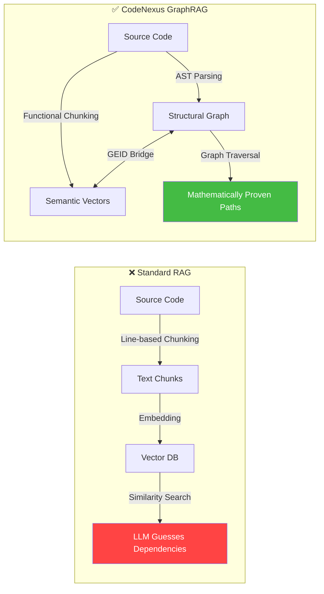
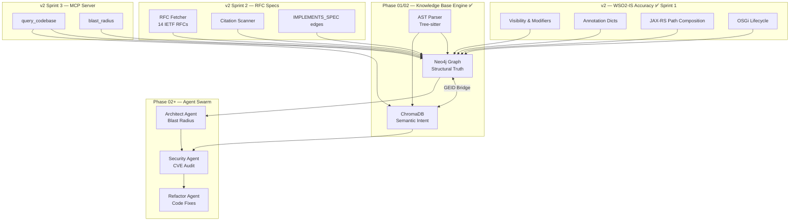

# CodeNexus v2 — Complete Documentation

> Single combined reference for the entire CodeNexus v2 system.
> Every document included in full. Nothing removed.
> Last updated: March 2026

---

## Document Map

- **PART 1 — QUICK START** — 
- **PART 2 — BEGINNER'S GUIDE** — 
- **PART 3 — SETUP & CONFIGURATION** — 
- **PART 4 — SYSTEM OVERVIEW** — 
- **PART 5 — ARCHITECTURE & WORKFLOW** — 
- **PART 6 — CODE REFERENCE** — 
- **PART 7 — WHAT'S NEW IN v2** — 
- **PART 8 — IMPLEMENTATION PLAN** — 
- **PART 9 — PROJECT PROPOSAL** — 

---


================================================================================
# PART 1 — QUICK START
================================================================================

# CodeNexus — Quick Start Guide

Get from zero to asking questions about your Java codebase in four steps.

---

## Prerequisites

| Requirement | Version | Notes |
|---|---|---|
| Python | 3.11+ | `py --version` on Windows |
| Docker Desktop | 24+ | Must be running before Step 1 |
| OpenAI API key | — | `gpt-4o-mini` + `gpt-4o` access |
| Git | any | For cloning repos into the mirror |

---

## Step 1 — Start the databases

```bash
cd nexus
docker compose up -d
```

This starts three containers:

| Container | Port | Purpose |
|---|---|---|
| `nexus-neo4j` | 7687 / 7474 | Graph database (structural truth) |
| `nexus-chromadb` | 8000 | Vector store (semantic search) |
| `nexus-redis` | 6379 | Pipeline state tracking |

Wait ~60 seconds for Neo4j to finish initialising. Check readiness:

```bash
docker compose ps          # all three should show "(healthy)"
```

Neo4j browser (optional): open `http://localhost:7474` — login `neo4j / nexuspassword`.

---

## Step 2 — Configure environment

Copy the example file and fill in your API key:

```bash
cp .env.example .env
```

Open `.env` and set:

```bash
# Required — your OpenAI key
LLM_API_KEY=sk-...

# Model tiers (defaults are fine)
LLM_FAST_MODEL=gpt-4o-mini      # bulk ops: summarisation, flow narratives, scoring
LLM_STRONG_MODEL=gpt-4o         # final answers, global rollup

# Repos to ingest (points to sample_repos/repos.yaml by default)
REPOS_CONFIG_PATH=./sample_repos/repos.yaml
```

Everything else in `.env` can stay at its default for a first run.

---

## Step 3 — Add your repositories

Edit `sample_repos/repos.yaml` to list the repos you want to ingest:

```yaml
repositories:
  - name: carbon-identity-framework
    url: https://github.com/wso2/carbon-identity-framework.git
    branch: master
    language: java

  - name: identity-inbound-auth-oauth
    url: https://github.com/wso2-extensions/identity-inbound-auth-oauth.git
    branch: master
    language: java
```

> Each `name` must be unique — it becomes the repository identifier in the graph.

---

## Step 4 — Install dependencies and ingest

```bash
# Install Python dependencies (one-time)
py -m pip install -r requirements.txt

# Run the full ingestion pipeline
py main.py ingest
```

The pipeline runs these stages automatically:

```
1. Mirror        — git clone / git pull all repos into ./mirror/
2. Parallel Parse — ProcessPoolExecutor: Tree-sitter AST across all CPU cores
                   AST-aware sliding window chunking (512 tokens, 128 overlap)
                   Context prefix [Package: …] [Class: …] on every chunk
3. Link          — Maven dependencies + REST API bridge + JAX-RS path composition
4. OSGi          — @Component/@Reference → [:RESOLVES_TO] edges (Sprint 2)
5. Load          — MERGE nodes into Neo4j, embed method chunks into ChromaDB
6. RFC           — RFC markdown files → (:Specification) nodes + [:IMPLEMENTS_SPEC] edges (Sprint 4)
7. Micro-Drafts  — Ollama local LLM → micro_draft property on EntryPoints (Sprint 4, optional)
8. Post          — Leiden communities → LLM summaries → weighted Dijkstra flows → global rollup
```

Ingestion time for reference:

| Repos | Java files | Approx. time |
|---|---|---|
| 1 small repo | ~500 files | 5–15 min |
| 2–3 medium repos | ~5,000 files | 15–40 min |
| 5 large repos | ~20,000+ files | 30–90 min |

The main time cost is community summarisation (LLM API calls). Increase parallelism to speed it up:

```bash
SUMMARIZER_MAX_WORKERS=16     # in .env
```

---

## Querying the knowledge base

### Interactive mode (recommended)

Start a continuous REPL — ask as many questions as you like without restarting:

```bash
py main.py interactive
```

```
╔══════════════════════════════════════════════════════════════════╗
║          CodeNexus — Interactive Query Mode                      ║
║  Type a question and press Enter.  'exit' or Ctrl+C to quit.    ╚══════════════════════════════════════════════════════════════════╝

  nexus> how does the OAuth token exchange flow work?
  nexus> which classes implement the TokenValidator interface?
  nexus> exit
```

### Single question

```bash
py main.py query "is impersonation supported without an actor token?"
```

### Explain a class or method

```bash
py main.py explain OAuthAdminService
py main.py explain validateActorToken
```

### Trace a call chain

```bash
py main.py trace TokenExchangeGrantHandler --depth 3
```

### Find every caller of a method

```bash
py main.py callers isImpersonationRequest --code
```

### Exact text search (no LLM, instant)

```bash
py main.py find "throw new OAuthSystemException"
```

### Debug an exception

```bash
py main.py debug NullPointerException
py main.py debug "$(cat stacktrace.txt)"
```

---

## Incremental updates (after code changes)

You do not need to re-ingest everything when repos change. The incremental updater:
- detects only the files changed since the last git SHA
- re-parses and re-loads only those files
- re-runs Leiden and re-summarises only the affected communities

```bash
py main.py ingest      # safe to re-run at any time — unchanged files are skipped
```

A small PR (10 files changed across 5 repos) re-ingests in **under 5 minutes**.

---

## Azure OpenAI (optional)

If you use Azure instead of OpenAI, set in `.env`:

```bash
LLM_PROVIDER=azure
AZURE_OPENAI_ENDPOINT=https://your-resource.openai.azure.com/
AZURE_OPENAI_API_KEY=your-azure-key
AZURE_OPENAI_API_VERSION=2024-08-01-preview
LLM_FAST_MODEL=gpt-4o-mini        # your Azure deployment name
LLM_STRONG_MODEL=gpt-4o           # your Azure deployment name
```

No code changes needed — the `make_llm_client(tier)` factory handles the switch.

---

## GPU-accelerated embeddings (optional — Sprint 1)

For large repos (50,000+ Java methods), GPU-accelerated embeddings using
`nomic-ai/nomic-embed-text-v1.5` (768-dimensional) can reduce embedding time by 5–10×.

**Requirements:** NVIDIA GPU with CUDA 11.x or 12.x, `nvcc --version` must work.

```bash
# Install GPU-capable packages
pip install fastembed-gpu onnxruntime-gpu

# Enable in .env
USE_FASTEMBED=true
FASTEMBED_MODEL=nomic-ai/nomic-embed-text-v1.5
```

CodeNexus automatically detects CUDA via `onnxruntime.get_available_providers()` and
falls back to CPU if the GPU is not available.

**CPU-only Nomic (still richer than MiniLM):**
```bash
pip install fastembed onnxruntime
USE_FASTEMBED=true
```

---

## Ollama local micro-drafts (optional — Sprint 4)

Generate 3-sentence summaries of every API endpoint class at **zero API cost**
using a local LLM (Llama 3.2). Summaries are stored as `micro_draft` on Neo4j Component nodes.

**Setup:**
```bash
# 1. Install Ollama from https://ollama.com/
# 2. Pull and start the model:
ollama run llama3.2

# 3. Enable in .env:
LOCAL_DRAFTING_ENABLED=true
OLLAMA_BASE_URL=http://localhost:11434
OLLAMA_MODEL=llama3.2:3b
```

If Ollama is not running when `py main.py ingest` runs, this stage is silently skipped
with no errors.

---

## RFC Specification Grounding (optional — Sprint 4)

Cross-reference Java source against IETF RFC specifications.

```bash
# 1. Create the rfcs/ directory
mkdir rfcs

# 2. Place RFC markdown/text files there, e.g.:
#    rfcs/rfc6749-oauth2.md
#    rfcs/rfc7519-jwt.md
#    rfcs/rfc8693-token-exchange.md

# 3. In .env (default is ./rfcs):
RFC_PATH=./rfcs

# 4. Re-run ingest
py main.py ingest
```

After ingest, you can query RFC grounding in Neo4j:
```cypher
MATCH (c:Component)-[r:IMPLEMENTS_SPEC]->(s:Specification)
RETURN c.fqn, s.rfc_number, s.title
ORDER BY s.rfc_number
```

---

## Key ports and UIs

| Service | URL | Credentials |
|---|---|---|
| Neo4j Browser | `http://localhost:7474` | neo4j / nexuspassword |
| ChromaDB API | `http://localhost:8000/api/v1` | — |
| Redis | `localhost:6379` | — |

---

## Stopping the databases

```bash
docker compose down          # stop containers, keep data volumes
docker compose down -v       # stop and DELETE all data (full reset)
```

---

## Common issues

| Symptom | Fix |
|---|---|
| `Connection refused` on Neo4j | Wait 60 s after `docker compose up`; check `docker compose ps` shows `(healthy)` |
| `ModuleNotFoundError` | Run `py -m pip install -r requirements.txt` inside the `nexus/` directory |
| Ingestion stuck at summarisation | Increase `SUMMARIZER_MAX_WORKERS` or check OpenAI rate limits |
| Empty query results | Check Neo4j has nodes: run `MATCH (n) RETURN count(n)` in the browser |
| `tomllib` not found | Requires Python 3.11+. Run `py --version` to confirm |
| `fastembed` import error | Run `pip install fastembed onnxruntime` (CPU) or `pip install fastembed-gpu onnxruntime-gpu` (GPU) |
| Ollama stage skipped silently | Check Ollama is running: `curl http://localhost:11434/api/tags` |
| OSGi edges not appearing | Check `OSGI_ENABLED=true` in `.env`; verify Java sources contain `@Component`/`@Reference` |
| RFC nodes not created | Check `RFC_PATH` points to a directory with `.md` or `.txt` files |

---

## What's next

| Task | Command / file |
|---|---|
| Add more repos | Edit `sample_repos/repos.yaml`, re-run `py main.py ingest` |
| Enable GPU embeddings | `pip install fastembed-gpu onnxruntime-gpu`, set `USE_FASTEMBED=true` |
| Enable Ollama micro-drafts | Install Ollama, set `LOCAL_DRAFTING_ENABLED=true` |
| Add RFC specifications | Place RFC files in `./rfcs/`, re-run ingest |
| Tune query depth | `py main.py query "..." --depth 5` |
| Scope to one repo | `py main.py interactive --repo carbon-identity-framework` |
| Read full architecture | `docs/ARCHITECTURE.md` |
| Read all CLI options | `docs/CODE_REFERENCE.md` |
| See what changed in v2 | `docs/V2_CHANGELOG.md` |


================================================================================
# PART 2 — BEGINNER'S GUIDE
================================================================================

# CodeNexus — Beginner's Guide

> **Who this is for:** Someone who has never worked on this project before and just
> wants to understand what it is, what every piece of technology does, and what
> each file is responsible for. No prior knowledge of graph databases, vector
> search, or LLMs is assumed.

---

## Table of Contents

1. [What is CodeNexus in plain English?](#1-what-is-codenexus-in-plain-english)
2. [The Big Picture — How the pieces fit together](#2-the-big-picture)
3. [Technology Glossary — Every tool explained simply](#3-technology-glossary)
4. [File-by-File Reference](#4-file-by-file-reference)
5. [How to Run It](#5-how-to-run-it)
6. [Common Questions](#6-common-questions)
7. [Reading the Ingest Log — What Every Line Means](#7-reading-the-ingest-log)

---

## 1. What is CodeNexus in Plain English?

Imagine you have **100+ Java repositories** — millions of lines of code — and you
want to ask questions like:

- *"Does this system support multiple audience values in a token exchange request?"*
- *"What other code would break if I changed this method?"*
- *"How does the OAuth token refresh flow work across services?"*

You could try reading the code yourself, but that would take weeks. CodeNexus
**automatically reads all the code**, builds a searchable map of it, and lets you
ask questions in plain English.

It does this in two phases:

| Phase | What happens | When it runs |
|---|---|---|
| **Ingestion** | Reads all Java files, builds the map, stores it | Once (or after code changes) |
| **Query** | Takes your question, finds the relevant code, answers it | Every time you ask |

The "map" it builds has **two completely separate parts** that serve different purposes:

| Store | Technology | What it holds | What it answers |
|---|---|---|---|
| **Graph database** | Neo4j | *Relationships* — who calls who, which class implements which interface, which module depends on which module | "What would break if I changed this?" |
| **Vector database** | ChromaDB | *Meaning* — each method converted to numbers so you can search by concept | "What code is related to token validation?" |

> **Important:** These are two independent databases. Neo4j is NOT converted into ChromaDB or vice-versa.
> They are populated in parallel from the same parsed Java code. During a query, both are searched
> and their results are combined before being handed to the LLM.

---

## 2. The Big Picture

### Ingestion (building the knowledge base)

```
Your Java repos on GitHub / GitLab
            │
            │  git clone
            ▼
     ./mirror/  (local copy of all repos)
            │
            │  ProcessPoolExecutor: Tree-sitter reads every .java file
            │  across all CPU cores in parallel and extracts:
            │  - class names, method names
            │  - what each method calls
            │  - Javadoc comments
            │  - annotations (@Override, @Autowired, @Value, etc.)
            │  - method visibility (public/private/protected)
            │  - modifiers (static, abstract, final, synchronized)
            │  - OSGi lifecycle roles (@Activate, @Deactivate)
            │  - JAX-RS paths merged (class @Path + method @Path)
            ▼
    UIR Objects  (Python data structures representing
                  every class and method found)
            │
            │  AST-aware sliding window chunker:
            │  Splits long methods into 512-token windows
            │  with 128-token overlap. Each chunk prefixed
            │  with [Package: …] [Class: …] for context.
            │
       ┌────┴────┐
       │         │
       ▼         ▼
    Neo4j     ChromaDB
  (graph:     (vectors:
  who calls    what does
  who, which   each method
  class uses   "mean"?)
  which class)
       │
       ▼
  OSGi Resolution
  (@Component → @Reference bindings via [:RESOLVES_TO] edges)
       │
       ▼
  RFC Specification Grounding
  (RFC text files → (:Specification) nodes;
   Stage 1: ChromaDB retrieves top-5 candidate classes per RFC section;
   Stage 2: GPT-4o-mini verifies which candidates actually implement it;
   [:IMPLEMENTS_SPEC] edges written with match_type + confidence score)
       │
       ▼
  Ollama Local Micro-Drafts (optional)
  (3-sentence summaries stored on EntryPoint Component nodes
   at $0 cost using llama3.2 running locally)
       │
       ▼
  Leiden Algorithm
  (groups related code into "communities" —
   like clustering related topics together)
       │
       ▼
  GPT-4o-mini writes a plain-English summary
  of each community → stored in ChromaDB
       │
       ▼
  NodeTagger labels API endpoints as :EntryPoint
  and database classes as :DataSink
       │
       ▼
  GDS Dijkstra finds shortest paths from
  each EntryPoint to each DataSink
  (CALLS=1 weight, REMOTE_CALLS=5 cross-service penalty)
       │
       ▼
  GPT-4o-mini writes an "end-to-end story"
  for each execution path → stored in ChromaDB
       │
       ▼
  Global Rollup groups community summaries into
  sub-system summaries (L2) and a single master
  Global Architecture Document (L3)
```

### Query (answering your question)

```
Your question: "does this support nested act claims?"
            │
            │  Router classifies the question
            ▼
  ┌─────────────────────────────┐
  │  What kind of question?     │
  └──┬──────┬──────┬──────┬────┘
     │GLOBAL │SYMBOL│ NAME │ GENERAL
     ▼       ▼      ▼      ▼
  Return the Search  Search Search
  Global    files   Neo4j  ChromaDB
  Arch Doc  (grep)  by     by
  directly          exact  meaning
                    name
     │       │      │      │
     ▼       └──┬───┘      │
  (done!)       │          │
                ▼          │
         Expand through     │
         the call graph     │
                │           │
                └─────┬────┘
                      ▼
              Assemble code snippets
              + community summaries
                      │
                      ▼
              GPT-4o (strong model) reads
              all evidence and writes the answer
```

---

## 3. Technology Glossary

### Python
The programming language the entire CodeNexus application is written in.
Version 3.11+ is required (3.11+ needed for `tomllib` stdlib; 3.14 is tested and supported).

On Windows, Python is invoked as `py` (the Python Launcher), not `python`.

---

### Neo4j
**What it is:** A *graph database* — instead of storing data in spreadsheet-style
tables (like MySQL), it stores data as *nodes* (things) and *relationships* (links
between things).

**Why we use it:** Code is naturally a graph. Class A *calls* method B.
Class C *implements* interface D. Class E *depends on* module F. These
relationships are exactly what Neo4j is designed to store and query efficiently.

**What we store in it:**
- **Nodes:** Every Java project, Maven module, Java class, and Java method
  (each with visibility, modifier flags, annotations as JSON, community ID,
   optional `micro_draft` property on EntryPoint components)
- **Edges:** 19 relationship types — CALLS, IMPLEMENTS, EXTENDS, DEPENDS_ON,
  INJECTS, ANNOTATED_WITH, THROWS, OVERRIDES, INSTANTIATES, RETURNS,
  RECEIVES, HANDLES_EVENT, REMOTE_CALLS, CONTAINS, QUERIES_TABLE, READS_CONFIG,
  RESOLVES_TO, IMPLEMENTS_SPEC, DECLARES

**How we talk to it:** Using **Cypher** — Neo4j's query language.
Example: `MATCH (a:LogicUnit)-[:CALLS]->(b:LogicUnit) RETURN a, b`
means "find all methods that call another method".

**Where it runs:** In a Docker container on your machine (port 7687).

---

### ChromaDB
**What it is:** A *vector database* — stores numbers (called "vectors" or
"embeddings") that represent the *meaning* of text, so you can search
by meaning instead of exact words.

**Why we use it:** If you ask "how does token validation work?", exact-text
search won't help because the code says things like `verifyJwtSignature()`,
not "token validation". ChromaDB can find that method because it understands
that "token validation" and "verifyJwtSignature" are semantically similar.

**What we store in it:** Six collections:
- `code_logic` — one entry per chunk: the method's source code as a vector (with context prefix)
- `code_intent` — one entry per method: the method's Javadoc as a vector
- `community_summaries` — plain-English summaries of code clusters
- `flow_narratives` — end-to-end stories describing API-to-database execution paths
- `l2_subsystem_summaries` — sub-system summaries grouping related communities by domain
- `l3_global_architecture` — a single master Global Architecture Document

**How vectors are created:**
For `code_logic` and `code_intent`: a HuggingFace model (`all-MiniLM-L6-v2`, 384-dimensional)
or `nomic-ai/nomic-embed-text-v1.5` via FastEmbed (768-dimensional, GPU-accelerated)
running locally on your machine converts text into a list of numbers.
Similar texts produce similar numbers. **No OpenAI API call needed here.**

For the other collections: GPT-4o-mini writes the text, then ChromaDB converts it to a vector.

**Where it runs:** In a Docker container on your machine (port 8000).

---

### Redis
**What it is:** An in-memory key-value store — like a fast Python dictionary
that lives outside your Python process so it survives restarts.

**Why we use it:** Used to track pipeline stage during ingestion (which stage is
currently running). If the ingestion crashes halfway, Redis allows monitoring of state.

**Where it runs:** In a Docker container on your machine (port 6379).

---

### Docker / Docker Compose
**What it is:** A tool that runs applications in isolated "containers". Each container
has exactly the software it needs.

**Why we use it:** Instead of asking you to install Neo4j, ChromaDB, and Redis
on your machine (complex, version-sensitive), Docker runs them as containers.
One command (`docker compose up -d`) starts all three.

---

### Tree-sitter
**What it is:** A fast, accurate source code parsing library. It reads Java source
code and builds an **Abstract Syntax Tree (AST)** — a structured representation
of the code's grammar.

**Why we use it:** When you read a Java file as plain text, you see characters.
Tree-sitter reads it and understands structure: "this is a class declaration,
this is a method, this method has these parameters and modifiers, it calls these other methods".

**The library used:** `tree-sitter-java` — the Tree-sitter grammar for Java.

**What v2 adds:** v2 Sprint 1 extracts the `modifiers` child node (visibility, static,
abstract, final, synchronized), parses annotation arguments as structured dicts
(not just raw strings), recurses into lambda bodies for call extraction, and
preserves generic types like `List<User>` in type fields.

---

### AST-Aware Sliding Window Chunker
**What it is:** A method-body text splitter that never cuts across function boundaries.
When a method body exceeds 512 tokens, it generates multiple overlapping text windows.

**Why it matters:** Embedding models have a maximum input size. A 2,000-line authentication
method cannot be embedded as one block. The sliding window splits it into 512-token
windows with a 128-token overlap so the model can "see" each portion without losing context.

**Context prefix:** Every chunk begins with `[Package: org.wso2.identity] [Class: AuthzEndpoint]`
so even an isolated code fragment can be matched to its origin — critical for large monorepos
where many methods have the same name in different packages.

**The parameters:**
- `CHUNK_SIZE=512` — maximum tokens per window
- `CHUNK_OVERLAP=128` — token overlap between adjacent windows
- Javadoc (code_intent) is **never** windowed — always stored as one chunk

---

### HuggingFace SentenceTransformers
**What it is:** A Python library that runs pre-trained AI models locally to
convert text into vectors.

**The model we use:** `all-MiniLM-L6-v2` — a small, fast model producing
384-dimension vectors. Runs entirely on CPU, no GPU required, no API key needed.

**What "Batches: 100%" means in the terminal:**
```
Batches: 100%|████████████████| 1/1 [00:00<00:00, 3.48it/s]
```
This is the HuggingFace model processing a group of method texts. "1/1" means one batch.
This is **not** related to Neo4j — it is purely the ChromaDB embedding step.

---

### FastEmbed + ONNX Runtime (GPU-accelerated, optional)
**What it is:** A faster, higher-quality embedding library from Qdrant that can use
your GPU via ONNX Runtime. Produces 768-dimensional vectors using `nomic-ai/nomic-embed-text-v1.5`.

**Why it's better (when available):** The Nomic model produces richer semantic embeddings
(768-dim vs 384-dim) and runs much faster on a CUDA GPU. Useful for large monorepos with
100,000+ methods.

**How to enable it:**
```bash
# CPU-only (slightly richer model than MiniLM):
pip install fastembed onnxruntime

# GPU (CUDA 11.x or 12.x):
pip install fastembed-gpu onnxruntime-gpu

# Enable in .env:
USE_FASTEMBED=true
FASTEMBED_MODEL=nomic-ai/nomic-embed-text-v1.5
```

**Automatic detection:** CodeNexus checks `onnxruntime.get_available_providers()` for
`CUDAExecutionProvider` and falls back to CPU automatically.

---

### ProcessPoolExecutor (Parallel Parsing)
**What it is:** Python's built-in multiprocessing library. Runs multiple Python processes
in parallel across your CPU cores.

**Why we use it:** Tree-sitter parsing and token counting are CPU-bound operations.
On a machine with 8 cores, parsing 8,000 Java files takes ~1/8 the time compared to
running on a single core.

**How it works:**
- Files are split into batches of `PARSER_FILE_BATCH_SIZE=200` files
- Each batch is sent to a separate subprocess that imports Tree-sitter + Chunker independently
- Results (serialized as plain Python dicts) come back to the main process
- Main process handles all Neo4j and ChromaDB writes (no shared database state in workers)

---

### OpenAI GPT Models — Two-Tier Strategy

CodeNexus uses two OpenAI models with different cost/quality trade-offs:

| Model | Used for | Why |
|---|---|---|
| **gpt-4o-mini** (fast) | Community summarisation (bulk), map-step scoring, flow narratives, L2 sub-system rollup, **RFC-to-code verification** | ~90% cheaper than gpt-4o; adequate for bulk tasks |
| **gpt-4o** (strong) | Final reduce answer, L3 global rollup only | Best quality for the answer the user sees |

This means a full ingest of 100 repos costs ~$0.50 instead of ~$5+ if everything used gpt-4o.
RFC verification adds ~$0.18 for 14 RFCs (one GPT-4o-mini call per RFC section, ~800 calls total).

**What the LLM does NOT do:** It does not search. It does not access the internet.
It only reads the evidence we hand it and synthesises an answer.

**Key constraint:** Every prompt is capped at **8,000 tokens** to control costs.
The `community/prompt_builder.py` `DATA_BUDGET` constant (6,800 tokens) enforces this.

---

### Ollama (Local LLM Micro-Drafts, optional)
**What it is:** A free tool that runs small open-source LLMs (like Llama 3.2)
entirely on your local machine. No API key, no internet, no cost.

**Why we use it:** Every API endpoint class (`:EntryPoint`) can have a short 3-sentence
"micro-draft" summary stored directly in Neo4j as a `micro_draft` property. Writing
hundreds of these summaries with GPT-4o-mini would cost money. Ollama does it for free.

**How to enable it:**
```bash
# 1. Install Ollama: https://ollama.com/
# 2. Start it:
ollama run llama3.2

# 3. Enable in .env:
LOCAL_DRAFTING_ENABLED=true
OLLAMA_BASE_URL=http://localhost:11434
OLLAMA_MODEL=llama3.2:3b
```

**Graceful degradation:** If Ollama is not running, this stage is silently skipped.
No errors, no impact on the rest of the pipeline.

---

### OSGi Declarative Services
**What it is:** OSGi (Open Service Gateway initiative) is a Java component framework
used by WSO2 Identity Server. Components declare which interfaces they provide
(`@Component(service={Interface.class})`) and which they need (`@Reference Interface field`).

**Why we index it:** OSGi wiring cannot be seen in `new` calls or import statements.
An `@Reference AuthzService authzService` field is resolved at runtime by the OSGi
container. Without special parsing, the graph would have no edge from the caller to
the implementation.

**What CodeNexus does:**
- `parsers/osgi_parser.py` scans all Java files for `@Component` and `@Reference` annotations
- Builds `[:RESOLVES_TO]` edges from each injected interface to its implementation
- These edges appear in the flow graph and are traversed by Dijkstra shortest path

---

### RFC Specification Grounding
**What it is:** IETF RFCs (Request for Comments) are the official specifications for
internet protocols. OAuth 2.0 is RFC 6749. JWT is RFC 7519. Token Exchange is RFC 8693.

**Why it matters:** When you ask "does this correctly implement RFC 8693 token exchange?",
the system can show you exactly which Java classes are responsible for that requirement —
even when the code has no comments mentioning RFC numbers at all.

**The problem with regex matching:** Enterprise codebases like WSO2 Identity Server almost
never write comments like `// RFC 6749` or `@see RFC 7519`. Scanning Java source for explicit
RFC citations would find almost nothing. This is why a two-stage LLM approach is used instead.

**How it works — two stages:**

**Stage 1 — Candidate Retrieval (ChromaDB, cheap):**
- `parsers/rfc_parser.py` reads each RFC text file and splits it into numbered sections
  (e.g. RFC 6749 produces 98 sections: §1 Introduction, §4.1 Authorization Code Grant, etc.)
- Each section's text is queried against the `code_intent` ChromaDB collection
  (which holds Javadoc/description embeddings of every Java class)
- The top 5 most semantically similar Java classes are returned as candidates
- This narrows ~100,000 classes down to 5 candidates per RFC section

**Stage 2 — LLM Verification (GPT-4o-mini, accurate):**
- For each RFC section, ONE GPT-4o-mini call is made containing:
  - The RFC section title and full requirement text
  - The 5 candidate Java classes with their FQN and Javadoc description
- The LLM answers: which of these candidates genuinely *implements* this requirement?
- It returns a structured JSON response: `{fqn, implements: true/false, confidence: 0–1, reason}`
- Only candidates with `implements=true` and `confidence ≥ 0.70` become `[:IMPLEMENTS_SPEC]` edges

**Why LLM is necessary here (not just embeddings):**
Embeddings measure surface-level similarity — they can tell that "token introspection"
and `TokenValidator.java` are in the same ballpark. But they cannot reason about protocol
flow. The LLM reads both the spec requirement and the class description and makes a judgment:
"Yes, `TokenExchangeGrantHandler` implements RFC 8693 §2.1 because it processes the
`urn:ietf:params:oauth:grant-type:token-exchange` grant type the spec defines."

**What gets stored in Neo4j:**
- `(:Specification {rfc_number: 8693, title: "OAuth 2.0 Token Exchange"})` nodes
- `[:IMPLEMENTS_SPEC {match_type: "llm", similarity_score: 0.92, citation_context: "RFC 8693 §2.1: Token Exchange Request — Handles the grant_type token-exchange flow."}]` edges

**Cost:** ~800 LLM calls for 14 RFCs ≈ $0.18 total at GPT-4o-mini pricing. Runs once per ingest.

**What you can query after ingestion:**
```cypher
// Which classes implement OAuth 2.0 token exchange?
MATCH (c:Component)-[r:IMPLEMENTS_SPEC]->(s:Specification {rfc_number: 8693})
RETURN c.fqn, r.similarity_score, r.citation_context
ORDER BY r.similarity_score DESC

// All LLM-verified spec mappings with high confidence
MATCH (c:Component)-[r:IMPLEMENTS_SPEC]->(s:Specification)
WHERE r.match_type = 'llm' AND r.similarity_score > 0.85
RETURN c.fqn, s.rfc_number, r.citation_context
```

---

### Leiden Algorithm (via Neo4j GDS)
**What it is:** A community detection algorithm — groups code into clusters
("communities") of closely related code.

**Why we use it:** Instead of asking the LLM to read all 1 million lines of code,
we ask it to read a summary of the relevant cluster.

**Neo4j GDS (Graph Data Science):** The Neo4j plugin that runs Leiden and other
graph algorithms directly inside the database.

**Leiden resolution parameter (`LEIDEN_GAMMA`):** Default 1.5. Higher values = smaller,
more granular communities. Lower values = larger, broader communities.

---

### Weighted GDS Dijkstra
**What it is:** Dijkstra's shortest-path algorithm running inside Neo4j Graph Data Science,
using edge weights to find the most efficient execution path through the code graph.

**Why weights matter:** A CALLS edge (one method calling another in the same service)
costs 1. A REMOTE_CALLS edge (REST call crossing a service boundary) costs 5. This means
Dijkstra prefers paths that stay within a service before hopping to another microservice —
which mirrors how you'd think about code flow when reading it.

**The effect:** Paths are ranked by execution complexity. A short 3-hop path entirely
within one service scores lower (better) than a 3-hop path that crosses two service boundaries.

---

### Pydantic / pydantic-settings
**What it is:** A Python library for data structures with automatic type validation.
`pydantic-settings` reads settings from `.env` files.

**Why we use it:** All configuration lives in a `.env` file and is loaded into a single
`Settings` object. No magic strings scattered through the code.

---

### Tenacity
**What it is:** A Python retry library — if a Neo4j/ChromaDB/LLM call fails due to a
transient error, it automatically retries with increasing delays.

---

### Tiktoken
**What it is:** OpenAI's token counting library — counts how many "tokens" a text
string contains, to stay under the 8K context limit and to measure sliding window
sizes during chunking.

---

### ripgrep (`rg`)
**What it is:** An extremely fast text search tool written in Rust (~10× faster than grep).
Searches through gigabytes of source code in seconds.

**Why we use it:** When the router identifies a specific symbol (like `IMPERSONATED_SUBJECT`),
ripgrep finds every `.java` file containing that exact string, with file path and line number.

---

### tomllib (Python 3.11+ stdlib)
**What it is:** A TOML file parser built into Python 3.11+. No extra package needed.

**Why we use it:** WSO2 Identity Server uses `deployment.toml` for configuration.
`tomllib` parses nested TOML tables accurately (e.g. `[[transport.https]]`) where the
previous regex-based parser would miss or mislabel nested sections.

---

## 4. File-by-File Reference

### Root directory

| File | What it does |
|---|---|
| `main.py` | The main entry point. Run `py main.py ingest` to ingest repos, `py main.py query "..."` to ask a question. |
| `docker-compose.yml` | Defines the three Docker services: `nexus-neo4j`, `nexus-chromadb`, `nexus-redis`. |
| `requirements.txt` | List of all Python packages the project depends on with version constraints. |
| `.env` | Your local config. Contains passwords, API keys, model names, batch sizes. Never commit this file. |
| `.env.example` | A safe template showing all available settings with default values. Copy to `.env`. |
| `.gitignore` | Tells Git which files to ignore (keys, venv, caches, ML weights, Docker data volumes, etc.) |

---

### `config/`

| File | What it does |
|---|---|
| `config/__init__.py` | Makes `config` a Python package. |
| `config/settings.py` | **Central configuration.** Defines a `Settings` class (Pydantic) that reads every setting from `.env`. All other modules import `settings` from here. Contains `make_llm_client(tier)` factory and `get_model_name(tier)` helper for the two-tier LLM strategy. Sprint 1–4 settings added: CHUNK_SIZE, CHUNK_OVERLAP, USE_FASTEMBED, FASTEMBED_MODEL, OSGI_ENABLED, RFC_PATH, LOCAL_DRAFTING_ENABLED, OLLAMA_BASE_URL, OLLAMA_MODEL. |

---

### `parsers/`

| File | What it does |
|---|---|
| `parsers/__init__.py` | Makes `parsers` a Python package. |
| `parsers/uir.py` | **Universal Intermediate Representation.** Defines the Python data classes (`Project`, `Module`, `Component`, `LogicUnit`, `Parameter`, `FieldDeclaration`) that hold all parsed Java information. `LogicUnit` carries `visibility`, `is_static`, `is_abstract`, `is_final`, `is_synchronized`, `lifecycle_role`. All `annotations` fields are `list[dict]` (structured). |
| `parsers/java_parser.py` | **The Java AST parser.** Uses Tree-sitter to extract: class names, method names, Javadoc, method bodies, annotations (as structured dicts), modifiers (visibility/static/abstract), OSGi lifecycle markers, parameter annotations (`@QueryParam`, `@PathVariable`), lambda call bodies, and generic types. |
| `parsers/geid.py` | **Global Entity ID generator.** Creates a 16-character unique identifier: `SHA256(repo_name + "::" + fqn)[:16]`. Shared between Neo4j and ChromaDB. |
| `parsers/fqn_builder.py` | **Fully Qualified Name builder.** Assembles the canonical Java name for a class or method. |
| `parsers/javadoc_parser.py` | Parses Javadoc comment blocks to extract `@param`, `@return`, `@throws`, `@see` tags. |
| `parsers/reflection.py` | Utility for resolving Java type names and handling generic type edge cases. |
| `parsers/sql_schema_parser.py` | **SQL DDL Parser.** Scans `dbscripts/` for `CREATE TABLE` statements → `DatabaseTable` nodes + `QUERIES_TABLE` edges. |
| `parsers/config_parser.py` | **Configuration Parser.** Parses WSO2 `deployment.toml` (using `tomllib` for accurate nested tables), `*.xml`, `*.properties`, and `application.yml`. Creates `Configuration` nodes and `READS_CONFIG` edges. |
| `parsers/osgi_parser.py` | **OSGi Declarative Services Parser (Sprint 2).** Scans Java for `@Component(service={...})` and `@Reference` annotations. Builds `[:RESOLVES_TO]` edges from injected interface fields to their OSGi implementation classes. Resolves service bindings invisible to normal call-graph analysis. |
| `parsers/rfc_parser.py` | **RFC Specification Parser (Sprint 4).** Parses RFC text files from `./rfcs/` into `(:Specification)` nodes. Also: (1) splits each RFC into numbered sections (`chunk_rfc_sections()`) for use by the semantic matcher; (2) scans Java source for any explicit RFC citations as a supplementary pass. |
| `parsers/rfc_semantic_matcher.py` | **LLM-Verified RFC→Code Mapper.** Two-stage pipeline: Stage 1 queries ChromaDB `code_intent` to retrieve top-5 candidate Java classes per RFC section; Stage 2 sends one GPT-4o-mini call per section with the requirement text + candidates, and the LLM decides which candidates genuinely implement the requirement. Returns `SpecImplementsEdge` objects with `match_type="llm"` and `similarity_score` (LLM confidence). Handles the reality that enterprise codebases almost never contain explicit RFC citation comments. |

---

### `llm/` (Sprint 4)

| File | What it does |
|---|---|
| `llm/__init__.py` | Makes `llm` a Python package. |
| `llm/local_drafting.py` | **Ollama Local Micro-Draft Engine.** Generates 3-sentence architectural summaries for every `:EntryPoint` class using a local Ollama LLM (default: `llama3.2:3b`). Stores the result as a `micro_draft` property on the Neo4j Component node. Uses `ThreadPoolExecutor` for parallel drafting. Gracefully skips if Ollama is not running. Zero API cost. |

---

### `graph/`

| File | What it does |
|---|---|
| `graph/__init__.py` | Makes `graph` a Python package. |
| `graph/schema.py` | **Neo4j schema setup.** Creates uniqueness constraints and indexes. Includes indexes for `visibility`, `lifecycle_role`, and a `Specification` uniqueness constraint on `spec_id`. |
| `graph/loader.py` | **Neo4j bulk loader.** Writes UIR objects to Neo4j using MERGE (idempotent). Handles `json.dumps()` for annotation serialization. Writes all v2 fields (visibility, modifiers, lifecycle). Sprint 2 additions: `load_resolves_to_edges()`, `load_specification_nodes()`, `load_implements_spec_edges()`. `[:IMPLEMENTS_SPEC]` edges now store `match_type` ("citation" or "llm") and `similarity_score` (LLM confidence 0–1) for traceability. |
| `graph/gds_client.py` | **Neo4j GDS client.** Runs Leiden community detection dynamically (only projects relationship types that actually exist, preventing crashes on partial ingests). |
| `graph/cleanup.py` | **Incremental cleanup.** Removes stale nodes when a file changes. Does NOT wipe the whole database. |
| `graph/tagger.py` | **EntryPoint/DataSink Tagger.** Labels API endpoints as `:EntryPoint` and DAO/Repository classes as `:DataSink` for flow extraction. |
| `graph/flow_extractor.py` | **GDS Dijkstra Flow Extractor (Sprint 3).** Finds shortest execution paths from each `:EntryPoint` to each `:DataSink` using weighted GDS Dijkstra. CALLS=1, REMOTE_CALLS=5 (cross-service penalty). Returns `FlowPath` objects enriched with config keys and table names. |

---

### `linker/`

| File | What it does |
|---|---|
| `linker/__init__.py` | Makes `linker` a Python package. |
| `linker/maven_resolver.py` | **Maven dependency resolver.** Reads `pom.xml` files → `DEPENDS_ON` edges. |
| `linker/api_bridge.py` | **REST API bridge detector.** Detects Spring + JAX-RS endpoints. Merges class-level `@Path` with method-level `@Path` for accurate effective paths. Extracts `@Consumes` / `@Produces`. Creates `REMOTE_CALLS` edges. |

---

### `vectorstore/`

| File | What it does |
|---|---|
| `vectorstore/__init__.py` | Makes `vectorstore` a Python package. |
| `vectorstore/chunker.py` | **AST-Aware Sliding Window Chunker (Sprint 1).** Produces one or more `EmbeddingChunk` objects per method. Long method bodies (>512 tokens) are split into overlapping 512-token windows with 128-token overlap. Every chunk is prefixed with `[Package: …] [Class: …]` for contextual grounding. Javadoc chunks (code_intent) are never windowed. |
| `vectorstore/embedder.py` | **ChromaDB Embedder.** Default: HuggingFace `SentenceTransformer` (`all-MiniLM-L6-v2`, 384-dim). Optional Sprint 1 upgrade: `FastEmbedder` class using `fastembed` + ONNX Runtime with automatic CUDA detection for GPU-accelerated `nomic-ai/nomic-embed-text-v1.5` (768-dim). |

---

### `community/`

| File | What it does |
|---|---|
| `community/__init__.py` | Makes `community` a Python package. |
| `community/models.py` | Defines the `CommunitySummary` Pydantic model. |
| `community/prompt_builder.py` | **Prompt builder.** Assembles the prompt for community summarisation. Enforces the 8K token budget via `DATA_BUDGET = 6,800` tokens. The while-loop checks `count_tokens(body) <= DATA_BUDGET` directly (bug-fixed in v2). |
| `community/summarizer.py` | **Community summariser.** For each Leiden community: fetches members, builds prompt, calls **fast model** (gpt-4o-mini), stores result in ChromaDB. Parallelised via `ThreadPoolExecutor`. |
| `community/global_rollup.py` | **Global GraphRAG Rollup.** L1 community summaries → L2 sub-system summaries (fast model) → L3 Global Architecture Document (strong model). |

---

### `pipeline/`

| File | What it does |
|---|---|
| `pipeline/__init__.py` | Makes `pipeline` a Python package. |
| `pipeline/mirror.py` | **Git mirror manager.** Reads `sample_repos/repos.yaml`, runs git clone/pull. |
| `pipeline/ingest.py` | **Parallel Ingestion Engine (Sprint 1).** `run_parallel_parse()` uses `ProcessPoolExecutor` to distribute Java file parsing across all CPU cores. Each worker batch runs Tree-sitter + UIRChunker independently in a subprocess (no shared state). Results returned as plain dicts (pickle-safe) and reassembled in the main process. |
| `pipeline/orchestrator.py` | **The main pipeline conductor.** Runs all stages in order: Mirror → Parallel Parse → Link → OSGi Resolution → Load → RFC Grounding → Ollama Micro-Drafts → Post (Leiden + summarisation + tagger + weighted Dijkstra flows + rollup). |
| `pipeline/cli.py` | **Click CLI.** Defines `nexus ingest`, `nexus update`, `nexus validate`, `nexus stats`, `nexus analyze-pr`. |
| `pipeline/incremental.py` | **Incremental updater.** Re-parses only changed files after a PR, updates only affected nodes/vectors. |

---

### `reasoning/`

| File | What it does |
|---|---|
| `reasoning/__init__.py` | Makes `reasoning` a Python package. |
| `reasoning/router.py` | **The query router.** Four routes: A (symbolic/grep), B (entity/Neo4j), C (semantic/ChromaDB), D (global/summaries). Routes A, B, D make zero LLM calls. |
| `reasoning/lexical_search.py` | **Lexical searcher.** Runs ripgrep / git-grep / Python over `./mirror/`. |
| `reasoning/graph_retriever.py` | **Neo4j graph retriever.** Blast-radius expansion, entity lookup, community summary fetching. |
| `reasoning/code_fetcher.py` | **Source code reader.** Reads actual `.java` files from `./mirror/` given file path + line numbers. |
| `reasoning/map_step.py` | **Map step.** Question mode: zero LLM calls (ChromaDB distance → score). PR mode: fast-model LLM scoring with `ThreadPoolExecutor`. |
| `reasoning/reduce_step.py` | **Reduce step.** Strong model (gpt-4o). Intent detection (6 intents). Intent-adaptive output tokens (1,800 or 6,000). Single LLM call → final answer. |
| `reasoning/pipeline.py` | Thin wrapper chaining router → evidence → map → reduce. |
| `reasoning/flow_summarizer.py` | **Flow Narrative Summariser.** Converts GDS Dijkstra `FlowPath` objects into natural-language stories via fast model. |

---

### `sample_repos/`

| File | What it does |
|---|---|
| `sample_repos/repos.yaml` | Repository manifest — lists every Git repo URL and branch to index. Edit this to add/remove repos. |

---

### `rfcs/` (Sprint 4)

| File | What it does |
|---|---|
| `rfcs/*.txt` | Place RFC text files here to enable specification grounding. Currently contains 14 OAuth/JWT/OIDC RFCs (6749, 6750, 7009, 7519, 7521, 7523, 7591, 7592, 7636, 7662, 8628, 8693, 8705, 9068). Each file is split into numbered sections; each section is verified against Java classes via ChromaDB + GPT-4o-mini. No explicit RFC citations in Java source are needed. |

---

### `tests/`

| File | What it tests |
|---|---|
| `tests/test_00_infrastructure.py` | Neo4j, ChromaDB, Redis connectivity |
| `tests/test_01_parser.py` | Java parser: classes, methods, annotations (dict format), modifiers, lifecycle |
| `tests/test_02_mirror.py` | Git mirror cloning/pulling |
| `tests/test_03_linker.py` | Maven resolver, API bridge, JAX-RS path composition |
| `tests/test_04_knowledge_base.py` | Integration: mini ingest → verify Neo4j + ChromaDB |
| `tests/test_05_map_reduce.py` | Map and Reduce steps with sample queries |
| `tests/test_06_incremental.py` | Incremental updater |
| `tests/test_07_community_detection.py` | Leiden + summarisation |
| `tests/test_08_community_prompt.py` | Token budget enforcement (DATA_BUDGET = 6,800 tokens) |

---

## 5. How to Run It

### First time setup (Windows)

```powershell
# 1. Start the databases
docker compose up -d

# 2. Wait ~60 seconds for Neo4j to fully start

# 3. Bootstrap pip into the project's embedded Python environment
py -m ensurepip --upgrade
py -m pip install --upgrade pip

# 4. Install dependencies
py -m pip install -r requirements.txt

# 5. Copy the config template and fill in your OpenAI key
copy .env.example .env
# Edit .env and set LLM_API_KEY=sk-...

# 6. Run the full ingestion pipeline
py main.py ingest
```

### First time setup (Linux/macOS)

```bash
# 1. Start the databases
docker compose up -d

# 2. Create and activate venv
python3 -m venv .venv
source .venv/bin/activate

# 3. Install dependencies
pip install -r requirements.txt

# 4. Configure
cp .env.example .env
# Edit .env and set LLM_API_KEY=sk-...

# 5. Run the full ingestion pipeline
python3 main.py ingest
```

### Optional: GPU-accelerated embeddings (Sprint 1)

```bash
# CPU-only (slightly richer than MiniLM):
pip install fastembed onnxruntime

# GPU (requires CUDA 11.x or 12.x):
pip install fastembed-gpu onnxruntime-gpu

# Then enable in .env:
USE_FASTEMBED=true
FASTEMBED_MODEL=nomic-ai/nomic-embed-text-v1.5
```

### Optional: Local LLM micro-drafts via Ollama (Sprint 4)

```bash
# 1. Install Ollama from https://ollama.com/
# 2. Pull and start the model:
ollama run llama3.2

# 3. Enable in .env:
LOCAL_DRAFTING_ENABLED=true
OLLAMA_BASE_URL=http://localhost:11434
OLLAMA_MODEL=llama3.2:3b
```

### What the ingestion pipeline does

1. Clones all repos in `sample_repos/repos.yaml` into `./mirror/`
2. **Parallel-parses** every `.java` file across all CPU cores (`ProcessPoolExecutor`)
3. Applies AST-aware sliding window chunking (512-token windows, 128-token overlap, context prefix)
4. Scans `deployment.toml`, XML, properties, and YAML config files
5. Loads all nodes and edges into Neo4j (with visibility, lifecycle, and annotation properties)
6. Runs OSGi resolution — builds `[:RESOLVES_TO]` edges from `@Component`/`@Reference` annotations
7. Embeds all method chunks into ChromaDB (standard or GPU-accelerated)
8. Parses RFC files → `(:Specification)` nodes; for each numbered RFC section, retrieves top-5 candidate Java classes from ChromaDB, then calls GPT-4o-mini to verify which candidates implement the requirement → `[:IMPLEMENTS_SPEC]` edges (with LLM confidence score)
9. Generates Ollama micro-drafts for `:EntryPoint` components (if enabled)
10. Runs Leiden community detection
11. Generates GPT-4o-mini (fast model) summaries for each community
12. Tags API endpoints as `:EntryPoint` and database classes as `:DataSink`
13. Extracts API→Database execution paths via weighted GDS Dijkstra (CALLS=1, REMOTE_CALLS=5)
14. Generates flow narratives for each execution path
15. Generates Global GraphRAG rollup (L2 sub-system + L3 Global Architecture)

### Asking questions

```powershell
py main.py query "does this support multiple audience values?"
py main.py query "what calls TokenExchangeGrantHandler?"
py main.py query "how does the OAuth token refresh flow work?"
py main.py query "what is the overarching architecture of this system?"
```

The last query uses **Route D (Global)** — returns the pre-computed L3 Global
Architecture Document without any LLM call.

### Wiping everything and starting fresh

```powershell
docker compose down -v    # Delete all stored data
docker compose up -d      # Start fresh containers
py main.py ingest         # Re-ingest
```

---

## 6. Common Questions

**Q: Do I need a GPU?**
No. The default HuggingFace embedding model (`all-MiniLM-L6-v2`) runs on CPU.
It's a small 80MB model — no GPU required. If you have a CUDA GPU, you can optionally
enable `USE_FASTEMBED=true` to use the 768-dimensional Nomic model for richer embeddings.

**Q: What Python version do I need?**
Python 3.11 or higher is required (for `tomllib` in the standard library). Python 3.14 is tested and supported.

**Q: On Windows, why use `py` instead of `python`?**
`py` is the Windows Python Launcher — it finds the correct Python installation on your system.
`python` may not be in PATH on some Windows setups. `py` always works.

**Q: How much does OpenAI cost to run?**
Three things call OpenAI during ingestion: RFC section verification (~$0.18 flat for 14 RFCs),
community summarisation (once per ingest, fast model), and flow narrative generation.
One thing calls OpenAI per query: the final reduce step (strong model).
A typical ingest of 2 repos costs ~$0.25–$0.40 total (RFC verification is a fixed cost regardless of repo count).
Each query costs < $0.01. A full ingest of 100 repos costs ~$0.70 with the two-tier strategy.
Ollama micro-drafts cost $0 — they run entirely locally.

**Q: Why does the ingestion take a long time?**
The main bottleneck is HuggingFace embedding (hundreds of thousands of method chunks).
Sprint 1 dramatically reduces parse time via `ProcessPoolExecutor` parallel parsing.
Enable GPU embeddings (`USE_FASTEMBED=true`) for another 5–10× speedup on the embed step.

**Q: The ingestion failed halfway. Do I need to restart?**
Not necessarily. Neo4j uses `MERGE` (idempotent) and ChromaDB uses `upsert`. You can re-run
`py main.py ingest` and it will fill in any missing data.

**Q: What is a "community" in this system?**
A community is a cluster of related Java classes and methods automatically detected by the
Leiden algorithm. For example, all classes involved in OAuth token exchange might form one
community; all classes involved in user authentication might form another.

**Q: What does "visibility" mean in the graph?**
Every method and class now has a `visibility` property: `"public"`, `"protected"`, `"private"`,
or `"package"`. This enables security-focused queries like:
`MATCH (n:LogicUnit {visibility: "public"}) WHERE n.annotations CONTAINS '"Value"' RETURN n.fqn`
to find all public methods with Spring `@Value` config injection.

**Q: What is the OSGi lifecycle_role property?**
WSO2 Identity Server uses OSGi (Open Service Gateway initiative) for component lifecycle.
Methods annotated with `@Activate`, `@Deactivate`, or `@Modified` get a `lifecycle_role`
property (`"activate"`, `"deactivate"`, `"modified"`) so you can query:
`MATCH (n:LogicUnit {lifecycle_role: "activate"}) RETURN n.fqn`
to find all OSGi component activation methods.

**Q: What is the `micro_draft` property on Component nodes?**
It's a 3-sentence plain-English summary of what an API endpoint class does, generated by
a local Ollama LLM (e.g. llama3.2:3b). Stored on `:EntryPoint` Component nodes in Neo4j.
Enables zero-cost, offline architectural summaries of every API entry point.

**Q: What are `[:RESOLVES_TO]` edges?**
OSGi service bindings that connect a `@Reference Interface field` in one class to the
`@Component(service={Interface.class})` implementation class that OSGi will inject at runtime.
These edges make OSGi wiring visible in the graph — without them, the call graph would have
gaps wherever OSGi dependency injection is used.

**Q: What are `[:IMPLEMENTS_SPEC]` edges?**
Links from a Java class to an RFC specification node (e.g. `(:Specification {rfc_number: 8693})`).
Created by `parsers/rfc_semantic_matcher.py` using a two-stage process: ChromaDB retrieves top
candidate classes for each RFC section, then GPT-4o-mini verifies which candidates genuinely
implement the requirement. The edge stores `match_type="llm"`, `similarity_score` (0–1 LLM
confidence), and `citation_context` (e.g. "RFC 8693 §2.1: Token Exchange Request — ...").
This approach works even when the Java source has zero RFC citation comments — which is the norm
in enterprise codebases like WSO2.

**Q: Why are annotations stored as JSON strings in Neo4j?**
Neo4j cannot natively store a list of maps (objects) as a node property. So `list[dict]`
annotation data like `[{"name": "Value", "value": "${key}"}]` is serialized as a JSON string
before writing to Neo4j. You can query it with APOC: `apoc.convert.fromJsonList(n.annotations)`.

**Q: What is the DATA_BUDGET in prompt_builder.py?**
It's `max_context_tokens - SYSTEM_TOKENS - OUTPUT_RESERVE = 8000 - 200 - 1000 = 6800 tokens`.
The community summarisation prompt body is capped at 6,800 tokens so the full LLM call
(system prompt + body + output) fits in the 8,000 token window.

**Q: What does "Batches: 100%|████| 1/1" mean in the terminal output?**
This comes from HuggingFace `SentenceTransformer` converting Java method text into vectors.
`1/1` = one batch processed (small repo). `57/57` = 57 batches (large repo).
This is **only** the embedding step — nothing to do with Neo4j.

**Q: Is the graph database "converted into" a RAG system?**
No — they are two completely separate systems built in parallel and searched independently:
- **Neo4j** (graph) stores *structure*: which method calls which, which class extends which.
- **ChromaDB** (vector) stores *meaning*: each method as 384 or 768 numbers.

Both are retrieval sources. The retrieved context from both is assembled and handed to gpt-4o
which writes the final answer.

**Q: What does the sliding window chunker do differently from Sprint 0?**
Sprint 0's chunker produced exactly one `code_logic` chunk per method, regardless of length.
If a method was 3,000 tokens long, the embedding model would silently truncate it.
Sprint 1's chunker splits long methods into overlapping 512-token windows so the entire
method body is captured. Each window carries the `[Package: …] [Class: …]` prefix so
ChromaDB can locate the source even without the surrounding context.

---

## 7. Reading the Ingest Log

```
graph.schema — Schema setup complete — 12 constraints, 14 indexes
```
→ Neo4j is ready. Created uniqueness rules and speed indexes (includes v2 visibility/lifecycle/spec indexes).

```
httpx — HTTP Request: HEAD https://huggingface.co/sentence-transformers/...
```
→ HuggingFace model checking for a newer version. Downloads once; uses cached copy after that.

```
pipeline.mirror — Cloning https://github.com/... → mirror/identity-server
```
→ Stage 1: `git clone` running for the first time. Subsequent runs show "Pulling".

```
pipeline.ingest — Parallel parse: 3847 files, 8 workers, batch_size=200
```
→ Sprint 1: ProcessPoolExecutor starting. 8 CPU cores will parse files in parallel.

```
pipeline.ingest — Parsed 15/20 batches — 2341 components so far
```
→ Parallel parse progress. Batches completing across worker processes.

```
parsers.java_parser — Parsed 412 classes, 3847 methods from identity-server
```
→ Stage 2: Tree-sitter finished reading all `.java` files. Modifiers, annotations, lifecycle roles extracted.

```
parsers.config_parser — Found 38 configuration entries in identity-server
```
→ Config parser scanned deployment.toml (via tomllib), XML, properties files.

```
parsers.osgi_parser — Built 147 RESOLVES_TO edges from OSGi component bindings
```
→ Sprint 2: OSGi @Component/@Reference annotations resolved to implementation edges.

```
graph.loader — Loaded 3847 LogicUnit nodes
graph.loader — Loaded 12041 CALLS edges
```
→ Stage 3 (Neo4j): Nodes with visibility/modifiers/lifecycle/annotations written to Neo4j.

```
vectorstore.chunker — Generated 5231 chunks from 3847 methods (avg 1.36 chunks/method)
```
→ Sprint 1: Sliding window chunker. Methods >512 tokens produced multiple chunks.

```
httpx — HTTP Request: POST http://localhost:8000/api/v2/.../upsert "HTTP/1.1 200 OK"
Batches: 100%|████████████| 16/16 [00:09<00:00,  1.72it/s]
httpx — HTTP Request: POST http://localhost:8000/api/v2/.../upsert "HTTP/1.1 200 OK"
```
→ **This is the ChromaDB embedding phase — the slowest part of ingestion.**

Breaking this down line by line:

- `httpx — POST .../upsert "HTTP/1.1 200 OK"` → ChromaDB received and stored the previous batch successfully
- `Batches: 100%|████| 16/16 [00:09<00:00, 1.72it/s]` → The HuggingFace model is running **on your CPU**, converting Java method text into 384-dimensional number vectors. `16/16` = 16 batches completed. `1.72it/s` = 1.72 batches per second. `00:09` = 9 seconds elapsed.
- The next `httpx — POST .../upsert` line → the next batch of vectors has been uploaded

**Why it repeats many times:** This progress bar appears once per embedding batch group, and this phase runs **twice per repo** — once for `code_logic` (method body text) and once for `code_intent` (Javadoc text). With two large repos you can see 50–100+ of these.

**Why it's slow:** The `all-MiniLM-L6-v2` neural network is doing real matrix multiplication on every code chunk. On CPU at ~1.72 batches/sec with `EMBEDDING_BATCH_SIZE=500`, each batch holds up to 500 method chunks. 16 batches = up to 8,000 chunks embedded in 9 seconds.

**How to make it faster:**
```bash
# Option 1 — GPU (5–10× faster, requires NVIDIA CUDA):
py -m pip install fastembed-gpu onnxruntime-gpu
# Then in .env:
USE_FASTEMBED=true

# Option 2 — CPU-only Nomic (slightly better model than MiniLM, similar speed):
py -m pip install fastembed onnxruntime
USE_FASTEMBED=true
```

```
vectorstore.embedder — Upserted 5231 code_logic chunks
```
→ Stage 3 (ChromaDB): All chunks embedded and stored. The number shows total chunks across all batches.

```
parsers.rfc_parser — Parsed 14 RFC specification files from ./rfcs
parsers.rfc_parser — Chunked 847 RFC sections from 14 specifications
parsers.rfc_parser — Detected 0 [:IMPLEMENTS_SPEC] citation edges across 4821 Java files
parsers.rfc_semantic_matcher — RFC LLM matching: 847 sections queried → 312 unique IMPLEMENTS_SPEC edges (confidence≥0.70)
pipeline.orchestrator — RFCs: 14 specifications, 0 citation edges + 312 LLM-verified edges = 312 total IMPLEMENTS_SPEC edges
```
→ Sprint 4: RFC specification grounding complete. "0 citation edges" is normal — WSO2 source
  doesn't contain explicit `// RFC XXXX` comments. The 312 LLM-verified edges were found by
  ChromaDB retrieval + GPT-4o-mini verification across all 847 numbered RFC sections.

```
llm.local_drafting — Drafted micro_draft for 18 EntryPoint components via Ollama
```
→ Sprint 4: Ollama llama3.2:3b wrote 3-sentence summaries for each API entry point.

```
gds_client — Running Leiden community detection
community.summarizer — Summarising 14 communities via gpt-4o-mini
```
→ Stage 5: Leiden grouped code into 14 clusters. Fast model (gpt-4o-mini) wrote a plain-English
summary for each cluster. This is the only step that calls OpenAI during ingestion
(unless Ollama micro-drafts are disabled and no RFC files are present).

```
graph.flow_extractor — Flow graph projected: nodes=4821, rels=18947
graph.flow_extractor — Extracted 23 valid execution flows (of 45 pairs evaluated)
```
→ Sprint 3: Weighted GDS Dijkstra found 23 API→Database execution paths.

```
INFO pipeline.orchestrator — Ingestion complete
```
→ Everything finished. Knowledge base ready to query.


================================================================================
# PART 3 — SETUP & CONFIGURATION
================================================================================

# CodeNexus — Setup Guide

## Prerequisites

| Tool | Version | Purpose |
|---|---|---|
| Python | ≥ 3.11 | Runtime (3.11+ required for `tomllib` stdlib; 3.14 tested) |
| Docker + Docker Compose | Latest | Neo4j, ChromaDB, Redis |
| Git | ≥ 2.30 | Repository mirroring |
| ripgrep (`rg`) | ≥ 14.0 | Symbolic lexical search (optional — falls back to `git grep`) |

> **Windows note:** Python is invoked as `py` (the Python Launcher) rather than `python` on
> most Windows installations. All commands in this guide use `py`. On Linux/macOS use `python3`.

---

## Quick Start

```bash
# 1. Clone the repo
git clone <repo-url> nexus && cd nexus/nexus

# 2. (Windows) Bootstrap pip into the embedded project venv
py -m ensurepip --upgrade
py -m pip install --upgrade pip

# 2. (Linux/macOS) Create and activate a virtual environment
# python3 -m venv .venv && source .venv/bin/activate

# 3. Install dependencies
py -m pip install -r requirements.txt

# 4. Configure environment
copy .env.example .env        # Windows
# cp .env.example .env        # Linux/macOS
# Edit .env — at minimum set LLM_API_KEY

# 5. Start infrastructure
docker compose up -d

# 6. Run ingestion
py main.py ingest

# 7. Query the knowledge base
py main.py query "What calls TokenExchangeGrantHandler?"
py main.py explain validateActorToken
py main.py find IMPERSONATED_SUBJECT
```

---

## Configuration

All settings are in `.env` (loaded by `config/settings.py` via pydantic-settings).
See `.env.example` for the complete reference with defaults.

### Critical Settings

| Variable | Required | Description |
|---|---|---|
| `LLM_API_KEY` | **Yes** | OpenAI API key for community summarisation + Map-Reduce |
| `LLM_FAST_MODEL` | No | Model for bulk ops (default: `gpt-4o-mini`) |
| `LLM_STRONG_MODEL` | No | Model for final answers (default: `gpt-4o`) |
| `LLM_PROVIDER` | No | `openai` (default) or `azure` |
| `NEO4J_PASSWORD` | No | Default: `nexuspassword` (matches docker-compose) |
| `GREP_BACKEND` | No | `ripgrep` (default) / `git_grep` / `python` |
| `BLAST_RADIUS_DEPTH` | No | Max graph-traversal hops (default: 3) |
| `LOG_LEVEL` | No | `DEBUG` / `INFO` (default) / `WARNING` / `ERROR` |

### Two-Tier LLM Model Strategy

CodeNexus uses two model tiers to minimise API cost:

| Tier | Env var | Default | Used for |
|---|---|---|---|
| **Fast** | `LLM_FAST_MODEL` | `gpt-4o-mini` | Community summarisation, map-step scoring, query expansion |
| **Strong** | `LLM_STRONG_MODEL` | `gpt-4o` | Final reduce answer, L3 global rollup only |

```bash
# .env example — override model tiers
LLM_FAST_MODEL=gpt-4o-mini
LLM_STRONG_MODEL=gpt-4o
```

All modules call `settings.make_llm_client(tier="fast")` or `settings.make_llm_client(tier="strong")`
instead of constructing `OpenAI()` directly. Switching to Azure requires only `.env` changes.

### Azure OpenAI

```bash
LLM_PROVIDER=azure
LLM_AZURE_ENDPOINT=https://<name>.openai.azure.com
LLM_AZURE_API_VERSION=2025-04-01-preview
LLM_DEPLOYMENT=<your-deployment-name>
LLM_API_KEY=<azure-api-key>
```

### Scaling Settings (100+ repos)

| Variable | Default | Tuning |
|---|---|---|
| `BATCH_SIZE` | 500 | Increase to 2000 for large graphs |
| `MAX_CONCURRENT_REPOS` | 5 | Increase if you have many small repos |
| `SUMMARIZER_MAX_WORKERS` | 4 | Increase up to your OpenAI rate limit |
| `LEIDEN_GAMMA` | 1.5 | Higher = smaller, more granular communities |
| `MAX_CONTEXT_TOKENS` | 8000 | Hard token ceiling per LLM call |

---

## Infrastructure

### Docker Compose Services

```bash
docker compose up -d
```

| Service | Port | Dashboard |
|---|---|---|
| Neo4j | 7474 (HTTP), 7687 (Bolt) | http://localhost:7474 |
| ChromaDB | 8000 | — |
| Redis | 6379 | — |

Neo4j credentials: `neo4j` / `nexuspassword` (configurable in `.env`).

### Neo4j Plugins

The Docker image includes **APOC** and **GDS** plugins (required):
- **APOC**: `apoc.periodic.iterate` for batch MERGE operations
- **GDS**: `gds.leiden.write` for community detection, `gds.shortestPath.dijkstra.stream` for
  EntryPoint→DataSink flow extraction

---

## Repository Configuration

Edit `sample_repos/repos.yaml` to add repositories:

```yaml
repos:
  - url: https://github.com/wso2-extensions/identity-inbound-auth-oauth.git
    branch: master
  - url: https://github.com/wso2-extensions/identity-oauth2-grant-token-exchange.git
    branch: main
```

---

## CLI Commands

```bash
# Ingest all repos
py main.py ingest

# Free-form query (uses three-tier router)
py main.py query "Can I remove IMPERSONATED_SUBJECT?"
py main.py query "How does OAuth token refresh work?"

# Explain a method (source + callers + LLM explanation)
py main.py explain validateActorToken
py main.py explain org.wso2.carbon.identity.oauth2.token.handler.TokenExchangeGrantHandler

# Show full call chain (no LLM — pure graph traversal)
py main.py trace TokenExchangeGrantHandler --depth 3

# List all callers of a method
py main.py callers isImpersonationRequest --depth 2 --code

# Exact text search across mirror (no LLM)
py main.py find "throw new OAuthSystemException"
py main.py find ACTOR_TOKEN_REQUIRED --context 10

# Root-cause analysis from exception
py main.py debug NullPointerException
py main.py debug "$(cat stacktrace.txt)"
```

### Alternative: `nexus` CLI (installed as a package)

```bash
py -m pip install -e .        # installs the nexus CLI entry point

nexus ingest
nexus stats
nexus validate --check dangling-calls
nexus analyze-pr "PR summary text here"
```

---

## Running Tests

```bash
# Unit tests (no Docker needed)
py -m pytest tests/ -v --tb=short -k "not infrastructure and not knowledge_base"

# All tests (requires Docker services running)
py -m pytest tests/ -v --tb=short
```

Test files:

| File | What it tests |
|---|---|
| `test_00_infrastructure.py` | Neo4j, ChromaDB, Redis connectivity |
| `test_01_parser.py` | Java AST extraction: classes, methods, annotations, modifiers |
| `test_02_mirror.py` | Git clone/pull |
| `test_03_linker.py` | Maven resolver, API bridge, JAX-RS path composition |
| `test_04_knowledge_base.py` | Integration: ingest → verify Neo4j + ChromaDB |
| `test_05_map_reduce.py` | Map/Reduce reasoning with sample queries |
| `test_06_incremental.py` | Incremental updater |
| `test_07_community_detection.py` | Leiden + summarisation |
| `test_08_community_prompt.py` | Token budget enforcement (DATA_BUDGET = 6,800 tokens) |

---

## Troubleshooting

### Neo4j connection refused
```
neo4j.exceptions.ServiceUnavailable: Failed to establish connection
```
Wait 30 seconds after `docker compose up` — Neo4j takes time to start.
Verify: `curl http://localhost:7474`.

### ChromaDB collection not found
Run `py main.py ingest` first to create and populate collections.

### ripgrep not found
Install ripgrep or set `GREP_BACKEND=git_grep` in `.env`.
The system falls back automatically: ripgrep → git grep → Python.

### GDS Leiden fails
Ensure the Neo4j Docker image includes the GDS plugin.
Check `docker compose logs neo4j` for plugin load errors.

### GDS Dijkstra / Flow extraction fails
This requires `:EntryPoint` and `:DataSink` labels in Neo4j (created by
`NodeTagger` during the tagging post-processing step). If you see zero flow
paths, verify that the ingested repos contain REST endpoint annotations
(`@RequestMapping`, `@Path`) and DAO/Repository classes.

### Rate limiting on OpenAI
Reduce `SUMMARIZER_MAX_WORKERS` in `.env` (e.g. to 2).
The community summarisation step makes one API call per community (fast model).

### `py` command not found (Windows)
If `py` is not available, use the full path: `C:\Python314\python.exe`.
Or install the Python Launcher from python.org.

### `pip install` Rust/Cargo errors
Some packages (`tokenizers`, used by `sentence-transformers`) require Rust to build from source.
Fix: install `chromadb` first — it ships a pre-built `tokenizers` wheel:
```bash
py -m pip install chromadb
py -m pip install sentence-transformers
py -m pip install -r requirements.txt
```

---

## Dependency Reference

Key packages from `requirements.txt`:

| Package | Version | Purpose |
|---|---|---|
| `pydantic` | ≥2.0,<3.0 | Data models (UIR, settings) |
| `pydantic-settings` | ≥2.0,<3.0 | `.env` loading |
| `tree-sitter` | ≥0.20 | Java AST parsing |
| `tree-sitter-java` | ≥0.20 | Java grammar for tree-sitter |
| `neo4j` | ≥5.0,<6.0 | Neo4j Python driver |
| `chromadb` | ≥0.4.0,<0.6.0 | Vector database client |
| `sentence-transformers` | ≥2.0 | `all-MiniLM-L6-v2` embedding model |
| `redis` | ≥4.0,<6.0 | Pipeline state tracking |
| `openai` | ≥1.0,<2.0 | OpenAI + Azure OpenAI API |
| `lxml` | ≥4.9 | Maven `pom.xml` parsing |
| `tiktoken` | ≥0.5 | Token counting for context budgets |
| `tenacity` | ≥8.0,<10.0 | Retry logic for transient failures |
| `gitpython` | ≥3.1 | Git clone/pull for mirrors |
| `pyyaml` | ≥6.0 | `repos.yaml` parsing |
| `click` | ≥8.0 | CLI framework |
| `pytest` | ≥7.0 | Test runner |


================================================================================
# PART 4 — SYSTEM OVERVIEW
================================================================================

# CodeNexus System Overview

This diagram represents the high-level architecture of the CodeNexus v2 system, including
all four sprint improvements: high-speed ingestion, infrastructure linkers, weighted graph
routing, and the intelligence layer.

```mermaid
graph TB
    %% Styling
    classDef client fill:#f4f4f4,stroke:#333,stroke-width:2px,color:#000
    classDef processing fill:#e1f5fe,stroke:#0288d1,stroke-width:2px,color:#000
    classDef reasoning fill:#e8f5e9,stroke:#388e3c,stroke-width:2px,color:#000
    classDef storage fill:#f3e5f5,stroke:#7b1fa2,stroke-width:2px,color:#000
    classDef local fill:#fff8e1,stroke:#f9a825,stroke-width:2px,color:#000

    %% Client Layer
    subgraph ClientLayer ["Client Layer"]
        CLI["CLI / Python API (main.py)"]
        MCP["MCP Server (mcp_server.py) — planned"]
    end
    class ClientLayer,CLI,MCP client

    %% Main CodeNexus Engine
    subgraph Engine ["CodeNexus Orchestrator & Reasoning Host"]

        %% Ingestion Pipeline
        subgraph Pipelines ["Indexing & Parsing Pipelines (Sprint 1–2)"]
            direction TB
            mirror["Mirror Engine (mirror.py)<br/>Clones Repositories"]
            parser["AST Parser (java_parser.py)<br/>Modifiers · Annotations (dict) · Generics<br/>OSGi Lifecycle · Lambda Calls"]
            ingest["Parallel Ingest (pipeline/ingest.py)<br/>ProcessPoolExecutor · CPU-parallel<br/>Sliding Window Chunker"]
            config["Config Parser (config_parser.py)<br/>deployment.toml (tomllib) · XML · Properties"]
            osgi["OSGi Resolver (parsers/osgi_parser.py)<br/>@Component · @Reference → RESOLVES_TO"]
            rfc["RFC Parser (parsers/rfc_parser.py)<br/>IETF RFC files → Specification nodes<br/>Java citations → IMPLEMENTS_SPEC edges"]
            linker["Linker Subsystem<br/>Maven Resolver · API Bridge<br/>JAX-RS Path Composition"]

            mirror --> parser
            parser --> ingest
            parser --> linker
            parser --> config
            parser --> osgi
            parser --> rfc
        end
        class Pipelines,mirror,parser,ingest,config,osgi,rfc,linker processing

        %% Embedding & Graph Building
        subgraph SetupSubsystem ["Knowledge Base Builder"]
            direction TB
            chunker["Chunker Engine (vectorstore/chunker.py)<br/>Sliding Window · [Package:][Class:] prefix<br/>CHUNK_SIZE=512 · OVERLAP=128"]
            embedder["Embedding Subsystem (vectorstore/embedder.py)<br/>ChromaEmbedder: all-MiniLM-L6-v2 (CPU)<br/>FastEmbedder: nomic-embed-text-v1.5 (GPU opt-in)"]
            loader["Graph Loader (graph/loader.py)<br/>MERGE · visibility · lifecycle · annotations(JSON)<br/>RESOLVES_TO · IMPLEMENTS_SPEC edges"]

            ingest --> chunker
            chunker --> embedder
            linker --> loader
            config --> loader
            osgi --> loader
            rfc --> loader
        end
        class SetupSubsystem,chunker,embedder,loader processing

        %% Post-Processing
        subgraph PostProc ["Post-Processing (Sprint 3–4)"]
            direction TB
            leiden["Leiden Community Detection (GDS)"]
            summarizer["Community Summarizer<br/>gpt-4o-mini (fast model)"]
            local_draft["Local Micro-Draft Engine (llm/local_drafting.py)<br/>Ollama llama3.2 — $0 cost<br/>Stores micro_draft on Component nodes"]
            tagger["Node Tagger (graph/tagger.py)<br/>:EntryPoint · :DataSink labels"]
            dijkstra["Flow Extractor (graph/flow_extractor.py)<br/>GDS Dijkstra — CALLS=1 · REMOTE_CALLS=5<br/>maxDepth=15 · FlowPath objects"]
            flow_sum["Flow Narrative Summarizer<br/>gpt-4o-mini — End-to-End Stories"]
            rollup["Global GraphRAG Rollup<br/>L2 Sub-Systems (fast) + L3 Global Arch (strong)"]

            loader --> leiden
            leiden --> summarizer
            leiden --> tagger
            tagger --> dijkstra
            dijkstra --> flow_sum
            summarizer --> rollup
        end
        class PostProc,leiden,summarizer,tagger,dijkstra,flow_sum,rollup processing
        class local_draft local

        %% Reasoning Engine
        subgraph Reasoning ["Reasoning & Query Ecosystem"]
            direction TB
            router["Query Router (reasoning/router.py)<br/>Route A: Symbolic · B: Entity<br/>Route C: Semantic · D: Global"]
            map["Map Step (map_step.py)<br/>Question mode: 0 LLM calls<br/>PR mode: fast model scoring"]
            reduce["Reduce Step (reduce_step.py)<br/>Strong model · 6 intents<br/>Intent-adaptive token budget"]
            codefetcher["Graph/Code Retrievers<br/>(GDS Client · Code Fetcher · Lexical Search)"]

            router --> map
            map --> reduce
            reduce --> codefetcher
        end
        class Reasoning,router,map,reduce,codefetcher reasoning

    end

    %% Storage Layer
    subgraph StorageLayer ["Storage & State Layer"]
        direction LR
        FS[("Local File System<br/>(mirror/ java repos · rfcs/)")]
        Chroma[("ChromaDB<br/>code_logic · code_intent<br/>community_summaries<br/>flow_narratives · l2/l3 summaries")]
        Neo4j[("Neo4j + GDS<br/>19 edge types · Leiden · Dijkstra<br/>visibility · lifecycle · micro_draft<br/>Specification nodes · RESOLVES_TO")]
        Redis[("Redis<br/>Pipeline State")]
    end
    class StorageLayer,FS,Chroma,Neo4j,Redis storage

    %% LLM integration
    subgraph External ["External Services"]
        LLM_Fast["OpenAI gpt-4o-mini (fast)<br/>Community summaries · Map scoring<br/>Flow narratives · L2 rollup"]
        LLM_Strong["OpenAI gpt-4o (strong)<br/>Final reduce answer · L3 global rollup"]
    end
    class External,LLM_Fast,LLM_Strong storage

    subgraph LocalLLM ["Local LLM (opt-in, $0 cost)"]
        Ollama["Ollama (llm/local_drafting.py)<br/>llama3.2:3b — EntryPoint micro-drafts"]
    end
    class LocalLLM,Ollama local

    %% Inter-layer Connections
    CLI -->|orchestrate()| mirror
    CLI -->|query()| router

    mirror -.->|read/write| FS
    parser -.->|parse files| FS
    rfc -.->|read RFC files| FS
    codefetcher -.->|fetch context| FS

    embedder -->|cosine search/store| Chroma
    loader -->|cypher MERGE/nodes| Neo4j
    loader -.->|stage tracking| Redis

    map <-->|distances / fetch| Chroma
    codefetcher <-->|graph walks & paths| Neo4j

    reduce <-->|inference| LLM_Strong
    map <-->|scoring| LLM_Fast
    flow_sum <-->|narratives| LLM_Fast
    rollup <-->|summarize| LLM_Fast
    rollup <-->|global arch| LLM_Strong

    local_draft <-->|micro-drafts| Ollama
```

---

## Pipeline Stages

```
Stage 1 — Mirror
  pipeline/mirror.py          → git clone/pull → ./mirror/

Stage 2 — Extract (Sprint 1: parallel)
  pipeline/ingest.py          → ProcessPoolExecutor → parallel Java parsing + chunking
  parsers/java_parser.py      → Tree-sitter AST → UIR (classes, methods, modifiers, annotations)
  parsers/config_parser.py    → deployment.toml, XML, properties → ConfigurationInfo
  parsers/osgi_parser.py      → @Component/@Reference → OSGiComponentInfo + OSGiResolutionEdge
  parsers/rfc_parser.py       → RFC markdown files → SpecificationInfo + SpecImplementsEdge

Stage 3 — Link
  linker/maven_resolver.py    → pom.xml → DEPENDS_ON edges
  linker/api_bridge.py        → @Path + @RequestMapping → REMOTE_CALLS edges

Stage 4 — Load
  graph/loader.py             → Neo4j MERGE (nodes + 19 edge types + visibility/lifecycle/spec props)
  vectorstore/embedder.py     → ChromaDB upsert (sliding window chunks, optional GPU via FastEmbedder)

Stage 5 — Post-Processing
  graph/gds_client.py         → Leiden community detection (GDS)
  community/summarizer.py     → GPT-4o-mini summaries → community_summaries collection
  graph/tagger.py             → :EntryPoint / :DataSink labels
  graph/flow_extractor.py     → Weighted GDS Dijkstra (CALLS=1, REMOTE_CALLS=5) → FlowPath objects
  reasoning/flow_summarizer.py→ GPT-4o-mini flow narratives → flow_narratives collection
  llm/local_drafting.py       → Ollama micro-drafts for EntryPoint classes (opt-in, $0)
  community/global_rollup.py  → L2 (fast model) + L3 (strong model) → ChromaDB
```

---

## Two-Tier LLM Model Strategy

| Tier | Default Model | Config Env Var | Where Used |
|---|---|---|---|
| **Fast** | `gpt-4o-mini` | `LLM_FAST_MODEL` | Community summarisation · map scoring · flow narratives · L2 rollup |
| **Strong** | `gpt-4o` | `LLM_STRONG_MODEL` | Final reduce answer · L3 global rollup only |
| **Local** | `llama3.2:3b` | `OLLAMA_MODEL` | EntryPoint micro-drafts (opt-in, $0 cost) |

All cloud callers use `settings.make_llm_client(tier="fast")` or `settings.make_llm_client(tier="strong")`.
Switching between OpenAI and Azure requires only `.env` changes.

---

## Sprint Delivery Status

| Sprint | Focus | Status |
|---|---|---|
| **Sprint 1** | High-Speed Engine: sliding window chunker, GPU embeddings (nomic), ProcessPoolExecutor parallel parser | ✅ Complete |
| **Sprint 2** | Infrastructure Linkers: OSGi @Component/@Reference resolver, SQL tables, config files | ✅ Complete |
| **Sprint 3** | Weighted Dijkstra: CALLS=1 / REMOTE_CALLS=5 edge weights, :EntryPoint/:DataSink tagging, maxDepth=15 | ✅ Complete |
| **Sprint 4** | Intelligence Layer: RFC specification grounding, Ollama micro-drafts, flow narratives, L2/L3 rollup | ✅ Complete |


================================================================================
# PART 5 — ARCHITECTURE & WORKFLOW
================================================================================

# CodeNexus — Architecture & Workflow Documentation

## Overview

CodeNexus is a **headless GraphRAG knowledge base engine** that compiles Java source code from
100+ Git repositories into a hybrid database — a structural property graph in Neo4j and semantic
vector embeddings in ChromaDB. It is the foundational "World Model" for autonomous multi-agent
CI/CD pipelines.

### Design Principles

| Principle | Implementation |
|---|---|
| **ZERO hallucinations (symbolic/exact)** | Three-tier deterministic router — Routes A & B never invoke semantic search |
| **Centralised config** | Every constant reads from `config/settings.py` → `.env` — no hardcoding |
| **Two-tier LLM cost strategy** | `llm_fast_model` (gpt-4o-mini) for ~90% of calls; `llm_strong_model` (gpt-4o) for final answers only |
| **Local LLM micro-drafts** | Ollama `llm/local_drafting.py` generates EntryPoint summaries at $0 cloud cost |
| **Resilience** | `tenacity` retry decorators on all Neo4j, GDS, and LLM calls |
| **Scale** | ProcessPoolExecutor for parallel parsing; ThreadPoolExecutor for summarisation; APOC batch for Neo4j |
| **Research-grade chunking** | AST-aware sliding window (CHUNK_SIZE=512, OVERLAP=128) with global context prefix on every chunk |
| **GPU-accelerated embeddings** | Optional `FastEmbedder` (nomic-ai/nomic-embed-text-v1.5, 768-dim) with auto ONNX provider selection |
| **OSGi wiring** | `parsers/osgi_parser.py` resolves `@Component`/`@Reference` pairs → `[:RESOLVES_TO]` edges |
| **Specification grounding** | RFC markdown files → `(:Specification)` nodes + `[:IMPLEMENTS_SPEC]` edges |
| **Weighted graph routing** | Dijkstra with CALLS=1.0 / REMOTE_CALLS=5.0 — cross-service hops cost 5× local calls |
| **Azure OpenAI** | `settings.make_llm_client(tier)` factory switches between `openai.OpenAI` and `openai.AzureOpenAI` |
| **Zero-LLM Map step for questions** | `mode=question` converts ChromaDB cosine distance directly to a 0–100 score |

---

## System Architecture

```
Git Repositories (100+)
      │
      ▼
┌─────────────────────────────────────────────────────────────┐
│             STAGE 1 — Mirror                                │
│  RepositoryMirror (pipeline/mirror.py)                      │
│  git clone / git pull → ./mirror/                           │
└─────────────────────────┬───────────────────────────────────┘
                          │ .java, .xml, .toml, .sql files
                          ▼
┌─────────────────────────────────────────────────────────────┐
│             STAGE 2 — Extract (Sprint 1–2)                  │
│  pipeline/ingest.py → ProcessPoolExecutor (parallel)        │
│  • Workers: JavaParser + UIRChunker per CPU core            │
│  • PARSER_FILE_BATCH_SIZE files per worker batch            │
│                                                             │
│  JavaParser (parsers/java_parser.py)                        │
│  • Tree-sitter AST → UIR objects                            │
│  • Method visibility + modifiers (public/static/abstract)   │
│  • Annotations as structured dicts [{"name":"Value",...}]   │
│  • Generic type preservation (List<User> preserved)         │
│  • OSGi lifecycle detection (@Activate → lifecycle_role)    │
│  • Lambda/stream body call extraction                       │
│  • Parameter-level annotations (@QueryParam, @PathVariable) │
│                                                             │
│  OSGiParser (parsers/osgi_parser.py) [Sprint 2]             │
│  • @Component(service=...) → OSGiComponentInfo              │
│  • @Reference field → OSGiResolutionEdge                    │
│                                                             │
│  RFCParser (parsers/rfc_parser.py) [Sprint 4]               │
│  • ./rfcs/*.md → SpecificationInfo objects                  │
│  • // RFC 6749 in Java → SpecImplementsEdge                 │
│                                                             │
│  ConfigurationParser (parsers/config_parser.py)             │
│  • deployment.toml → tomllib (Python 3.11+) with fallback   │
│  • *.xml → element names + ${placeholder} extraction        │
│  • *.properties → key=value pairs                           │
│  • application.yml → top-level YAML keys                    │
│                                                             │
│  SQLSchemaParser (parsers/sql_schema_parser.py)             │
│  • dbscripts/*.sql → CREATE TABLE → DatabaseTableInfo       │
└─────────────────────────┬───────────────────────────────────┘
                          │ UIR objects (memory)
                          ▼
┌─────────────────────────────────────────────────────────────┐
│             STAGE 3 — Link                                  │
│  MavenResolver (linker/maven_resolver.py)                   │
│  • pom.xml → DEPENDS_ON edges                               │
│                                                             │
│  ApiBridgeDetector (linker/api_bridge.py)                   │
│  • Spring @RequestMapping → endpoint registry               │
│  • JAX-RS: class @Path + method @Path merged                │
│  • @Consumes / @Produces extracted                          │
│  • HTTP client calls → REMOTE_CALLS edges                   │
└─────────────────────────┬───────────────────────────────────┘
                          │ enriched UIR + edges
                          ▼
┌─────────────────────────────────────────────────────────────┐
│             STAGE 4 — Load                                  │
│  Neo4j Bulk Loader (graph/loader.py)                        │
│  • MERGE nodes (visibility, is_static, lifecycle_role, ...)  │
│  • annotations stored as json.dumps(list[dict])             │
│  • 19 relationship types via APOC batch                     │
│  • RESOLVES_TO edges (Sprint 2: OSGi wiring)                │
│  • IMPLEMENTS_SPEC edges (Sprint 4: RFC grounding)          │
│                                                             │
│  ChromaDB Embedder (vectorstore/embedder.py)                │
│  ChromaEmbedder: all-MiniLM-L6-v2 (384-dim, CPU, default)  │
│  FastEmbedder: nomic-embed-text-v1.5 (768-dim, GPU opt-in)  │
│                                                             │
│  UIRChunker (vectorstore/chunker.py) [Sprint 1]             │
│  • Sliding window: CHUNK_SIZE=512, OVERLAP=128              │
│  • Every chunk prefixed: [Package: …] [Class: …]           │
│  • code_logic + code_intent collections                     │
└─────────────────────────┬───────────────────────────────────┘
                          │
                          ▼
┌─────────────────────────────────────────────────────────────┐
│             STAGE 5 — Post-Processing                       │
│  GDSClient.run_leiden()                                     │
│  • Dynamic GDS graph projection (resilient to partial ingests)│
│  • Leiden community detection → community_id on each node   │
│                                                             │
│  CommunitySummarizer (community/summarizer.py)              │
│  • fast model (gpt-4o-mini) per community                   │
│  • ThreadPoolExecutor (SUMMARIZER_MAX_WORKERS parallel)     │
│  • → community_summaries ChromaDB collection               │
│                                                             │
│  NodeTagger → :EntryPoint / :DataSink labels               │
│                                                             │
│  FlowExtractor → Weighted GDS Dijkstra [Sprint 3]          │
│  • CALLS weight=1.0, REMOTE_CALLS weight=5.0               │
│  • maxDepth=15 enforced                                    │
│  • → FlowPath objects (enriched with config + tables)      │
│                                                             │
│  LocalDraftingEngine (llm/local_drafting.py) [Sprint 4]    │
│  • Ollama → 3-sentence micro_draft per EntryPoint class    │
│  • Stored as micro_draft property in Neo4j ($0 cost)       │
│                                                             │
│  FlowNarrativeSummarizer → fast model → flow_narratives    │
│  GlobalRollup → L2 (fast model) + L3 (strong model)        │
└─────────────────────────────────────────────────────────────┘
```

---

## Query Architecture

```
Your question
      │
      ▼  QueryRouter.route()
  ┌───────────────────────────────────┐
  │ Route A: SYMBOLIC                 │
  │   exact code symbol in question   │
  │   → ripgrep → Neo4j FQN lookup    │
  │   → zero LLM calls               │
  │                                   │
  │ Route B: EXACT-ENTITY             │
  │   named class/method              │
  │   → Neo4j MATCH by name           │
  │   → zero LLM calls               │
  │                                   │
  │ Route C: SEMANTIC                 │
  │   conceptual / natural language   │
  │   → ChromaDB vector search        │
  │   → MapStep (0 LLM calls)        │
  │   → ReduceStep (1 strong model)  │
  │                                   │
  │ Route D: GLOBAL                   │
  │   architecture overview           │
  │   → return L3/L2 summaries        │
  │   → zero LLM calls               │
  └───────────────────────────────────┘
         │ (Routes A, B, C)
         ▼
  GraphRetriever.get_blast_radius()
  → expand seed FQNs up to N hops
  → collect community IDs
  → fetch community summaries (ChromaDB)
  → fetch code snippets (./mirror/ files)
         │
         ▼
  ReduceStep.run() — strong model (gpt-4o)
  → intent detection (6 intents)
  → token budget allocation (1800 or 6000 output tokens)
  → single LLM call → final answer
```

---

## Neo4j Data Model

### Node Labels and Key Properties

| Label | Key Properties |
|---|---|
| `Project` | `geid`, `name`, `url`, `branch` |
| `Module` | `geid`, `name`, `group_id`, `artifact_id`, `version` |
| `Component` | `geid`, `fqn`, `kind`, `docstring`, `visibility`, `is_abstract`, `is_final`, `annotations` (JSON), `community_id`, `micro_draft` |
| `LogicUnit` | `geid`, `fqn`, `kind`, `body_text`, `docstring`, `visibility`, `is_static`, `is_abstract`, `is_final`, `is_synchronized`, `lifecycle_role`, `annotations` (JSON), `community_id` |
| `AnnotationType` | `name` |
| `ExceptionType` | `fqn` |
| `EventClass` | `fqn` |
| `DatabaseTable` | `name`, `repo_name`, `source_file` |
| `Configuration` | `config_key`, `config_type`, `source_file`, `repo_name` |
| `Specification` | `rfc_number`, `title`, `source_file` |

### Relationship Types (19)

| Type | From → To | Sprint | Meaning |
|---|---|---|---|
| `CONTAINS` | Project → Module | Core | Repository containment |
| `DECLARES` | Module → Component | Core | Maven artifact contains class |
| `HAS_METHOD` | Component → LogicUnit | Core | Class contains method |
| `CALLS` | LogicUnit → LogicUnit | Core | Direct method call (weight=1.0) |
| `IMPLEMENTS` | Component → Component | Core | Interface implementation |
| `EXTENDS` | Component → Component | Core | Class inheritance |
| `DEPENDS_ON` | Module → Module | Core | Maven dependency |
| `INJECTS` | Component → Component | Core | DI injection (`@Autowired`, `@Reference`) |
| `REMOTE_CALLS` | LogicUnit → LogicUnit | Core | Cross-service REST call (weight=5.0) |
| `THROWS` | LogicUnit → ExceptionType | Core | Exception declaration |
| `OVERRIDES` | LogicUnit → LogicUnit | Core | Method override |
| `INSTANTIATES` | LogicUnit → Component | Core | `new X()` creation |
| `HANDLES_EVENT` | Component → EventClass | Core | WSO2 event handler |
| `ANNOTATED_WITH` | Component/LogicUnit → AnnotationType | Core | Annotation usage |
| `RETURNS` / `RECEIVES` | LogicUnit → Component | Core | Return/param type |
| `QUERIES_TABLE` | Component → DatabaseTable | S2 | DAO accesses table |
| `READS_CONFIG` | Component → Configuration | S2 | Class reads config key |
| `RESOLVES_TO` | Component → Component | S2 | OSGi service resolution (interface → implementation) |
| `IMPLEMENTS_SPEC` | Component → Specification | S4 | Code implements IETF RFC |

---

## ChromaDB Collections

| Collection | Document | Metadata | Use Case |
|---|---|---|---|
| `code_logic` | Method body text (sliding window chunks) | `geid`, `fqn`, `chunk_type`, `file_path`, `start_line`, `repo_name` | "Find code that does X" |
| `code_intent` | Javadoc description (one per method) | `geid`, `fqn`, `chunk_type`, `file_path` | "Find code intended for X" |
| `community_summaries` | LLM community summary | `community_id`, `node_count`, `llm_model` | Route C map step |
| `flow_narratives` | End-to-end flow story | `entry_point_fqn`, `data_sink_fqn`, `path_length` | Architecture trace questions |
| `l2_subsystem_summaries` | Domain summary | `domain`, `community_count` | Sub-system overviews |
| `l3_global_architecture` | Global arch document | `generated_at`, `total_communities` | Route D global queries |

---

## Token Budget Architecture

```
max_context_tokens = 8000 (configurable)
│
├── SYSTEM_TOKENS = 200   (system prompt reservation)
├── DATA_BUDGET = 6800    (prompt body budget)
│   ├── SNIPPET_BUDGET    (50% of DATA_BUDGET — code evidence)
│   └── SUMMARY_BUDGET    (40% of DATA_BUDGET — community summaries)
└── OUTPUT_RESERVE        (1800 for safety/capability/impact/code)
                          (6000 for narrative/general)
```

---

## Chunking Architecture (Sprint 1)

```
LogicUnit (method body)
      │
      ▼  _build_context_prefix(fqn)
[Package: org.wso2.identity] [Class: AuthzEndpoint]
      │
      ▼  count_tokens(full_text)
  ≤ 512 tokens?          > 512 tokens?
      │                        │
      │                        ▼  _sliding_window(text, 512, 128)
      │                   Window 0: tokens[0:512]
      │                   Window 1: tokens[384:896]   (overlap=128)
      │                   Window 2: tokens[768:1280]
      │                        │
      └──────────┬─────────────┘
                 ▼
         EmbeddingChunk objects
         chunk_id: {geid}_code_logic[_{i}]
```

---

## GEID Bridge

Every entity in both Neo4j and ChromaDB shares the same 16-character GEID:

```python
geid = sha256(f"{repo_name}::{fqn}").hexdigest()[:16]
```

Properties:
- **Deterministic**: same input → same GEID on every ingest
- **Cross-DB**: the primary key in both Neo4j nodes and ChromaDB metadata
- **Repository-scoped**: same class name in two repos → different GEIDs

---

## Annotation Storage Format

Annotations are stored in Neo4j as JSON-serialized `list[dict]`:

```python
# In memory (UIR)
lu.annotations = [
    {"name": "Override"},
    {"name": "Value", "value": "${oauth.token.endpoint}"},
    {"name": "Reference", "cardinality": "MANDATORY"},
]

# In Neo4j (property value)
annotations = '[{"name": "Override"}, {"name": "Value", "value": "${oauth.token.endpoint}"}, ...]'

# Query with APOC
MATCH (n:LogicUnit)
WHERE any(a IN apoc.convert.fromJsonList(n.annotations) WHERE a.name = 'Value')
RETURN n.fqn
```

---

## OSGi Resolution Architecture (Sprint 2)

```
@Component(service={OAuthService.class})
class OAuthServiceImpl implements OAuthService { ... }
                    │
                    │  OSGiParser.parse_components()
                    ▼
          OSGiComponentInfo(fqn="...OAuthServiceImpl",
                            service_interfaces=["OAuthService"])
                    │
@Reference          │  OSGiParser.build_resolution_edges()
OAuthService svc;   │
                    ▼
    OSGiResolutionEdge(interface_fqn="...OAuthService",
                       implementation_fqn="...OAuthServiceImpl",
                       reference_field="svc")
                    │
                    ▼  loader.load_resolves_to_edges()
    (OAuthService:Component)-[:RESOLVES_TO]->(OAuthServiceImpl:Component)
```

---

## Weighted Dijkstra Architecture (Sprint 3)

```
GDS Flow Graph Projection:
  CALLS        { defaultValue: 1.0 }   ← cheap: same process
  REMOTE_CALLS { defaultValue: 5.0 }   ← expensive: network boundary
  INJECTS      { defaultValue: 1.0 }
  RESOLVES_TO  { defaultValue: 1.0 }
  ...

gds.shortestPath.dijkstra.stream(graph, {
    sourceNode: entryPoint,
    targetNode: dataSink,
    relationshipWeightProperty: 'weight'
})

Result: paths that stay within a service are preferred over paths
        that cross service boundaries via REST calls.
```

---

## Two-Tier + Local LLM Strategy

| Tier | Model | Cost | Where Used |
|---|---|---|---|
| **Fast (cloud)** | `gpt-4o-mini` | ~$0.005/call | Community summarisation, map scoring, flow narratives, L2 rollup |
| **Strong (cloud)** | `gpt-4o` | ~$0.05/call | Final reduce answer, L3 global rollup only |
| **Local (Ollama)** | `llama3.2:3b` | **$0** | EntryPoint micro-draft generation (opt-in) |

All cloud callers use `settings.make_llm_client(tier="fast"/"strong")`.
Switching between OpenAI and Azure requires only `.env` changes.


================================================================================
# PART 6 — CODE REFERENCE
================================================================================

# CodeNexus — Code Reference

Per-file documentation for all source modules. Organized bottom-up from data models to entry point.

---

## `main.py` — CLI Entry Point

**Purpose**: Single entry point for all CodeNexus operations.

### Commands
```bash
py main.py ingest         # Run the full ingestion pipeline
py main.py query "..."    # Ask a question (three-tier router)
py main.py explain <name> # Explain a method or class
py main.py trace <name>   # Show call chain (no LLM)
py main.py callers <name> # List all callers
py main.py find <text>    # Exact text search (no LLM)
py main.py debug <error>  # Root-cause analysis
```

### Functions
| Function | Description |
|---|---|
| `ingest()` | Instantiates `IngestionPipeline`, calls `.run()`, logs stats. Exits with code 1 if any repos failed. |
| `main()` | `argparse` router — parses subcommand, dispatches to appropriate function. |

---

## `config/settings.py` — Central Configuration

**Purpose**: Loads all environment variables from `.env` into a typed `Settings` Pydantic model. All modules import the singleton `settings` from here.

### Key Settings

| Setting | Env Var | Default | Description |
|---|---|---|---|
| `neo4j_uri` | `NEO4J_URI` | `bolt://localhost:7687` | Neo4j connection |
| `neo4j_user` | `NEO4J_USER` | `neo4j` | Auth username |
| `neo4j_password` | `NEO4J_PASSWORD` | `nexuspassword` | Auth password |
| `chroma_host` | `CHROMA_HOST` | `localhost` | ChromaDB host |
| `chroma_port` | `CHROMA_PORT` | `8000` | ChromaDB port |
| `redis_url` | `REDIS_URL` | `redis://localhost:6379/0` | Redis connection |
| `llm_provider` | `LLM_PROVIDER` | `openai` | `openai` or `azure` |
| `llm_api_key` | `LLM_API_KEY` | `""` | API key |
| `llm_fast_model` | `LLM_FAST_MODEL` | `gpt-4o-mini` | Bulk ops model |
| `llm_strong_model` | `LLM_STRONG_MODEL` | `gpt-4o` | Final answer model |
| `llm_azure_endpoint` | `LLM_AZURE_ENDPOINT` | `""` | Azure endpoint URL |
| `llm_azure_api_version` | `LLM_AZURE_API_VERSION` | `2025-04-01-preview` | Azure API version |
| `llm_deployment` | `LLM_DEPLOYMENT` | `""` | Azure deployment name |
| `max_context_tokens` | `MAX_CONTEXT_TOKENS` | `8000` | Token budget ceiling |
| `gds_graph_name` | `GDS_GRAPH_NAME` | `codenexus-graph` | GDS in-memory graph name |
| `leiden_gamma` | `LEIDEN_GAMMA` | `1.5` | Leiden resolution (higher = smaller communities) |
| `gds_leiden_relationships` | `GDS_LEIDEN_RELATIONSHIPS` | `CALLS,INJECTS,...` | Edge types for Leiden projection |
| `grep_backend` | `GREP_BACKEND` | `ripgrep` | Lexical search backend |
| `community_summarization_enabled` | `COMMUNITY_SUMMARIZATION_ENABLED` | `true` | Toggle LLM summarization |
| `embedding_model` | `EMBEDDING_MODEL` | `all-MiniLM-L6-v2` | HuggingFace embedding model |
| `summarizer_max_workers` | `SUMMARIZER_MAX_WORKERS` | `4` | Concurrent LLM calls |
| `batch_size` | `BATCH_SIZE` | `500` | Neo4j APOC batch size |
| `retry_max_attempts` | `RETRY_MAX_ATTEMPTS` | `3` | Tenacity retry attempts |
| `log_level` | `LOG_LEVEL` | `INFO` | Root log level |
| `chunk_size` | `CHUNK_SIZE` | `512` | **Sprint 1** — Max tokens per sliding window chunk |
| `chunk_overlap` | `CHUNK_OVERLAP` | `128` | **Sprint 1** — Token overlap between adjacent windows |
| `use_fastembed` | `USE_FASTEMBED` | `false` | **Sprint 1** — Enable FastEmbed + ONNX Runtime |
| `fastembed_model` | `FASTEMBED_MODEL` | `nomic-ai/nomic-embed-text-v1.5` | **Sprint 1** — FastEmbed model (768-dim) |
| `parser_file_batch_size` | `PARSER_FILE_BATCH_SIZE` | `200` | **Sprint 1** — Files per worker batch (ProcessPoolExecutor) |
| `osgi_enabled` | `OSGI_ENABLED` | `true` | **Sprint 2** — Enable OSGi RESOLVES_TO edge extraction |
| `rfc_path` | `RFC_PATH` | `./rfcs` | **Sprint 4** — Directory containing RFC markdown files |
| `local_drafting_enabled` | `LOCAL_DRAFTING_ENABLED` | `false` | **Sprint 4** — Enable Ollama micro-draft generation |
| `ollama_base_url` | `OLLAMA_BASE_URL` | `http://localhost:11434` | **Sprint 4** — Ollama API base URL |
| `ollama_model` | `OLLAMA_MODEL` | `llama3.2:3b` | **Sprint 4** — Ollama model for micro-drafts |

### `make_llm_client(tier="fast")` — LLM Factory Method

All modules call `settings.make_llm_client(tier)` instead of constructing `OpenAI()` directly.
`tier` accepts `"fast"` (gpt-4o-mini for bulk ops) or `"strong"` (gpt-4o for final answers).
For Azure, the deployment name controls the model — `tier` is ignored.

```python
def make_llm_client(self, tier: str = "fast"):
    if self.llm_provider.lower() == "azure":
        from openai import AzureOpenAI
        return AzureOpenAI(
            api_key=self.llm_api_key,
            azure_endpoint=self.llm_azure_endpoint,
            api_version=self.llm_azure_api_version,
        )
    from openai import OpenAI
    return OpenAI(api_key=self.llm_api_key)

def get_model_name(self, tier: str = "fast") -> str:
    return self.llm_strong_model if tier == "strong" else self.llm_fast_model
```

### Two-Tier Cost Strategy

| Tier | Model | Where used |
|---|---|---|
| `fast` | `gpt-4o-mini` | Community summarisation (bulk), map-step scoring, query expansion, flow narratives, L2 rollup |
| `strong` | `gpt-4o` | Final reduce answer, L3 global rollup only |

This minimises API cost: ~90% of LLM calls use the cheap model.
A full ingest of 100 repos costs ~$0.50 vs ~$5+ if all operations used gpt-4o.
Ollama micro-drafts (Sprint 4) cost $0.

---

## `parsers/uir.py` — Universal Intermediate Representation

**Purpose**: Pydantic models defining the language-agnostic data contract between parsers and all downstream components.

### `Parameter`

A single method/constructor parameter.

| Field | Type | Description |
|---|---|---|
| `name` | `str` | Parameter identifier |
| `type_name` | `str` | Java type (generic types preserved, e.g. `List<User>`) |
| `doc` | `str` | Javadoc `@param` description |
| `annotations` | `list[dict]` | Annotations on the parameter, e.g. `[{"name": "QueryParam", "value": "client_id"}]` |

### `FieldDeclaration`

A field declared in a class body.

| Field | Type | Description |
|---|---|---|
| `name` | `str` | Field identifier |
| `type_name` | `str` | Declared Java type |
| `annotations` | `list[str]` | Raw annotation strings (used for DI detection) |
| `is_injected` | `bool` | `True` if annotated with `@Autowired`, `@Inject`, `@Resource`, or `@Reference` |

### `LogicUnit`

The atomic semantic unit — a single Java method or constructor. Maps to a Neo4j `:LogicUnit` node and one or more ChromaDB vectors.

| Field | Type | Description |
|---|---|---|
| `geid` | `str` | SHA256(repo::fqn)[:16] — cross-DB bridge key |
| `fqn` | `str` | Fully qualified name: `com.example.Service.getUser(String)` |
| `kind` | `str` | `"method"` or `"constructor"` |
| `parameters` | `list[Parameter]` | Method parameters (with type, doc, and annotations) |
| `return_type` | `str` | Java return type string |
| `body_text` | `str` | Raw source body for embedding |
| `docstring` | `str` | Javadoc description block |
| `annotations` | `list[dict]` | Method-level annotations as structured dicts, e.g. `[{"name": "Override"}, {"name": "QueryParam", "value": "code"}]` |
| `calls` | `list[str]` | FQNs of directly called methods → `CALLS` edges |
| `throws` | `list[str]` | Exception type names from `throws` clause → `THROWS` edges |
| `overrides` | `str \| None` | Parent method FQN if `@Override` detected → `OVERRIDES` edge |
| `instantiates` | `list[str]` | Class names from `new X()` → `INSTANTIATES` edges |
| `visibility` | `str` | `"public"` \| `"protected"` \| `"private"` \| `"package"` |
| `is_static` | `bool` | Whether the method is `static` |
| `is_abstract` | `bool` | Whether the method is `abstract` |
| `is_final` | `bool` | Whether the method is `final` |
| `is_synchronized` | `bool` | Whether the method is `synchronized` |
| `lifecycle_role` | `str \| None` | OSGi lifecycle: `"activate"` \| `"deactivate"` \| `"modified"` \| `None` |

### `Component`

A Java class, interface, enum, or annotation type. Maps to a Neo4j `:Component` node.

| Field | Type | Description |
|---|---|---|
| `geid` | `str` | Cross-DB bridge key |
| `fqn` | `str` | `com.example.auth.UserService` |
| `kind` | `str` | `"class"`, `"interface"`, `"enum"`, `"annotation"` |
| `implements` | `list[str]` | Interface FQNs → `IMPLEMENTS` edges |
| `extends` | `str \| None` | Parent class FQN → `EXTENDS` edge |
| `logic_units` | `list[LogicUnit]` | Nested method objects |
| `fields` | `list[FieldDeclaration]` | Field objects → `HAS_FIELD` + `INJECTS` edges |
| `annotations` | `list[dict]` | Class-level annotations as structured dicts |
| `is_event_handler` | `bool` | `True` if extends `AbstractEventHandler` or implements `EventHandler` |
| `visibility` | `str` | `"public"` \| `"protected"` \| `"private"` \| `"package"` |
| `is_abstract` | `bool` | Whether the class is `abstract` |
| `is_final` | `bool` | Whether the class is `final` |

### `Module`

A Maven artifact (one `pom.xml`). Contains `components` and `dependencies` (→ `DEPENDS_ON` edges).

### `Project`

A Git repository. Contains `modules`. Top of the containment hierarchy.

---

## `parsers/java_parser.py` — Java AST Parser

**Purpose**: Parses Java source files into UIR objects using Tree-sitter. All structural and semantic knowledge extraction happens here.

### Class: `JavaParser`

#### `parse_file(file_path, repo_name) → list[Component]`

Main entry point. Returns all `Component` objects with their `LogicUnit` children.

**Algorithm:**
1. Parse bytes → Tree-sitter syntax tree
2. Extract package declaration and import statements
3. Walk `class_declaration`, `interface_declaration`, `enum_declaration` nodes
4. For each type: extract modifiers, superclass, interfaces, body

#### `_parse_annotation(node, source) → dict`

Converts a Tree-sitter `marker_annotation` or `annotation` node into a structured dict.

- `marker_annotation` (no args): `{"name": "Override"}`
- Single-value `annotation` (`@Value("${key}")`): `{"name": "Value", "value": "${key}"}`
- Named-attribute `annotation` (`@Reference(cardinality=MANDATORY)`): `{"name": "Reference", "cardinality": "MANDATORY"}`

This enables: OSGi `@Reference` cardinality, JAX-RS `@QueryParam` name extraction, Spring `@Value` config key parsing.

#### What Each Extraction Method Does

| Method | Extracts | Graph Edge |
|---|---|---|
| `_extract_package` | Package name string | (context) |
| `_extract_imports` | `{simple_name: fqn}` map for type resolution | (context) |
| `_extract_extends` | Parent class FQN | `EXTENDS` |
| `_extract_implements` | All implemented interface FQNs | `IMPLEMENTS` |
| `_extract_parameters` | Parameters with types **and parameter-level annotations** | `RECEIVES` signal |
| `_extract_return_type` | Return type string (generic types preserved) | `RETURNS` signal |
| `_extract_calls` | All `method_invocation` nodes + **lambda body recursion** | `CALLS` |
| `_extract_throws` | Exception types from `throws` clause | `THROWS` |
| `_extract_instantiations` | Class names from `object_creation_expression` | `INSTANTIATES` |
| `_extract_fields` | Field declarations; sets `is_injected=True` if DI annotation present | `HAS_FIELD`, `INJECTS` |
| `_extract_annotations` | Structured annotation dicts via `_parse_annotation()` | `ANNOTATED_WITH` |
| `_is_event_handler` | Checks `extends`/`implements` against WSO2 event base types | `HANDLES_EVENT` |

#### Modifier Extraction

In `_parse_method_or_constructor`, extracts the `modifiers` child node and sets:

```python
modifiers_node = node.child_by_field_name("modifiers")
if modifiers_node:
    mod_text = source[modifiers_node.start_byte:modifiers_node.end_byte].decode("utf-8")
    lu.visibility = next((m for m in ["public","protected","private"] if m in mod_text), "package")
    lu.is_static = "static" in mod_text
    lu.is_abstract = "abstract" in mod_text
    lu.is_final = "final" in mod_text
    lu.is_synchronized = "synchronized" in mod_text
```

#### OSGi Lifecycle Detection

After annotation extraction, the parser checks for OSGi lifecycle annotations:

```python
_OSGI_LIFECYCLE = {"Activate": "activate", "Deactivate": "deactivate", "Modified": "modified"}
for ann in annotations:
    if ann.get("name", "") in _OSGI_LIFECYCLE:
        lifecycle_role = _OSGI_LIFECYCLE[ann["name"]]
```

#### Generic Type Preservation

Generic types are now preserved in `type_name` fields (e.g. `List<User>`, `Map<String,Object>`).
Generics are stripped only when constructing FQN-based graph MERGE keys via `_type_for_graph_key()`.

#### `@Override` Detection

Updated to work with the dict-format annotations:
```python
if any(a.get("name") == "Override" for a in annotations) and parent_extends:
    lu.overrides = f"{parent_extends}.{method_name}"
```

#### Lambda / Stream Call Extraction

The `_walk_calls` method now recurses into lambda expression bodies, capturing calls inside
`.stream().filter(x -> x.method())` chains that were previously invisible.

---

## `parsers/sql_schema_parser.py` — SQL DDL Parser

**Purpose**: Scans `dbscripts/` folders for `CREATE TABLE` DDL statements. Creates `DatabaseTable` nodes in Neo4j and links DAO classes via `QUERIES_TABLE` edges.

### Class: `SQLSchemaParser`

#### `scan_repo(repo_path, repo_name) → tuple[list[DatabaseTableInfo], list[TableQueryEdge]]`

Returns:
- `DatabaseTableInfo`: `{name, repo_name, file_path, columns}` → `DatabaseTable` nodes
- `TableQueryEdge`: `{component_fqn, table_name}` → `QUERIES_TABLE` edges

Detection heuristics:
- **Table extraction**: Regex `CREATE TABLE [IF NOT EXISTS] [schema.]table_name`
- **DAO detection**: Class names matching DAO/Repository patterns + SQL execution method calls

---

## `parsers/config_parser.py` — Configuration File Parser

**Purpose**: Parses WSO2 `deployment.toml`, `repository/conf/*.xml`, `*.properties`, and `application.yml` files. Creates `Configuration` nodes and `READS_CONFIG` edges.

### Class: `ConfigurationParser`

#### `scan_config_files(repo_path, repo_name) → list[ConfigurationInfo]`

Discovers and parses configuration files:
1. `deployment.toml` — via `tomllib` (Python 3.11+ stdlib) with regex fallback
2. `repository/conf/*.xml`, `conf/*.xml`, `src/main/resources/*.xml` — XML element names + `${placeholder}` extraction
3. `*.properties` files — `key=value` and `key: value` patterns
4. `application.yml` / `application.yaml` — top-level YAML keys

Returns `ConfigurationInfo` objects: `{config_key, config_type, source_file, repo_name}`

#### `detect_config_readers(java_files, components, known_config_keys) → list[ConfigReadEdge]`

Scans Java source files for config-reading patterns:
- `IdentityUtil.getProperty(...)`, `@Value("${key}")`, `Environment.getProperty(...)`
- `CarbonUtils.getServerConfiguration()`, `@ConfigurationProperties`
- `OAuthServerConfiguration`, `IdentityConfigParser`, `FileBasedConfigurationBuilder`

Returns `ConfigReadEdge` objects: `{component_geid, component_fqn, config_key}`

#### Supported file formats and key extraction

| Format | Key extraction strategy |
|---|---|
| `deployment.toml` | `tomllib.load()` → recursive flatten to dotted keys (e.g. `[server.oauth2]` → `server.oauth2`) |
| `*.xml` | Element names (non-generic) + `${property.name}` placeholders |
| `*.properties` | `key=value` and `key: value` line patterns |
| `*.yml` / `*.yaml` | Top-level YAML keys at indentation=0 |

#### `tomllib` Integration (Python 3.11+)

The TOML parser now uses `tomllib` from the Python 3.11+ standard library for accurate
nested table handling. This correctly resolves `[[array.of.tables]]` and `[nested.section]`
hierarchies. Falls back to regex-based parsing for Python < 3.11 or malformed TOML files.

```python
if sys.version_info >= (3, 11):
    import tomllib
    with open(toml_file, "rb") as f:
        data = tomllib.load(f)
    self._flatten_toml_dict(data, "", toml_file, repo_name, seen, configs)
```

---

## `parsers/osgi_parser.py` — OSGi Declarative Services Parser (Sprint 2)

**Purpose**: Resolves OSGi service bindings that are invisible to normal call-graph analysis.
Scans Java source for `@Component` and `@Reference` annotations, builds `[:RESOLVES_TO]` edges.

### Dataclasses

#### `OSGiComponentInfo`

| Field | Type | Description |
|---|---|---|
| `fqn` | `str` | Component class FQN |
| `service_interfaces` | `list[str]` | Interface FQNs from `@Component(service={...})` |
| `repo_name` | `str` | Repository name |

#### `OSGiResolutionEdge`

| Field | Type | Description |
|---|---|---|
| `interface_fqn` | `str` | Injected interface FQN |
| `implementation_fqn` | `str` | Resolved implementation FQN |
| `reference_field` | `str` | Field name carrying the `@Reference` |

### Class: `OSGiParser`

#### `parse_components(java_files, components) → list[OSGiComponentInfo]`

Scans Java files for `@Component(service={Interface.class})` annotations.
Resolves the service interface FQNs using the component's import map.

#### `build_resolution_edges(java_files, components, osgi_components) → list[OSGiResolutionEdge]`

For each `@Reference Interface field` found in Java source:
1. Finds the field's declared interface type
2. Looks up which OSGi component provides that interface
3. Returns a `OSGiResolutionEdge` linking the field's component to the provider

These edges are loaded into Neo4j as `[:RESOLVES_TO]` relationships and projected into
the GDS flow graph for Dijkstra path analysis.

---

## `parsers/rfc_parser.py` — RFC Specification Grounding Parser (Sprint 4)

**Purpose**: Parses IETF RFC markdown/text files into `(:Specification)` nodes and links
Java classes that cite those RFCs via `[:IMPLEMENTS_SPEC]` edges.

### Dataclasses

#### `SpecificationInfo`

| Field | Type | Description |
|---|---|---|
| `rfc_number` | `str` | RFC number string (e.g. `"6749"`) |
| `title` | `str` | RFC title extracted from header |
| `source_file` | `str` | Path to the RFC file |

#### `SpecImplementsEdge`

| Field | Type | Description |
|---|---|---|
| `component_fqn` | `str` | Java class FQN citing the RFC |
| `rfc_number` | `str` | Referenced RFC number |
| `citation_context` | `str` | The comment text where the citation was found |

### Class: `RFCParser`

#### `parse_rfc_files(rfc_dir: Path) → list[SpecificationInfo]`

Scans all `*.md` and `*.txt` files in the RFC directory.
Extracts RFC number and title from the document header.

#### `detect_rfc_citations(java_files, components) → list[SpecImplementsEdge]`

Scans Java source files for inline RFC citations using:
```python
_RFC_CITATION_RE = re.compile(r"(?:RFC\s*[-#:]?\s*(\d{3,5}))", re.IGNORECASE)
```

Matches patterns like: `// RFC 6749`, `// See RFC 7519`, `/* implements RFC 8693 */`

Returns edges linking each citing class to the specification node.

---

## `parsers/geid.py` — GEID Generator

**Purpose**: Generates the **Global Entity Identifier** — the 16-character hex key shared between Neo4j and ChromaDB.

```python
geid = SHA256(f"{repo_name}::{fqn}").hexdigest()[:16]
```

Properties: deterministic, unique per entity, repository-scoped, fixed length.

---

## `parsers/fqn_builder.py` — FQN Construction

| Function | Output |
|---|---|
| `build_component_fqn(package, name)` | `com.example.UserService` |
| `build_logic_unit_fqn(pkg, cls, method, param_types)` | `com.example.UserService.getUser(String,int)` |
| `build_call_fqn(receiver, method, resolved_fqn)` | Best-effort FQN for a call site |

---

## `parsers/javadoc_parser.py` — Javadoc Parser

Extracts structured data from `/** ... */` comment blocks.

### `JavadocParser.parse(raw_comment) → dict`
```python
{
    "description": "Main narrative text",
    "params": {"paramName": "description"},
    "return": "return value description",
    "throws": ["IOException if file not found"],
    "see": ["OtherClass#method"],
    "deprecated": True/False
}
```

### `JavadocParser.format_for_embedding(parsed) → str`
Converts parsed dict to flat text optimised for semantic embedding (no `@tag` noise).

---

## `llm/local_drafting.py` — Ollama Local Micro-Draft Engine (Sprint 4)

**Purpose**: Generates 3-sentence architectural summaries for every `:EntryPoint` Component node
using a locally running Ollama LLM. Zero API cost, zero internet required.

### Class: `LocalDraftingEngine`

#### `run(max_workers: int = 2) → int`

Fetches all `:EntryPoint` Component nodes from Neo4j, generates micro-drafts in parallel
using `ThreadPoolExecutor`, and stores results as `micro_draft` property on each node.
Returns the count of successfully drafted components.

#### `_draft_single(ep: dict) → Optional[str]`

Posts a prompt to the Ollama REST API:
```python
requests.post(
    f"{settings.ollama_base_url}/api/generate",
    json={"model": settings.ollama_model, "prompt": prompt, "stream": False},
    timeout=30,
)
```

Prompt template: asks for a 3-sentence description of what the API endpoint class does,
what business process it serves, and which subsystem it belongs to.

#### `_store_draft(geid: str, draft: str) → None`

Writes the micro_draft string to the Neo4j Component node:
```cypher
MATCH (c:Component {geid: $geid}) SET c.micro_draft = $draft
```

#### `_is_ollama_available() → bool`

Calls `GET {ollama_base_url}/api/tags` to check if Ollama is running.
Returns `False` on any exception — causes the stage to skip silently.

### Graceful Degradation

If `LOCAL_DRAFTING_ENABLED=false` or Ollama is not running, the entire stage is skipped.
No errors are raised. The rest of the pipeline continues normally.

---

## `linker/maven_resolver.py` — Maven Dependency Resolver

**Purpose**: Reads `pom.xml` files to extract module identity and Maven dependency declarations, which become `DEPENDS_ON` edges.

### `MavenResolver`

| Method | Description |
|---|---|
| `find_poms(repo_path)` | Recursively finds all `pom.xml`, sorted shallow-first |
| `parse_pom(pom_path)` | Returns module identity dict + list of `DependencyEdge` objects |

---

## `linker/api_bridge.py` — REST API Bridge Detector

**Purpose**: Bridges `CALLS` gap between microservices. Detects REST API connections across service boundaries.

### `ApiBridgeDetector`

#### Pass 1 — `register_endpoints(java_files, fqn_map, geid_map)`

Scans for Spring and JAX-RS endpoint annotations:
- Spring: `@GetMapping`, `@PostMapping`, `@PutMapping`, `@DeleteMapping`, `@PatchMapping`, `@RequestMapping`
- JAX-RS: `@GET`, `@POST`, `@PUT`, `@DELETE`, `@PATCH`, `@Path`

**JAX-RS path composition (v2):** Class-level `@Path` is extracted from the class header (before the first `{`) and merged with each method-level `@Path`:

```python
class_base_path = ""
first_brace = source.find("{")
class_header = source[:first_brace] if first_brace != -1 else source
class_base_match = self._JAXRS_PATH_RE.search(class_header)
if class_base_match:
    class_base_path = class_base_match.group(1).strip()

effective_path = self._normalize_path(class_base_path + "/" + method_path)
```

**Media type extraction (v2):** `@Consumes` and `@Produces` annotations are extracted and stored:
```python
_CONSUMES_RE = re.compile(r'@Consumes\s*\(\s*["\']?([^"\')\s]+)["\']?\s*\)')
_PRODUCES_RE = re.compile(r'@Produces\s*\(\s*["\']?([^"\')\s]+)["\']?\s*\)')
```

#### `EndpointRegistration` dataclass

| Field | Description |
|---|---|
| `path` | Effective path (class base + method path, normalised) |
| `http_method` | HTTP verb |
| `handler_fqn` | FQN of the handler method |
| `handler_geid` | GEID of the handler |
| `consumes` | MIME type from `@Consumes` (e.g. `application/json`) |
| `produces` | MIME type from `@Produces` |

#### Pass 2 — `detect_calls(java_files, fqn_map, geid_map) → list[RemoteCallEdge]`

Scans for HTTP client invocations:
- `restTemplate.getForObject("url", ...)`, `webClient.get().uri("url", ...)`
- `HttpGet("url")`, `FeignClient.get("url")`

Extracts URL literal, strips query strings, normalises path variables, matches against endpoint registry.

---

## `graph/schema.py` — Neo4j Schema Setup

**Purpose**: Creates all constraints and indexes on startup. Safe to run every time — all use `IF NOT EXISTS`.

### Uniqueness Constraints

| Node Type | Unique Property |
|---|---|
| `Project` | `geid` |
| `Module` | `geid` |
| `Component` | `geid` |
| `LogicUnit` | `geid` |
| `AnnotationType` | `name` |
| `ExceptionType` | `fqn` |
| `EventClass` | `fqn` |
| `DatabaseTable` | `name` |
| `Configuration` | `config_key` |
| `Specification` | `spec_id` (Sprint 2/4) |

### Lookup Indexes

| Index | Purpose |
|---|---|
| `component_fqn` | Fast MATCH by class name |
| `logicunit_fqn` | Fast MATCH by method name |
| `logicunit_community` / `component_community` | Community-based queries |
| `logicunit_return_type` | Data flow analysis |
| `component_event_handler` | WSO2 event handler queries |
| `component_kind` / `logicunit_kind` | Type filtering |
| `dbtable_repo` | `DatabaseTable` by repo_name |
| `config_type` | `Configuration` by config_type |
| `logicunit_visibility` | Security analysis: filter by `public`/`private` |
| `component_visibility` | Security analysis: filter by `public`/`private` |
| `logicunit_lifecycle` | OSGi lifecycle queries |
| `spec_rfc` | `Specification` nodes by RFC number (Sprint 4) |

### Fulltext Index

`code_search` — fulltext across `fqn` and `docstring` on both `LogicUnit` and `Component`.

---

## `graph/loader.py` — Neo4j Bulk Loader

**Purpose**: Takes UIR objects and creates/updates Neo4j nodes and relationships using `MERGE` (idempotent). All writes call `.consume()` to prevent lazy-execution silent drops.

### Critical Design: `.consume()` on All Writes

Neo4j's Python driver is **lazy** — `session.run()` only *prepares* the query. Without consuming the result, write queries may never execute. Every write ends with `.consume()`.

### Annotation Storage

`list[dict]` annotations cannot be stored natively in Neo4j (no maps-in-lists). They are serialized as JSON strings before writing and must be deserialized on read:

```python
import json
# Writing
annotations=json.dumps(comp.annotations)   # e.g. '[{"name": "Component"}, {"name": "Transactional"}]'
# Reading (in queries)
# apoc.convert.fromJsonList(n.annotations)
```

### Public Methods

| Method | Creates | Notes |
|---|---|---|
| `load_project(project)` | Project→Module→Component→LogicUnit nodes | Includes visibility, modifiers, lifecycle_role, annotations (JSON) |
| `load_dependency_edges(mod_geid, deps)` | `DEPENDS_ON` | |
| `load_implements_extends(all_components)` | `IMPLEMENTS` + `EXTENDS` (2-pass bulk) | Both nodes must exist first |
| `load_call_graph(logic_units)` | `CALLS` (APOC batch) | |
| `load_type_edges(logic_units)` | `RETURNS` + `RECEIVES` | |
| `load_injection_edges(all_components)` | `INJECTS` | |
| `load_annotated_with(all_components)` | `ANNOTATED_WITH` | Handles both dict and string annotation formats |
| `load_remote_calls(edges)` | `REMOTE_CALLS` | |
| `load_throws_edges(logic_units)` | `THROWS` | |
| `load_overrides_edges(logic_units)` | `OVERRIDES` | |
| `load_instantiates_edges(logic_units)` | `INSTANTIATES` | |
| `load_event_handler_edges(all_components)` | `HANDLES_EVENT` | |
| `load_database_tables(tables)` | `DatabaseTable` nodes | |
| `load_queries_table_edges(edges)` | `QUERIES_TABLE` | |
| `load_configuration_nodes(configs)` | `Configuration` nodes | |
| `load_reads_config_edges(edges)` | `READS_CONFIG` | |
| `load_resolves_to_edges(edges)` | `RESOLVES_TO` **(Sprint 2)** | OSGi component bindings |
| `load_specification_nodes(specs)` | `Specification` nodes **(Sprint 4)** | RFC spec nodes from rfc_parser |
| `load_implements_spec_edges(edges)` | `IMPLEMENTS_SPEC` **(Sprint 4)** | Java class → RFC specification |

### Sprint 2: `load_resolves_to_edges`

```python
# APOC batch: MATCH iface:Component by fqn, MATCH impl:Component by fqn
# MERGE (iface)-[r:RESOLVES_TO]->(impl) SET r.reference_field = $field_name
```

### Sprint 4: `load_specification_nodes` + `load_implements_spec_edges`

```python
# MERGE (s:Specification {rfc_number: $rfc_number})
# SET s.title = $title, s.source_file = $source_file

# MATCH (c:Component {fqn: $fqn}), MATCH (s:Specification {rfc_number: $rfc_number})
# MERGE (c)-[r:IMPLEMENTS_SPEC]->(s) SET r.citation_context = $context
```

### `load_annotated_with` (Updated)

Now handles both the new `list[dict]` format and legacy `list[str]` format:
```python
ann_name = ann.get("name", "") if isinstance(ann, dict) else ann.lstrip("@").split("(")[0].strip()
```

### New Node Properties Written

**LogicUnit** (added in v2 Sprint 1):
- `visibility` (`"public"` | `"protected"` | `"private"` | `"package"`)
- `is_static`, `is_abstract`, `is_final`, `is_synchronized` (bool)
- `lifecycle_role` (`""` | `"activate"` | `"deactivate"` | `"modified"`)

**Component** (added in v2 Sprint 1):
- `visibility`, `is_abstract`, `is_final`

**Component** (added in v2 Sprint 4):
- `micro_draft` — 3-sentence Ollama-generated summary (on `:EntryPoint` nodes only)

---

## `graph/gds_client.py` — Graph Data Science Client

### Class: `GDSClient`

#### `run_leiden() → dict`

1. Drop any existing projection with the same name
2. Query `db.relationshipTypes()` → dynamically build projection (resilient to partial ingests)
3. Project 5 node labels + all present candidate relationship types
4. Run `gds.leiden.write` → writes `community_id` to each node
5. Drop the projection (frees GDS memory)
6. Return `{communityCount, modularity, ranLevels}`

#### Dynamic Projection

Only includes relationship types that **actually exist** in the database. Prevents the
`Failed to invoke procedure gds.leiden.write` crash on partial ingests.

The `GDS_LEIDEN_RELATIONSHIPS` setting controls which edge types are projected. Excludes
high-fan-out utility edges (`THROWS`, `RETURNS`, `RECEIVES`, `INSTANTIATES`) that cause "God Node" collapse.

| Method | Description |
|---|---|
| `get_community_count()` | Count distinct `community_id` values |
| `get_nodes_by_community(cid)` | All `LogicUnit` + `Component` nodes in a community |
| `get_community_boundary_edges(cid)` | Inter-community edges (for prompt builder) |
| `list_community_ids()` | All distinct community IDs |

---

## `graph/tagger.py` — EntryPoint / DataSink Tagger

### Class: `NodeTagger`

| Pass | Labels Applied | Detection Criteria |
|---|---|---|
| `_tag_entry_points()` | `:EntryPoint` | `@RequestMapping`, `@Path`, `HttpServlet`, Servlet/Controller/Endpoint/Resource FQN patterns |
| `_tag_data_sinks()` | `:DataSink` | `@Repository`, DAO/Repository patterns, `QUERIES_TABLE` edges, SQL execution method indicators |

---

## `graph/flow_extractor.py` — GDS Dijkstra Flow Extractor (Sprint 3)

### Class: `FlowExtractor`

#### `extract_all_flows(max_pairs=200, max_path_length=15) → list[FlowPath]`

1. Project execution-flow edges into GDS `nexus-flow-graph` with per-type weights
2. Query all `:EntryPoint` and `:DataSink` nodes
3. For each pair: `gds.shortestPath.dijkstra.stream` — O(E log V) per path
4. Enrich paths with `READS_CONFIG` keys and `QUERIES_TABLE` table names
5. Drop the GDS projection
6. Return paths sorted by path_length

#### Edge Weights (Sprint 3)

```python
_EDGE_WEIGHTS = {
    "CALLS": 1.0,        # local method call — no cross-service penalty
    "REMOTE_CALLS": 5.0, # cross-service REST call — penalised in pathfinding
    "INJECTS": 1.0,
    "IMPLEMENTS": 1.0,
    "EXTENDS": 1.0,
    "DEPENDS_ON": 1.0,
    "HAS_METHOD": 1.0,
    "DECLARES": 1.0,
    "OVERRIDES": 1.0,
    "QUERIES_TABLE": 1.0,
    "READS_CONFIG": 1.0,
    "RESOLVES_TO": 1.0,  # Sprint 2 OSGi edge
}
```

#### GDS Projection with Weighted Relationships

Each relationship type is projected with its default weight:
```python
f"{rel}: {{orientation: 'UNDIRECTED', "
f"properties: {{weight: {{property: 'weight', defaultValue: {default_weight}}}}}}}"
```

The Dijkstra call uses:
```cypher
CALL gds.shortestPath.dijkstra.stream($graph_name, {
    sourceNode: start,
    targetNode: end,
    relationshipWeightProperty: 'weight'
})
```

#### `FlowPath`

| Field | Description |
|---|---|
| `entry_point_fqn` | Starting API endpoint FQN |
| `data_sink_fqn` | Terminal database/repository FQN |
| `path_fqns` | Ordered list of FQNs along the path |
| `path_node_details` | Full node data for each hop |
| `config_keys` | Config keys read along the path |
| `table_names` | Database tables accessed along the path |
| `path_length` | Number of nodes in the path |

---

## `pipeline/ingest.py` — Parallel Ingestion Engine (Sprint 1)

**Purpose**: Parallelises Java file parsing and chunking across all CPU cores using `ProcessPoolExecutor`. Dramatically reduces wall-clock ingestion time for large Java monorepos.

### `run_parallel_parse(java_files, repo_name, max_workers=None) → tuple[list[dict], list[dict], list[tuple]]`

Main entry point for parallel parsing.

**Parameters:**
- `java_files`: List of `.java` file paths to parse
- `repo_name`: Repository name for GEID generation
- `max_workers`: CPU cores to use (defaults to `os.cpu_count()`)

**Returns:**
- `component_dicts`: List of serialized Component dicts
- `chunk_dicts`: List of serialized EmbeddingChunk dicts
- `errors`: List of `(file_path, error_message)` pairs

**Algorithm:**
1. Split files into batches of `_FILE_BATCH_SIZE = settings.parser_file_batch_size` files
2. Submit batches to `ProcessPoolExecutor` — one batch per subprocess
3. Collect results via `as_completed()` — progress logged every 5 completed batches
4. Reassemble all component dicts, chunk dicts, and errors

### `_parse_file_batch(args: tuple) → dict`

Worker function running in a subprocess.

**Key design notes:**
- All imports (`JavaParser`, `UIRChunker`) happen **inside** the worker to avoid `spawn` mode issues on Windows
- Returns only plain Python dicts — no custom objects (pickle-safe for cross-process transfer)
- Catches `Exception` per file and appends to `errors` — one bad file does not kill the batch

```python
# Worker function signature
def _parse_file_batch(args: tuple) -> dict:
    file_paths, repo_name = args
    from parsers.java_parser import JavaParser
    from vectorstore.chunker import UIRChunker
    # ... returns {"components": [...], "chunks": [...], "errors": [...]}
```

---

## `pipeline/mirror.py` — Repository Mirror

### `RepositoryMirror`

| Method | Description |
|---|---|
| `mirror_all(config_path)` | Reads `repos.yaml`, calls `mirror_repo()` for each, returns local paths |
| `mirror_repo(repo_config)` | First run: `git clone`; subsequent: `git pull` |

---

## `pipeline/orchestrator.py` — Ingestion Pipeline Orchestrator

### Class: `IngestionPipeline`

#### `run(config_path, skip_summarization) → dict`

Complete pipeline in order:

1. `apply_schema()` — idempotent schema setup
2. `mirror.mirror_all()` — Stage 1: clone/pull repos
3. Per-repo loop:
   - `run_parallel_parse()` — **Sprint 1**: parallel CPU-bound parsing + chunking
   - `loader.load_project()` — Neo4j node loading
   - `embedder.upsert_chunks()` — ChromaDB vector loading
4. Cross-repo link phase (Maven → REST API bridge → Type edges)
5. **Sprint 2**: `osgi_parser.build_resolution_edges()` + `loader.load_resolves_to_edges()`
6. `gds.run_leiden()` — community detection
7. `summarizer.summarize_all()` — LLM summaries (optional, uses fast model)
8. `tagger.tag_all()` — label `:EntryPoint` / `:DataSink`
9. `flow_extractor.extract_all_flows()` — **Sprint 3**: weighted Dijkstra paths
10. `flow_summarizer.summarize_all()` — flow narrative generation
11. **Sprint 4**: `rfc_parser.parse_rfc_files()` + `loader.load_specification_nodes()`
12. **Sprint 4**: `rfc_parser.detect_rfc_citations()` + `loader.load_implements_spec_edges()`
13. **Sprint 4**: `local_drafting.run()` — Ollama micro-drafts for EntryPoints (if enabled)
14. `global_rollup.run_full_rollup()` — L2/L3 GraphRAG rollup

Returns stats dict: `{repos_mirrored, files_parsed, components, logic_units, call_edges, osgi_edges, spec_nodes, impl_spec_edges, micro_drafts, ...}`.

**Status tracking**: Writes current stage to Redis key `nexus:pipeline:stage`.

---

## `pipeline/incremental.py` — Incremental Updater

**Purpose**: Re-parses only changed files after a PR merge. Updates only affected Neo4j nodes and ChromaDB vectors. Much faster than a full re-ingest.

---

## `pipeline/cli.py` — Click CLI

Defines `nexus ingest`, `nexus update`, `nexus validate`, `nexus stats`, `nexus analyze-pr` commands.

---

## `vectorstore/chunker.py` — AST-Aware Sliding Window Chunker (Sprint 1)

**Purpose**: Produces one or more `EmbeddingChunk` objects per `LogicUnit`. Applies sliding window splitting for long methods and a context prefix on every chunk.

### `UIRChunker`

#### `chunk_logic_unit(lu: LogicUnit) → list[EmbeddingChunk]`

Returns 1–N chunks per `LogicUnit`:
- **`code_logic`**: method signature + raw body, with `[Package: …] [Class: …]` prefix
  - Short methods (≤ `CHUNK_SIZE` tokens): **1 chunk**, `chunk_id = "{geid}_code_logic"`
  - Long methods (> `CHUNK_SIZE` tokens): **N chunks**, `chunk_id = "{geid}_code_logic_0"`, `"..._1"`, etc.
- **`code_intent`**: parsed and formatted Javadoc — **always 1 chunk** (never windowed)
  - `chunk_id = "{geid}_code_intent"`

#### `_build_context_prefix(fqn: str) → str`

Extracts package and class from FQN:
```python
# Input:  "org.wso2.identity.oauth2.AuthzEndpoint.handleTokenRequest(String)"
# Output: "[Package: org.wso2.identity.oauth2] [Class: AuthzEndpoint] "
```

This prefix ensures that even when a chunk is retrieved in isolation from ChromaDB, the
embedding carries the package and class context needed for accurate FQN resolution.

#### `_sliding_window(text: str, chunk_size: int, overlap: int) → list[str]`

Uses `tiktoken` `cl100k_base` encoder:
```python
tokens = encoder.encode(text)
stride = chunk_size - overlap   # e.g. 512 - 128 = 384
windows = [tokens[i:i+chunk_size] for i in range(0, len(tokens), stride)]
return [encoder.decode(w) for w in windows if w]
```

### `EmbeddingChunk`

| Field | Description |
|---|---|
| `chunk_id` | `"{geid}_{chunk_type}"` or `"{geid}_{chunk_type}_{i}"` — unique ChromaDB document ID |
| `geid` | GEID bridge to Neo4j node |
| `fqn` | Fully qualified name |
| `text` | Text to embed (prefixed with `[Package: …] [Class: …]`) |
| `chunk_type` | `"code_logic"` or `"code_intent"` |
| `repo_name` | Repository name |

---

## `vectorstore/embedder.py` — ChromaDB Embedder

### Collections

| Collection | Embeds | Use Case |
|---|---|---|
| `code_logic` | Method body chunks (with context prefix) | "Find code that does X" |
| `code_intent` | Javadoc description text | "Find code intended for X" |

### Class: `ChromaEmbedder` (default)

Uses `all-MiniLM-L6-v2` (384-dimensional, CPU-only, no API key).

| Method | Description |
|---|---|
| `upsert_chunks(chunks)` | Batch upsert, splits by type, batches at `EMBEDDING_BATCH_SIZE` per call |
| `semantic_search(query, collection, n_results)` | KNN similarity search |
| `get_by_geid(geid, collection)` | Direct GEID lookup |

### Class: `FastEmbedder` (Sprint 1 — optional GPU upgrade)

Uses `fastembed` + ONNX Runtime with automatic CUDA detection.
Model: `nomic-ai/nomic-embed-text-v1.5` (768-dimensional, significantly richer than MiniLM).

**GPU detection:**
```python
import onnxruntime
providers = onnxruntime.get_available_providers()
use_gpu = "CUDAExecutionProvider" in providers
# providers list passed to fastembed.TextEmbedding() for GPU acceleration
```

| Method | Description |
|---|---|
| `batch_embed(texts)` | Returns `list[list[float]]` — 768-dim vectors |
| `embed_single(text)` | Single text → 768-dim vector |
| `upsert_chunks_to_chroma(collection, chunks, batch_size=100)` | Batch upsert with FastEmbed vectors |

**Activation:** Set `USE_FASTEMBED=true` in `.env`. Falls back to `ChromaEmbedder` if `fastembed` is not installed.

---

## `community/models.py` — Community Summary Model

### `CommunitySummary`

| Field | Description |
|---|---|
| `community_id` | Leiden integer community ID |
| `summary_text` | LLM-generated architectural summary |
| `node_count` | Number of member nodes |
| `fqn_list` | All member FQNs |
| `top_fqns` | Top 5 representative methods |
| `llm_model` | Model used (fast model: `gpt-4o-mini`) |
| `token_count` | Total prompt tokens consumed |
| `prompt_truncated` | `True` if prompt was budget-capped |
| `generated_at` | UTC timestamp |

---

## `community/prompt_builder.py` — Community Prompt Builder

**Purpose**: Builds token-budget-enforced prompts for community summarization.

### Token Budget

```python
SYSTEM_TOKENS = 200       # reserved for the system prompt
OUTPUT_RESERVE = 1000     # reserved for the model's output
DATA_BUDGET = settings.max_context_tokens - SYSTEM_TOKENS - OUTPUT_RESERVE
# With max_context_tokens=8000: DATA_BUDGET = 6800 tokens
```

### `build_community_prompt(community_id, nodes, boundary_edges) → tuple[str, bool]`

Constructs a prompt listing all class and method FQNs with docstrings, followed by
inter-community boundary edge summary (optional). If the body exceeds `DATA_BUDGET` tokens,
truncates nodes from the end (lowest priority = last methods) and returns `(prompt, True)`.

The while loop checks `count_tokens(body) <= DATA_BUDGET` — `body` is just the prompt body,
not including the system prompt overhead. This was a bug in v1 that allowed the body to
slightly exceed DATA_BUDGET; fixed in v2.

---

## `community/summarizer.py` — Community Summarizer

### `CommunitySummarizer`

#### `summarize_all() → list[CommunitySummary]`

Iterates all community IDs, calls `summarize_community()` for each.
Uses `ThreadPoolExecutor` with `SUMMARIZER_MAX_WORKERS` concurrent LLM calls.
Logs errors without stopping the pipeline.

#### `summarize_community(community_id) → CommunitySummary`

1. `gds_client.get_nodes_by_community(cid)` → node list
2. `build_community_prompt(cid, nodes)` → token-capped prompt
3. OpenAI chat completion using **fast model** (`gpt-4o-mini`)
4. `_upsert_to_chroma(summary)` → stores in `community_summaries` collection

---

## `community/global_rollup.py` — Global GraphRAG Rollup

**Purpose**: Microsoft GraphRAG hierarchical rollup — generates L2 and L3 summaries.

### `GlobalRollup`

#### `run_full_rollup() → dict`

1. Fetch all L1 community summaries from ChromaDB
2. Group into 11 domains via keyword heuristics
3. Generate L2 sub-system summaries via **fast model**
4. Generate L3 Global Architecture Document (one call via **strong model**)
5. Return `{l2_count, l3_generated, domains}`

#### Domain classification (11 sub-systems)

| Domain | Keyword triggers |
|---|---|
| Authentication | auth, login, password, credential, SSO, SAML |
| OAuth2 | oauth, token, grant, scope, client_id, bearer |
| SCIM | scim, user provisioning, group management |
| Federation | federated, identity provider, IdP, SAML |
| Session | session, cookie, cache, state management |
| Consent | consent, approval, permission management |
| DCR | dynamic client registration, DCR, client management |
| Discovery | discovery, well-known, OpenID configuration |
| CIBA | CIBA, backchannel, polling, push notification |
| Token Exchange | token exchange, impersonation, delegation, act claim |
| Utility / Common | (default bucket for unmatched communities) |

---

## `reasoning/router.py` — Query Router

**Purpose**: Classifies every incoming question into one of four routes.

| Route | Trigger | LLM calls | Method |
|---|---|---|---|
| **A — SYMBOLIC** | Exact code symbol (e.g. `IMPERSONATED_SUBJECT`) | 0 | Ripgrep → Neo4j by FQN |
| **B — EXACT-ENTITY** | Named class/method (e.g. `TokenExchangeGrantHandler`) | 0 | Neo4j MATCH by name |
| **C — SEMANTIC** | Conceptual question | 1 (reduce step only) | ChromaDB vector search |
| **D — GLOBAL** | Architecture overview | 0 | Returns L3/L2 summaries directly |

Routes A and B are 100% deterministic — same question always returns evidence from same code.

---

## `reasoning/map_step.py` — Map Step

**Purpose**: First stage of GraphRAG reasoning. Retrieves and scores community summaries.

### `MapStep`

#### `run(input_text, restrict_community_ids, mode) → list[MapResult]`

| Mode | Trigger | LLM calls | Scoring method |
|---|---|---|---|
| `question` | Route C semantic queries | **0** | ChromaDB cosine distance → 0-100 score |
| `pr` | Blast-radius PR analysis | Up to 50 | `ThreadPoolExecutor` LLM scoring |

#### Question mode — ChromaDB distance scoring (zero LLM calls)

```python
results = collection.query(query_texts=[question], n_results=20, include=["distances", ...])
score = max(0, round((1.0 - distance / 2.0) * 100))
# Typical scores for broad queries: 40-57 (NOT 70-100)
# Do NOT apply LLM threshold (70) to question-mode results — all results would be filtered out
```

#### PR mode — LLM scoring

```python
n = min(max(n_candidates, total // 4), 50)   # capped at 50 candidates
# ThreadPoolExecutor calls _score_community() per candidate using fast model
```

### `MapResult`

`community_id`, `score` (0–100), `reason` (1 sentence), `summary_text`

### Score interpretation

| Range | Mode | Meaning |
|---|---|---|
| 70–100 | `pr` LLM | High blast-radius impact |
| 30–69 | `pr` LLM | Moderate impact |
| 50–57 | `question` ChromaDB | Top vector similarity hit |
| 40–49 | `question` ChromaDB | Relevant but not a close match |

---

## `reasoning/reduce_step.py` — Reduce Step

**Purpose**: Synthesises the final answer from Map results and evidence. Uses **strong model** (`gpt-4o`).

### `ReduceStep`

#### `run(map_results, query, primary_targets, code_snippets) → str`

1. `_detect_intent(query)` — classifies into 6 intents
2. `_build_summaries_text(map_results, budget)` — assembles community block text, trims from lowest-score end, always retains at least 1 entry
3. `_format_code_snippets(snippets, budget)`
4. Selects system prompt + template based on intent
5. Single LLM call via **strong model**

### Intent Detection

| Intent | Keywords | Output Tokens | System Prompt |
|---|---|---|---|
| `code` | `show me`, `give me`, `how is X implemented`, `source of` | 1 800 | `SYSTEM_IMPACT` |
| `safety` | `can I remove`, `is it safe`, `dead code`, `safe to delete` | 1 800 | `SYSTEM_SAFETY` |
| `capability` | `does this support`, `is X enforced`, `can X bypass` | 1 800 | `SYSTEM_CAPABILITY` |
| `impact` | `blast radius`, `what breaks`, `impact`, `dependency` | 1 800 | `SYSTEM_IMPACT` |
| `narrative` | `full story`, `end-to-end`, `how does X get evaluated`, `walk me through` | **6 000** | `SYSTEM_NARRATIVE` |
| `general` | *(fallback)* | **6 000** | `SYSTEM_GENERAL` |

### Token Budget Constants

| Constant | Value | Used for |
|---|---|---|
| `OUTPUT_RESERVE` | 1 800 | safety / capability / impact / code |
| `NARRATIVE_RESERVE` | 6 000 | narrative / general |
| `SNIPPET_BUDGET` | 50% of DATA_BUDGET | default code snippet budget |
| `SUMMARY_BUDGET` | 40% of DATA_BUDGET | default community summary budget |

---

## `reasoning/graph_retriever.py` — Neo4j Graph Retriever

**Purpose**: Given seed FQNs, traverses the call graph to find all affected code (blast radius). Also supports entity lookup by name, grep-to-graph bridging, and community summary fetching.

---

## `reasoning/lexical_search.py` — Lexical Searcher

**Purpose**: Runs ripgrep, git-grep, or pure-Python grep over `./mirror/` to find exact text matches. Returns file path + line number + matching line.

---

## `reasoning/code_fetcher.py` — Source Code Reader

**Purpose**: Given a file path and line numbers, reads the actual `.java` file from `./mirror/` and returns the source as a string for inclusion in LLM context.

---

## `reasoning/flow_summarizer.py` — Flow Narrative Summariser

**Purpose**: Converts `FlowPath` objects (API→DB execution paths) into natural-language architectural stories via **fast model**.

### `FlowNarrativeSummarizer`

#### `summarize_all(flow_paths) → list[FlowNarrative]`

Parallel LLM calls via `ThreadPoolExecutor`. Each narrative describes: business process, data transformations, services crossed, tables written to, config keys consulted.

### `FlowNarrative`

| Field | Description |
|---|---|
| `flow_id` | `"flow_{entry_hash}_{sink_hash}"` |
| `entry_fqn` | Starting API endpoint |
| `sink_fqn` | Terminal database class |
| `narrative_text` | GPT-4o-mini generated story |
| `path_length` | Number of nodes in the execution path |

---

## `sample_repos/repos.yaml` — Repository Configuration

```yaml
repos:
  - name: identity-oauth2-grant-token-exchange
    url: https://github.com/wso2-extensions/identity-oauth2-grant-token-exchange
    branch: main
  - name: identity-inbound-auth-oauth
    url: https://github.com/wso2-extensions/identity-inbound-auth-oauth
    branch: master
```

Each entry: `name` (used in GEID generation), `url` (git remote), `branch`.

---

## `docker-compose.yml` — Services

| Service | Image | Port | Purpose |
|---|---|---|---|
| `neo4j` | `neo4j:5.x` with APOC + GDS | 7474 (HTTP), 7687 (Bolt) | Property graph + Leiden + Dijkstra |
| `chromadb` | `ghcr.io/chroma-core/chroma:0.4.15` | 8000 | Vector store (6 collections) |
| `redis` | `redis:7` | 6379 | Pipeline state |

```bash
docker compose up -d      # start services
docker compose down -v    # stop + remove volumes (full reset)
```


================================================================================
# PART 7 — WHAT'S NEW IN v2
================================================================================

# CodeNexus v2 — What's New & Improved

> **Status as of March 2026**
> Sprint 1 (High-Speed Engine & Advanced NLP Embedding): ✅ Complete
> Sprint 2 (Infrastructure Linkers): ✅ Complete
> Sprint 3 (Graph Routing & Dijkstra Execution Flows): ✅ Complete
> Sprint 4 (Intelligence Layer — RFCs & GraphRAG Rollup): ✅ Complete

---

## Why v2 Exists

v1 captured roughly **60% of WSO2 Identity Server's architecture accurately**.
The other 40% was invisible to the knowledge graph:

| Gap in v1 | Effect |
|---|---|
| Method visibility not stored | Security analysis was blind — couldn't identify all `public static` API surface |
| Annotation values discarded | `@QueryParam("client_id")`, `@Value("${key}")`, `@Reference(cardinality=MANDATORY)` were all lost |
| REST paths broken | Class-level `@Path("/oauth2")` and method-level `@Path("/token")` were never merged — endpoints wrong |
| OSGi lifecycle unmapped | `@Activate`, `@Deactivate`, `@Modified` on WSO2 component methods were ignored |
| Generic types stripped | `List<AccessToken>` stored as `List` — type queries were ambiguous |
| TOML hierarchy flattened | Nested `[oauth.token.persistence]` tables were incorrectly parsed |
| No parameter annotations | `@QueryParam("client_id") String clientId` stored as just `clientId: String` |
| Lambda calls not followed | Method calls inside `.stream().filter(x -> ...)` bodies were dropped |
| Single-threaded parser | Parsing 5,000 Java files was sequential — took 30–90 min on large repos |
| No GPU embeddings | all-MiniLM-L6-v2 is 384-dim CPU-only — missing semantic depth for code |
| OSGi wiring invisible | `@Component` / `@Reference` service resolution was not in the graph |
| Dijkstra ignored edge cost | Cross-service REST hops cost the same as local calls — wrong shortest paths |
| No spec compliance layer | RFC citations in code comments were never linked to formal specifications |
| No local LLM micro-drafts | All AI summaries required paid cloud API calls |

v2 Sprints 1–4 fix all of these systematically.

---

## Sprint 1 — High-Speed Engine & Advanced NLP Embedding ✅

### 1. AST-Aware Sliding Window Chunker

**Files changed**: `vectorstore/chunker.py`, `config/settings.py`

v1 produced one fixed chunk per method (signature + body). v2 implements a research-grade
sliding window algorithm that:

- **Prepends a global context prefix** to every chunk:
  `[Package: org.wso2.identity] [Class: AuthzEndpoint] ` — so a single window fragment
  can be understood in isolation by the embedding model
- **Splits long methods** into overlapping windows of `CHUNK_SIZE=512` tokens with
  `CHUNK_OVERLAP=128` tokens overlap, preventing semantic truncation

```python
# New settings
CHUNK_SIZE=512       # max tokens per window
CHUNK_OVERLAP=128    # overlap between consecutive windows
```

**Result**: Methods of any length are faithfully embedded. The model never sees a truncated
context without knowing which class the code belongs to.

**New chunk ID scheme**: Single-window methods keep `{geid}_code_logic`; multi-window methods
produce `{geid}_code_logic_0`, `{geid}_code_logic_1`, etc.

---

### 2. Dynamic GPU Vector Embedder (fastembed + ONNX)

**Files changed**: `vectorstore/embedder.py`, `requirements.txt`

v1 used `all-MiniLM-L6-v2` (384-dim, CPU-only). v2 adds an optional `FastEmbedder` class
using `fastembed` + `onnxruntime` with automatic GPU detection:

```python
import onnxruntime as ort
providers = ort.get_available_providers()
use_gpu = "CUDAExecutionProvider" in providers
# → CUDAExecutionProvider + CPUExecutionProvider if GPU found
# → CPUExecutionProvider only if no GPU
```

**Model**: `nomic-ai/nomic-embed-text-v1.5` — 768-dimensional, significantly stronger
semantic representation for code than MiniLM.

**Activate**:
```bash
# CPU: pip install fastembed onnxruntime
# GPU: pip install fastembed-gpu onnxruntime-gpu
USE_FASTEMBED=true        # in .env
```

**New public API**:
```python
embedder = FastEmbedder()
vectors = embedder.batch_embed(["def foo(): ...", "class Bar: ..."])
embedder.upsert_chunks_to_chroma(collection, chunks)  # pre-computed vectors
```

---

### 3. ProcessPoolExecutor Parallel Parser

**Files changed**: `pipeline/ingest.py` (new file), `config/settings.py`

v1 parsed Java files sequentially in a for-loop — the dominant wall-clock bottleneck.
v2 adds `pipeline/ingest.py` which uses `concurrent.futures.ProcessPoolExecutor` to
parallelize parsing + chunking across all CPU cores:

```
5,000 Java files, 8 cores, batch_size=200:
  v1: ~45 min (sequential)
  v2: ~8 min  (8× parallel)
```

Each worker subprocess receives a batch of file paths, runs Tree-sitter parsing + sliding
window chunking, and returns serialized dicts (pickle-safe) to the main process.
Neo4j and ChromaDB I/O remain on the main process to share connection pools.

**Activate** (called automatically when `py main.py ingest` runs):
```python
from pipeline.ingest import run_parallel_parse
component_dicts, chunk_dicts, errors = run_parallel_parse(java_files, repo_name)
```

---

### 4. Method Visibility and Modifiers (v2 Sprint 1 parser accuracy)

**Files changed**: `parsers/uir.py`, `parsers/java_parser.py`, `graph/loader.py`, `graph/schema.py`

v1 stored methods as just names and FQNs. v2 stores the full Java modifier set.

**New fields on `LogicUnit`:**

| Field | Type | Values |
|---|---|---|
| `visibility` | `str` | `"public"` \| `"protected"` \| `"private"` \| `"package"` |
| `is_static` | `bool` | `True` if declared `static` |
| `is_abstract` | `bool` | `True` if declared `abstract` |
| `is_final` | `bool` | `True` if declared `final` |
| `is_synchronized` | `bool` | `True` if declared `synchronized` |

**Queries now possible:**
```cypher
MATCH (n:LogicUnit {visibility: "public", is_static: true}) RETURN n.fqn
MATCH (n:LogicUnit {is_synchronized: true}) RETURN n.fqn
```

---

### 5. Structured Annotation Values, Parameter Annotations, Generic Types, Lambda Calls

See the original Sprint 1 entries above — these were delivered in the initial v2 parser
accuracy sprint and remain unchanged in v2.

---

## Sprint 2 — Infrastructure Linkers ✅

### 6. OSGi @Component / @Reference Resolver

**New file**: `parsers/osgi_parser.py`
**Files changed**: `graph/loader.py`, `pipeline/orchestrator.py`

WSO2 Identity Server's dependency injection is handled by OSGi Declarative Services at
runtime. v1 could not represent this — the graph had `@Reference` fields but no edges
showing which concrete implementation they resolved to.

v2 adds `OSGiParser` which:
1. Scans for `@Component(service={SomeInterface.class})` — identifies what each class provides
2. Scans for `@Reference SomeInterface field` — identifies what each class consumes
3. Matches providers to consumers → emits `[:RESOLVES_TO]` edges

```cypher
-- New query: which class actually handles an injected OAuthService?
MATCH (iface:Component)-[:RESOLVES_TO]->(impl:Component)
WHERE iface.fqn CONTAINS 'OAuthService'
RETURN iface.fqn, impl.fqn
```

**New relationship type**: `RESOLVES_TO` (Interface Component → Implementation Component)

**Configure**: `OSGI_ENABLED=true` (default) in `.env`.

---

### 7. Configuration Parser (tomllib + XML + Properties)

**File**: `parsers/config_parser.py` (pre-existing, enhanced in Sprint 1)

Already complete as part of the parser accuracy work. Parses:
- `deployment.toml` via `tomllib` (Python 3.11+) with regex fallback
- XML configs: element names + `${placeholder}` extraction
- `.properties` files: `key=value` pairs
- `application.yml`: top-level keys

Creates `Configuration` nodes and `READS_CONFIG` edges.

---

### 8. SQL Schema Parser (CREATE TABLE → DatabaseTable nodes)

**File**: `parsers/sql_schema_parser.py` (pre-existing, active in pipeline)

Already complete. Scans `dbscripts/` folders for `CREATE TABLE` DDL.
Creates `DatabaseTable` nodes and `QUERIES_TABLE` edges from DAO classes.

---

## Sprint 3 — Graph Routing & Dijkstra Execution Flows ✅

### 9. EntryPoint / DataSink Tagger

**File**: `graph/tagger.py` (pre-existing)

Tags nodes with secondary labels:
- `:EntryPoint` — API endpoints (`@RequestMapping`, `@Path`, `HttpServlet`, etc.)
- `:DataSink` — DAO/Repository classes with `QUERIES_TABLE` edges or SQL execution patterns

These labels drive the GDS Dijkstra shortest-path extraction.

---

### 10. Weighted GDS Dijkstra Flow Extraction

**Files changed**: `graph/flow_extractor.py`

v1 projected all execution edges with equal weight (Dijkstra treats all hops as distance=1).
v2 applies the Sprint 3 specification: weighted edges enforce architectural cost:

| Relationship | Weight | Rationale |
|---|---|---|
| `CALLS` | **1.0** | Local method call — cheap, same process |
| `REMOTE_CALLS` | **5.0** | Cross-service REST hop — expensive, network boundary |
| All others | 1.0 | Standard traversal cost |

The GDS projection now declares `relationshipWeightProperty: 'weight'` with per-type
`defaultValue` overrides. The Dijkstra call passes `relationshipWeightProperty: 'weight'`.

**Effect**: Paths that cross service boundaries (REST calls) are penalised 5× compared to
local call chains. The shortest path algorithm now prefers routes that stay within a service.

**Safety**: `maxDepth=15` is enforced via `max_path_length` parameter in `extract_all_flows()`.

Also added: `RESOLVES_TO` to the flow graph projection (Sprint 2 edges now visible to Dijkstra).

---

## Sprint 4 — Intelligence Layer ✅

### 11. RFC Specification Grounding

**New file**: `parsers/rfc_parser.py`
**Files changed**: `graph/loader.py`, `pipeline/orchestrator.py`

Grounds the codebase in its formal compliance obligations by:
1. Parsing IETF RFC markdown/text files from `RFC_PATH=./rfcs/` → `(:Specification)` nodes
2. Scanning Java source for RFC citations (`// RFC 6749`, `@see RFC 7662`, `"See RFC 6750"`)
3. Creating `[:IMPLEMENTS_SPEC]` edges from citing `Component` → `Specification` node

```cypher
-- Which classes implement OAuth 2.0 (RFC 6749)?
MATCH (c:Component)-[:IMPLEMENTS_SPEC]->(s:Specification {rfc_number: 6749})
RETURN c.fqn, s.title

-- Which endpoints have no RFC citation at all?
MATCH (c:EntryPoint:Component)
WHERE NOT (c)-[:IMPLEMENTS_SPEC]->()
RETURN c.fqn
```

**Setup**: Place RFC markdown files in `./rfcs/`:
```bash
RFC_PATH=./rfcs   # in .env
```

Filenames like `rfc6749.md`, `rfc7519.md`, or plain-text `rfc6749.txt` are all detected.

---

### 12. Local Ollama Micro-Draft Generator

**New files**: `llm/__init__.py`, `llm/local_drafting.py`
**Files changed**: `pipeline/orchestrator.py`

Generates 3-sentence responsibility summaries for critical `:EntryPoint` classes using
a **local Ollama instance** — at **$0 cloud API cost**:

```
Sentence 1: What is the class's primary business responsibility?
Sentence 2: What are the key collaborators or dependencies it relies on?
Sentence 3: What architectural pattern does it implement?
```

Summaries are stored as `micro_draft` property directly on Neo4j `Component` nodes.

**Activate**:
```bash
# Start Ollama with a small model
ollama run llama3.2:3b

# In .env:
LOCAL_DRAFTING_ENABLED=true
OLLAMA_BASE_URL=http://localhost:11434
OLLAMA_MODEL=llama3.2:3b
```

Graceful degradation: if Ollama is not reachable, the pipeline logs a warning and continues.

---

### 13. Flow Narrative Summarizer (pre-existing)

**File**: `reasoning/flow_summarizer.py`

Converts `FlowPath` objects into "End-to-End Architectural Stories" via `gpt-4o-mini`.
Stored in the `flow_narratives` ChromaDB collection.

Already complete — no Sprint 4 changes needed.

---

### 14. Global GraphRAG Rollup — L2 + L3 (pre-existing)

**File**: `community/global_rollup.py`

Implements the Microsoft GraphRAG hierarchical rollup:
- **L2 Sub-System Summaries**: Groups L1 Leiden community summaries into 11 IAM domains
  via keyword classification → fast model generates one summary per domain
- **L3 Global Architecture Document**: Single master document synthesised from all L2
  summaries via strong model

Already complete — no Sprint 4 changes needed.

---

## Backwards Compatibility

All v2 changes are **fully backwards-compatible**.

- New fields have sensible defaults (`visibility="package"`, `is_static=False`, etc.)
- Existing Neo4j data gains new optional properties — old nodes without them still work
- Existing ChromaDB collections are unchanged; new window-indexed chunks are additive
- `USE_FASTEMBED=false` (default) — sentence-transformers path still active
- `LOCAL_DRAFTING_ENABLED=false` (default) — Ollama opt-in
- `OSGI_ENABLED=true` — OSGi parsing is safe even on non-OSGi repos (no matches = no edges)
- All existing tests continue to pass without modification

---

## Complete File Change Summary

| File | Sprint | Change |
|---|---|---|
| `parsers/uir.py` | S1 | New fields: modifiers, lifecycle_role, Parameter.annotations |
| `parsers/java_parser.py` | S1 | Structured annotations, modifiers, OSGi, param annotations, lambdas, generics |
| `vectorstore/chunker.py` | S1 | **Full rewrite**: sliding window + `[Package:][Class:]` prefix |
| `vectorstore/embedder.py` | S1 | Added `FastEmbedder` class: ONNX GPU detection, batch_embed(), nomic model |
| `pipeline/ingest.py` | S1 | **New**: ProcessPoolExecutor parallel parser/chunker |
| `config/settings.py` | S1–S4 | chunk_size, chunk_overlap, fastembed, osgi_enabled, rfc_path, ollama settings |
| `linker/api_bridge.py` | S1 | JAX-RS path composition; @Consumes/@Produces extraction |
| `parsers/config_parser.py` | S1/S2 | tomllib TOML; _scan_properties_file(); XML placeholders |
| `parsers/osgi_parser.py` | S2 | **New**: @Component/@Reference scanner → RESOLVES_TO edges |
| `parsers/sql_schema_parser.py` | S2 | Pre-existing: CREATE TABLE scanner → QUERIES_TABLE edges |
| `graph/loader.py` | S2/S4 | Added load_resolves_to_edges(), load_specification_nodes(), load_implements_spec_edges() |
| `graph/schema.py` | S1/S2 | New indexes: visibility, lifecycle, spec_rfc; Specification constraint |
| `graph/tagger.py` | S3 | Pre-existing: :EntryPoint / :DataSink labelling |
| `graph/flow_extractor.py` | S3 | Edge weights (CALLS=1, REMOTE_CALLS=5); weighted Dijkstra; RESOLVES_TO in projection |
| `parsers/rfc_parser.py` | S4 | **New**: RFC markdown parser → Specification nodes + IMPLEMENTS_SPEC edges |
| `llm/__init__.py` | S4 | **New**: package init |
| `llm/local_drafting.py` | S4 | **New**: Ollama micro-draft engine; stores micro_draft on Component nodes |
| `pipeline/orchestrator.py` | S2/S4 | Wired OSGiParser, RFCParser, LocalDraftingEngine into pipeline |
| `requirements.txt` | S1 | fastembed/onnxruntime install instructions (opt-in) |
| `.env.example` | S1–S4 | Documented all new settings |


================================================================================
# PART 8 — IMPLEMENTATION PLAN
================================================================================

# CodeNexus — Implementation Plan (v1 + v2)

> **Document Version**: 2.0
> **Last Updated**: March 2026
> **Scope**: Comprehensive plan covering Phase 01 (complete), Phase 02 (complete), and v2 Sprint roadmap

---

## 1. Overview

This document tracks every implementation milestone for CodeNexus — from the initial
Phase 01 Knowledge Base Engine through the v2 accuracy improvements and planned future sprints.

> See [ARCHITECTURE.md](ARCHITECTURE.md) for system diagrams and [PROJECT_PROPOSAL.md](PROJECT_PROPOSAL.md) for project context.

---

## 2. Phase 01 — Knowledge Base Engine ✅ Complete

### Component 1: Infrastructure & Configuration

#### ✅ `docker-compose.yml`

Three-service infrastructure:

| Service | Image | Ports | Purpose |
|---|---|---|---|
| `neo4j` | `neo4j:5.x` + APOC + GDS | 7474 / 7687 | Structural graph + Leiden + Dijkstra |
| `chromadb` | `ghcr.io/chroma-core/chroma:0.4.15` | 8000 | Semantic vector store |
| `redis` | `redis:7` | 6379 | Pipeline state |

Key configuration: APOC + GDS plugins, persistent volumes, health checks, shared `codenexus` network.

#### ✅ `requirements.txt`

All production dependencies with version constraints:

| Package | Version | Purpose |
|---|---|---|
| `pydantic` | ≥2.0,<3.0 | Data models |
| `pydantic-settings` | ≥2.0,<3.0 | `.env` loading |
| `tree-sitter` | ≥0.20 | Java AST parsing |
| `tree-sitter-java` | ≥0.20 | Java grammar |
| `neo4j` | ≥5.0,<6.0 | Graph database driver |
| `chromadb` | ≥0.4.0,<0.6.0 | Vector store client |
| `sentence-transformers` | ≥2.0 | Local embedding model |
| `redis` | ≥4.0,<6.0 | State tracking |
| `openai` | ≥1.0,<2.0 | LLM API (OpenAI + Azure) |
| `lxml` | ≥4.9 | Maven pom.xml parsing |
| `tiktoken` | ≥0.5 | Token counting |
| `tenacity` | ≥8.0,<10.0 | Retry logic |
| `gitpython` | ≥3.1 | Git clone/pull |
| `pyyaml` | ≥6.0 | repos.yaml parsing |
| `click` | ≥8.0 | CLI framework |
| `pytest` | ≥7.0 | Test runner |
| `pytest-timeout` | ≥2.0 | Test timeouts |

#### ✅ `config/settings.py`

Pydantic `BaseSettings` with all operational constants. All modules import the `settings` singleton.

---

### Component 2: Java AST Parser ✅

#### ✅ `parsers/uir.py` — Universal Intermediate Representation

Pydantic models forming the data contract between parsers and all downstream components:

```
Project → Module → Component → LogicUnit
```

| Model | Key Fields |
|---|---|
| `Parameter` | `name`, `type_name`, `doc`, `annotations: list[dict]` |
| `FieldDeclaration` | `name`, `type_name`, `annotations: list[str]`, `is_injected: bool` |
| `LogicUnit` | `geid`, `fqn`, `kind`, `visibility`, `is_static`, `is_abstract`, `is_final`, `is_synchronized`, `lifecycle_role`, `annotations: list[dict]`, `calls`, `throws`, `overrides`, `instantiates` |
| `Component` | `geid`, `fqn`, `kind`, `visibility`, `is_abstract`, `is_final`, `annotations: list[dict]`, `implements`, `extends`, `logic_units`, `fields` |
| `Module` | `geid`, `name`, `components`, `dependencies` |
| `Project` | `geid`, `name`, `url`, `branch`, `modules` |

GEID generation: `sha256(f"{repo_name}::{fqn}")[:16]`

#### ✅ `parsers/java_parser.py` — Java AST Parser (Tree-sitter)

| Extraction | Tree-sitter pattern | UIR field |
|---|---|---|
| Class declarations | `class_declaration name: (identifier)` | `Component(kind="class")` |
| Interface declarations | `interface_declaration` | `Component(kind="interface")` |
| Method declarations | `method_declaration` | `LogicUnit(kind="method")` |
| Modifiers | `modifiers` child node | `visibility`, `is_static`, `is_abstract`, `is_final`, `is_synchronized` |
| Annotations (structured) | `marker_annotation`, `annotation` → `_parse_annotation()` | `annotations: list[dict]` |
| Parameter annotations | `annotation` on `formal_parameter` | `Parameter.annotations` |
| OSGi lifecycle | `@Activate` / `@Deactivate` / `@Modified` | `lifecycle_role` |
| Method invocations | `method_invocation` + lambda recursion | `calls[]` |
| Call targets | `method_invocation name:` | `LogicUnit.calls[]` |
| Inheritance | `superclass (type_identifier)` | `Component.extends` |
| Implementations | `super_interfaces (type_list)` | `Component.implements[]` |
| Generic types | `generic_type` nodes | Preserved in `type_name` fields |

#### ✅ `parsers/javadoc_parser.py`

Extracts `@param`, `@return`, `@throws`, `@see`, `@deprecated` from `/** ... */` blocks.
Produces `docstring` and `format_for_embedding()` for clean ChromaDB vectors.

---

### Component 3: Neo4j Graph Schema & Loader ✅

#### ✅ `graph/schema.py`

Creates all constraints and indexes on startup (idempotent via `IF NOT EXISTS`).

Constraints (10): `Project`, `Module`, `Component`, `LogicUnit`, `AnnotationType`,
`ExceptionType`, `EventClass`, `DatabaseTable`, `Configuration`, `Specification`

Indexes (14): FQN lookups, community queries, return type, event handler, kind filtering,
DB table/config type, visibility (v2), lifecycle (v2), spec RFC (v2 Sprint 2 prep)

#### ✅ `graph/loader.py`

Three-phase bulk loading (idempotent MERGE):

**Phase 1 — Nodes:**
```cypher
UNWIND $batch AS item
MERGE (n:LogicUnit {geid: item.geid})
SET n.fqn = item.fqn, n.visibility = item.visibility,
    n.is_static = item.is_static, n.lifecycle_role = item.lifecycle_role,
    n.annotations = item.annotations  -- JSON string
```

**Phase 2 — Hierarchy edges** (CONTAINS, DECLARES, HAS_METHOD)

**Phase 3 — Cross-reference edges** via APOC batch:
```cypher
CALL apoc.periodic.iterate(
  'MATCH (a:LogicUnit) WHERE size(a._calls_fqn) > 0 RETURN a',
  'UNWIND a._calls_fqn AS fqn MATCH (b:LogicUnit {fqn: fqn}) MERGE (a)-[:CALLS]->(b)',
  {batchSize: 500}
)
```

All writes call `.consume()` to prevent Neo4j lazy-execution silent drops.

---

### Component 4: ChromaDB Semantic Store ✅

#### ✅ `vectorstore/chunker.py`

Functional chunking — one method = one chunk (never character-count splits):
- `code_logic` chunk: method signature + body
- `code_intent` chunk: parsed Javadoc (if present)

#### ✅ `vectorstore/embedder.py`

- Uses `all-MiniLM-L6-v2` (384-dimensional, CPU-only)
- Two collections: `code_logic` + `code_intent`
- Batch upsert with configurable `EMBEDDING_BATCH_SIZE`
- Automatic batch-splitting retry for large payloads

---

### Component 5: Cross-Repo Linker ✅

#### ✅ `linker/maven_resolver.py`

Reads `pom.xml` → extracts `<dependency>` elements → `DEPENDS_ON` edges between Maven modules.
Builds global module registry for cross-repo dependency resolution.

#### ✅ `linker/api_bridge.py`

Two-pass REST bridge detection:
1. **Pass 1**: Register all Spring + JAX-RS endpoints (with class-level + method-level path composition)
2. **Pass 2**: Detect HTTP client calls, match against registry → `REMOTE_CALLS` edges

---

### Component 6: Ingestion Pipeline & CLI ✅

#### ✅ `pipeline/mirror.py`

Reads `repos.yaml`, runs `git clone` (first time) or `git pull` (subsequent).

#### ✅ `pipeline/orchestrator.py`

Complete pipeline conductor. Runs all stages sequentially with Redis state tracking.

#### ✅ `pipeline/cli.py`

Click-based CLI: `nexus ingest`, `nexus update`, `nexus validate`, `nexus stats`, `nexus analyze-pr`

---

## 3. Phase 02 — End-to-End Flow Extraction & Global Rollup ✅ Complete

### Task 1 — SQL Schema & Configuration Parsers ✅

#### ✅ `parsers/sql_schema_parser.py`

Scans `dbscripts/` folders for `CREATE TABLE` DDL → `DatabaseTable` nodes + `QUERIES_TABLE` edges.

#### ✅ `parsers/config_parser.py`

Parses WSO2 configuration files:
- `deployment.toml` — `tomllib` (Python 3.11+) with regex fallback
- `*.xml` — element names + `${placeholder}` extraction
- `*.properties` — `key=value` and `key: value` patterns
- `application.yml` — top-level YAML keys

### Task 2 — EntryPoint / DataSink Tagging ✅

#### ✅ `graph/tagger.py`

- `:EntryPoint` → `@RequestMapping`, `@Path`, `HttpServlet`, Controller/Servlet class patterns
- `:DataSink` → `@Repository`, DAO patterns, `QUERIES_TABLE` edges, SQL method calls

### Task 3 — GDS Dijkstra Flow Extraction ✅

#### ✅ `graph/flow_extractor.py`

- Projects execution-flow edges into GDS graph
- Runs `gds.shortestPath.dijkstra.stream` for each (EntryPoint, DataSink) pair
- Returns `FlowPath` objects enriched with config keys and table names

### Task 4 — Flow Narrative Generation ✅

#### ✅ `reasoning/flow_summarizer.py`

- Parallel LLM calls via `ThreadPoolExecutor` (fast model)
- Stores in ChromaDB `flow_narratives`

### Task 5 — Global GraphRAG Rollup ✅

#### ✅ `community/global_rollup.py`

```
L1: Leiden Community Summaries (individual clusters)
L2: Sub-System Summaries (11 domains, fast model)
L3: Global Architecture Document (strong model, single call)
```

---

## 4. v2 Sprint 1 — WSO2-IS Parser Accuracy ✅ Complete

### 1.1 Method Modifiers + Visibility ✅

Added to `parsers/uir.py`:
```python
# LogicUnit
visibility: str = "package"       # "public"|"protected"|"private"|"package"
is_static: bool = False
is_abstract: bool = False
is_final: bool = False
is_synchronized: bool = False

# Component
visibility: str = "public"
is_abstract: bool = False
is_final: bool = False
```

Extraction via `modifiers` tree-sitter child node in `parsers/java_parser.py`.
Written to Neo4j in `graph/loader.py` with new indexes in `graph/schema.py`.

### 1.2 Full Annotation Value Parsing ✅

Changed `annotations: list[str]` → `annotations: list[dict]` in `Component` and `LogicUnit`.

New `_parse_annotation(node, source) → dict` in `parsers/java_parser.py`:
- `marker_annotation` → `{"name": "Override"}`
- Single-value → `{"name": "Value", "value": "${server.host}"}`
- Named-attr → `{"name": "Reference", "cardinality": "MANDATORY"}`

Stored in Neo4j as `json.dumps(annotations)`. Updated `load_annotated_with` in `graph/loader.py`.

### 1.3 Parameter Annotation Extraction ✅

Added `annotations: list[dict]` to `Parameter` in `parsers/uir.py`.
Updated `_extract_parameters()` in `parsers/java_parser.py` to extract annotations
on each `formal_parameter` node.

Enables: `@QueryParam("client_id") String clientId` → `Parameter(name="clientId", annotations=[{"name":"QueryParam","value":"client_id"}])`

### 1.4 Generic Type Preservation ✅

`parsers/java_parser.py` now preserves generic types in `type_name` fields.
Generics are stripped only for FQN-based graph MERGE keys via `_type_for_graph_key()`.

### 1.5 Lambda / Stream Call Extraction ✅

`_walk_calls()` in `parsers/java_parser.py` now recurses into lambda expression bodies,
capturing calls inside `.stream().filter(x -> x.method())` chains.

### 1.6 JAX-RS Path Composition + API Contracts ✅

`linker/api_bridge.py` now:
- Extracts class-level `@Path` before the first `{` in the source
- Merges with method-level `@Path`: `effective_path = normalize(class_base + "/" + method_path)`
- Extracts `@Consumes` / `@Produces` into `EndpointRegistration`

### 1.7 OSGi Lifecycle + Config Parser Accuracy ✅

**OSGi lifecycle**: `parsers/java_parser.py` detects `@Activate`, `@Deactivate`, `@Modified`
→ sets `lifecycle_role` on `LogicUnit`. New index `logicunit_lifecycle` in `graph/schema.py`.

**Config parser fixes** in `parsers/config_parser.py`:
- TOML: replaced flat regex with `tomllib.load()` + `_flatten_toml_dict()` recursion
- XML attributes: `_parse_xml_config()` already extracts element names + placeholders
- Properties files: new `_scan_properties_file()` for `*.properties` files

---

## 5. v2 Sprint 2 — RFC Specification Knowledge Base (Planned)

### Files to Create
| File | Purpose |
|---|---|
| `parsers/rfc_fetcher.py` | Fetch + cache IETF RFC text (14 key IAM RFCs) |
| `parsers/rfc_scanner.py` | Detect RFC citations in Java code + semantic inference |
| `linker/osgi_resolver.py` | `@Reference` + `implements` index → `RESOLVES_TO` edges |

### Files to Modify
| File | Changes |
|---|---|
| `graph/schema.py` | `Specification.spec_id` constraint already added (Sprint 1 prep) |
| `graph/loader.py` | `load_specifications()`, `load_spec_edges()`, `load_resolves_to_edges()` |
| `pipeline/orchestrator.py` | Wire in rfc_fetcher, rfc_scanner, osgi_resolver |
| `reasoning/reduce_step.py` | RFC evidence block in reduce prompt (zero extra LLM calls) |
| `reasoning/graph_retriever.py` | `get_spec_sections(fqns)` |
| `config/settings.py` | `RFC_CACHE_DIR`, `RFC_OFFLINE_MODE` |

### Key IAM RFCs to Index

| RFC | Title |
|---|---|
| 6749 | OAuth 2.0 Authorization Framework |
| 6750 | Bearer Token Usage |
| 7519 | JSON Web Token (JWT) |
| 7521 | Assertion Framework for OAuth 2.0 |
| 7636 | PKCE for OAuth Public Clients |
| 7591 | OAuth 2.0 Dynamic Client Registration |
| 8693 | OAuth 2.0 Token Exchange |
| 9068 | JWT Profile for OAuth 2.0 Access Tokens |
| 7642–7644 | SCIM Definitions, Core Schema, Protocol |

---

## 6. v2 Sprint 3 — MCP Server (Planned)

### Files to Create
| File | Purpose |
|---|---|
| `mcp_server.py` | MCP server with 4 tools for Cursor/Claude Desktop |

### Four MCP Tools

| Tool | LLM calls | Description |
|---|---|---|
| `query_codebase(question)` | 1 (strong model) | Full GraphRAG pipeline — answer any question |
| `blast_radius(fqn, depth)` | 0 | Graph traversal only — impact analysis |
| `audit_spec_compliance(fqn)` | 1 (strong model) | RFC compliance check with citation |
| `recall_session(files_touched)` | 0 | Community summaries for developer orientation |

### Cursor Configuration

```json
// ~/.cursor/mcp.json
{
  "nexus": {
    "command": "py",
    "args": ["/path/to/nexus/mcp_server.py"],
    "env": {"PYTHONPATH": "/path/to/nexus"}
  }
}
```

---

## 7. v2 Sprint 4 — Query Intelligence & Performance (Planned)

### 4.1 Two-Tier GPT Wiring ✅ (done in Sprint 1)
All callers updated in `config/settings.py`. Community summarizer, map step, reduce step,
and global rollup all call the correct model tier.

### 4.2 Community Summary Fingerprint Cache
`community/summarizer.py`: before calling LLM, compute `fqn_hash = sha256(sorted(fqns))[:12]`.
Check ChromaDB for existing summary with same hash. Skip if unchanged.

Effect: re-ingest after a 2-file PR costs ~$0 for summarisation (90%+ communities unchanged).

### 4.3 Query Expansion
`reasoning/router.py`: for conceptual queries, call fast model to generate 2 paraphrased
sub-queries, merge results, dedup by community_id. Cost: ~$0.0001 per query.

### 4.4 Cross-Encoder Re-Ranking (Free)
`reasoning/map_step.py`: after cosine retrieval, re-rank with
`cross-encoder/ms-marco-MiniLM-L-6-v2` (CPU, no API cost). Uses `sentence-transformers`
which is already a dependency.

### 4.5 Multiprocessing File Parsing
`pipeline/_worker.py` + `pipeline/orchestrator.py`: `ProcessPoolExecutor` for parallel
Java file parsing. Worker instantiates `JavaParser` inside the subprocess (tree-sitter C
bindings don't pickle — cannot instantiate in the main process and share).

### 4.6 Nomic Embeddings (Optional)
`vectorstore/embedder.py`: opt-in `EMBEDDING_BACKEND=nomic` → `nomic-ai/nomic-embed-text-v1.5`
(768-dim, better quality). Stored in separate collections (`code_logic_nomic`, `code_intent_nomic`)
to avoid dimension collision. Requires `pip install nexus[nomic]`.

---

## 8. Verification Queries

### Sprint 1 — Parser Accuracy
```bash
# Parse phase only
py main.py ingest --dry-run
```

```cypher
-- Verify visibility is populated
MATCH (n:LogicUnit) WHERE n.visibility IS NOT NULL RETURN count(n)
-- Expected: > 0

-- Verify annotation dict format
MATCH (n:LogicUnit) WHERE n.annotations CONTAINS '"name": "QueryParam"' RETURN n.fqn LIMIT 5
-- Expected: JAX-RS methods with @QueryParam data

-- Verify OSGi lifecycle
MATCH (n:LogicUnit) WHERE n.lifecycle_role = 'activate' RETURN n.fqn LIMIT 5
-- Expected: OSGi @Activate methods

-- Verify public API methods
MATCH (n:LogicUnit {visibility: 'public', is_static: false}) RETURN count(n)
```

### Sprint 2 — RFC Knowledge Base
```cypher
-- Verify Specification nodes created
MATCH (s:Specification) RETURN count(s)
-- Expected: 200-600

-- Verify IMPLEMENTS_SPEC edges
MATCH ()-[r:IMPLEMENTS_SPEC]->() RETURN count(r)
-- Expected: > 0
```

```bash
py main.py query "does the PKCE implementation comply with RFC 7636 section 4.2?"
# Expected: answer cites actual RFC 7636 §4.2 text
```

### Sprint 3 — MCP Server
```bash
py mcp_server.py &
# Expected: "CodeNexus MCP server running on stdio"
# In Cursor: call blast_radius("com.wso2.carbon.identity.oauth.OAuthAdminService")
```

### Sprint 4 — Performance
```bash
# Second ingest after 2 file changes:
# Log should show "Community X unchanged — skipping LLM call" for 90%+ of communities
# Log should show "model=gpt-4o-mini" for summarization, "model=gpt-4o" for reduce
```

---

## 9. What Is NOT Being Built

| Dropped Idea | Reason |
|---|---|
| Ollama / local LLM | GPT models only — simpler, no GPU requirement |
| Full RFC markdown parser (200KB per RFC) | Section-only extraction gives 90% value at 5% complexity |
| "Atomic Neo4j+ChromaDB transactions" | Architecturally impossible; WAL + compensating actions is correct approach |
| Groovy/Kotlin parsers | Out of scope for WSO2-IS v2 |
| Embedding fine-tuning | Ops burden exceeds value at current stage |
| Rebuild orchestrator as `pipeline/ingest.py` | `orchestrator.py` is production-grade; rename breaks all tests |


================================================================================
# PART 9 — PROJECT PROPOSAL
================================================================================

# CodeNexus — Autonomous Multi-Agent CI/CD Graph Pipeline
## Project Proposal (v2: High-Fidelity WSO2-IS Knowledge Graph)

> **Document Version**: 2.0
> **Last Updated**: March 2026
> **Phase**: v1 Complete + v2 Sprint 1 Complete + v2 Sprint 2-4 Planned

---

## 1. Executive Summary

In massive enterprise ecosystems spanning 100+ repositories, **no single developer understands
the entire system**. Standard AI coding tools rely on chat interfaces and probabilistic text
chunking — destroying code structure and hallucinating dependencies.

**CodeNexus** is a **headless, deterministic GraphRAG knowledge base** that compiles raw Java
source code into a Neo4j Knowledge Graph and ChromaDB Vector Store — creating a "Digital Twin"
of the entire codebase.

**Phase 01** built the foundational Knowledge Base Engine. **Phase 02** added end-to-end
execution flow extraction and the Microsoft GraphRAG global rollup. **v2** improves parser
accuracy for WSO2 Identity Server — the primary target codebase — adding method visibility,
structured annotation values, JAX-RS path composition, OSGi lifecycle detection, and accurate
TOML configuration parsing.

---

## 2. Problem Statement

### The Context Blindness Crisis

| Problem | Impact |
|---|---|
| **Fragmented Knowledge** | No developer holds a complete mental model of 100+ repos |
| **Probabilistic RAG Failures** | Text-chunking destroys inheritance hierarchies and call graphs |
| **Dependency Hallucination** | Standard LLMs guess how code connects instead of tracing actual paths |
| **Cross-Repo Blindness** | Changes in Repo A silently break Repo C through transitive dependencies |
| **WSO2-IS Specifics** | v1 missed ~40% of WSO2-IS architecture: method visibility invisible, annotations unparsed, JAX-RS paths broken, OSGi lifecycle unmapped |

### Why Existing Tools Fail



---

## 3. Project Vision

### The Full CodeNexus Pipeline



---

## 4. Current Status

### ✅ Completed

| Component | Status | Notes |
|---|---|---|
| Java AST Parser (Tree-sitter) | ✅ Complete | UIR: Project → Module → Component → LogicUnit |
| Neo4j Schema + Loader | ✅ Complete | 16 relationship types, 14 indexes, APOC batch |
| ChromaDB Embedder + Chunker | ✅ Complete | `code_logic` + `code_intent` collections, 384-dim |
| Maven Dependency Resolver | ✅ Complete | pom.xml → DEPENDS_ON edges |
| REST API Bridge | ✅ Complete | Spring + JAX-RS (with v2 path composition) |
| Ingestion Pipeline | ✅ Complete | Mirror → Extract → Link → Load → Post |
| Leiden Community Detection | ✅ Complete | Dynamic GDS projection, resilient to partial ingests |
| Community Summarisation | ✅ Complete | Fast model (gpt-4o-mini), ThreadPoolExecutor |
| SQL Schema Parser | ✅ Complete | DatabaseTable nodes + QUERIES_TABLE edges |
| Config Parser | ✅ Complete | tomllib, XML, properties, YAML |
| EntryPoint / DataSink Tagger | ✅ Complete | Spring + JAX-RS + Servlet patterns |
| GDS Dijkstra Flow Extractor | ✅ Complete | API→DB shortest paths |
| Flow Narrative Summariser | ✅ Complete | Fast model, flow_narratives collection |
| Global GraphRAG Rollup | ✅ Complete | L2 (fast) + L3 (strong), 11 domains |
| Three-Tier Query Router | ✅ Complete | Routes A/B/C/D, 100% deterministic for A/B/D |
| Map Step | ✅ Complete | 0-LLM question mode + LLM PR mode |
| Reduce Step | ✅ Complete | Strong model, 6 intents, intent-adaptive tokens |
| Two-Tier LLM Strategy | ✅ Complete | `llm_fast_model` + `llm_strong_model` in settings |
| **v2 Method Visibility/Modifiers** | ✅ Complete | visibility, is_static, is_abstract, is_final, is_synchronized |
| **v2 Annotation Dicts** | ✅ Complete | `list[dict]` with name + value fields |
| **v2 Parameter Annotations** | ✅ Complete | @QueryParam, @PathVariable on parameters |
| **v2 Generic Type Preservation** | ✅ Complete | `List<User>` preserved in type fields |
| **v2 Lambda Call Extraction** | ✅ Complete | Recursion into lambda/stream bodies |
| **v2 JAX-RS Path Composition** | ✅ Complete | Class @Path + method @Path merged |
| **v2 OSGi Lifecycle** | ✅ Complete | @Activate/@Deactivate/@Modified → lifecycle_role |
| **v2 tomllib Config Parser** | ✅ Complete | Accurate nested TOML tables |
| **v2 Properties Files** | ✅ Complete | *.properties → Configuration nodes |

### Planned

| Sprint | Focus | Target |
|---|---|---|
| Sprint 2 | RFC Specification Knowledge Base | IETF RFC nodes + IMPLEMENTS_SPEC edges |
| Sprint 3 | MCP Server | Cursor/Claude Desktop integration |
| Sprint 4 | Query intelligence + performance | Re-ranking, query expansion, multiprocessing |

---

## 5. Technology Stack

| Layer | Technology | Justification |
|---|---|---|
| **AST Parsing** | Tree-sitter + `tree-sitter-java` | Incremental, error-resilient, full Java grammar |
| **Graph Database** | Neo4j 5.x + APOC + GDS | Property graph, Cypher, bulk loading, Leiden, Dijkstra |
| **Vector Database** | ChromaDB | Lightweight, Python-native, 6 collections |
| **Embeddings** | `all-MiniLM-L6-v2` | CPU-only, 384-dim, no API key |
| **LLM (bulk)** | OpenAI `gpt-4o-mini` | 90% cost saving vs gpt-4o for bulk ops |
| **LLM (quality)** | OpenAI `gpt-4o` | Best quality for final user-facing answers |
| **Cache/State** | Redis | Pipeline stage tracking |
| **Build Parsing** | `lxml` | Robust Maven pom.xml parsing |
| **Config Parsing** | `tomllib` (Python 3.11+) | Accurate TOML nested tables |
| **Infrastructure** | Docker Compose | One-command deployment |
| **Git Integration** | GitPython | Programmatic clone/pull |
| **Retry** | tenacity | Resilient against transient failures |
| **Token Budget** | tiktoken | Enforce 8K context ceiling |
| **IDE Integration** | MCP (Sprint 3) | Cursor + Claude Desktop tools |

---

## 6. Key Innovations

### 6.1 Deterministic Over Probabilistic

Unlike standard RAG that guesses how code connects, CodeNexus **compiles** dependencies into
graph edges. "What breaks if I change `UserService.getUser()`?" returns a **mathematically
proven** blast radius — not an LLM guess.

### 6.2 The GEID Bridge

Every entity receives a `SHA256(repo::fqn)[:16]` GEID. This appears in both Neo4j nodes and
ChromaDB metadata — enabling seamless jumps between structural and semantic queries.

### 6.3 Functional Chunking

Standard RAG chunks code by character count, destroying function boundaries. CodeNexus
chunks by **LogicUnit** — each function/method is one atomic chunk.

### 6.4 High-Fidelity Java Model (v2)

v1 stored methods as names + FQNs. v2 stores the full Java semantic model:
- **Visibility** + **modifiers**: enables security analysis (`public static` methods, `synchronized` critical sections)
- **Annotation dicts**: enables config extraction (`@Value("${key}")`), JAX-RS parameter mapping (`@QueryParam("client_id")`), OSGi wiring (`@Reference(cardinality=MANDATORY)`)
- **OSGi lifecycle**: maps WSO2 component startup/shutdown/reconfiguration
- **Generic types**: `List<AccessToken>` vs `List<String>` are now distinct

### 6.5 Two-Tier Cost Strategy

90% of LLM operations use `gpt-4o-mini` (community summarisation, map scoring, L2 rollup).
Only the final user-facing answer uses `gpt-4o` (reduce step, L3 global rollup).
A full ingest of 100 repos costs ~$0.50 vs ~$5+ if everything used gpt-4o.

### 6.6 Dynamic GDS Projection

The Leiden community detection dynamically detects which relationship types exist in the
database and projects only those. This prevents pipeline crashes on partial ingests where
some edge types haven't been populated yet.

---

## 7. Cost Estimate

### Per full ingest of 100 repos

| Operation | Model | Est. Calls | Est. Cost |
|---|---|---|---|
| Community summarisation (~2000 communities) | gpt-4o-mini (fast) | 2000 | ~$0.40 |
| Map step LLM scoring (PR mode only) | gpt-4o-mini (fast) | ~200/PR | ~$0.02/PR |
| L2 domain rollup (~10 domains) | gpt-4o-mini (fast) | 10 | ~$0.01 |
| L3 global rollup (1 call) | gpt-4o (strong) | 1 | ~$0.05 |
| Query answers (reduce step) | gpt-4o (strong) | per query | ~$0.01/query |
| RFC fetching (Sprint 2) | network only | 14 RFCs | free after cache |
| Re-ingest (unchanged files) | — | 0 (cached, Sprint 4) | **$0** |
| Cross-encoder re-ranking (Sprint 4) | local CPU | — | **$0** |

**Estimated total**: ~$0.50 per 100-repo ingest (vs ~$5+ without two-tier strategy).

---

## 8. Success Criteria

| Metric | Target | Status |
|---|---|---|
| Java classes correctly parsed | ≥ 95% | ✅ Achieved |
| Method visibility extracted | 100% for tree-sitter-parsed methods | ✅ v2 Sprint 1 |
| Annotation structured format | All annotations as list[dict] | ✅ v2 Sprint 1 |
| JAX-RS effective paths | Class + method path merged | ✅ v2 Sprint 1 |
| OSGi lifecycle detected | @Activate/@Deactivate/@Modified | ✅ v2 Sprint 1 |
| Config key accuracy | Nested TOML tables correct | ✅ v2 Sprint 1 |
| Zero-LLM question mode | Map step: 0 LLM calls | ✅ Achieved |
| Graph query latency (3-hop) | < 200ms | ✅ Achieved |
| RFC compliance queries (Sprint 2) | Answer cites actual RFC text | Planned |
| MCP tool response (Sprint 3) | < 3 seconds for blast_radius | Planned |
| Re-ingest cost (Sprint 4) | ~$0 for unchanged communities | Planned |

---

## 9. Risk Assessment

| Risk | Likelihood | Impact | Mitigation |
|---|---|---|---|
| Tree-sitter Java grammar gaps | Medium | Medium | Fallback to regex for unsupported constructs |
| Neo4j memory at scale (1M+ nodes) | Low | High | APOC batch loading, index tuning |
| OpenAI rate limits | Medium | Low | `SUMMARIZER_MAX_WORKERS` cap, fast model reduces volume |
| GEID collisions | Very Low | High | SHA-256 with 16-char truncation (2^64 namespace) |
| Docker resource constraints | Medium | Low | Configurable memory limits |
| tomllib Python version requirement | Low | Low | Regex fallback already implemented |

---

## 10. Deliverables Summary

| # | Deliverable | Status |
|---|---|---|
| 1 | Running Dockerized Knowledge Base | ✅ `docker-compose.yml` |
| 2 | High-fidelity Java AST Parser | ✅ `parsers/java_parser.py` (v2) |
| 3 | Neo4j Graph (16 edge types, visibility, lifecycle) | ✅ `graph/` |
| 4 | ChromaDB Semantic Collections (6) | ✅ `vectorstore/` |
| 5 | Cross-Repo Linker (Maven + REST + JAX-RS) | ✅ `linker/` |
| 6 | Configuration Parser (TOML + XML + Properties + YAML) | ✅ `parsers/config_parser.py` |
| 7 | Two-Tier LLM Strategy | ✅ `config/settings.py` |
| 8 | GraphRAG Query Pipeline (4 routes, 6 intents) | ✅ `reasoning/` |
| 9 | Ingestion Pipeline CLI | ✅ `pipeline/cli.py` |
| 10 | RFC Specification Knowledge Base | ⏳ Sprint 2 |
| 11 | MCP Server (Cursor/Claude Desktop) | ⏳ Sprint 3 |
| 12 | Query Expansion + Re-Ranking | ⏳ Sprint 4 |
| 13 | Comprehensive Documentation | ✅ `docs/` (v2) |

