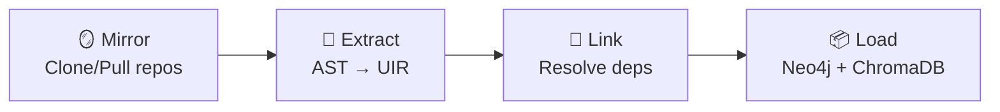

# CodeNexus Phase 01 — Implementation Plan

> **Document Version**: 1.0  
> **Date**: February 27, 2026  
> **Scope**: Step-by-step implementation guide for the Knowledge Base Engine

---

## 1. Overview

This document provides the detailed implementation plan for CodeNexus Phase 01. It specifies every file to be created, the technical approach for each component, and the verification strategy.

> [!TIP]
> Refer to [ARCHITECTURE.md](file:///c:/Users/Binulawso2/Desktop/nexus/docs/ARCHITECTURE.md) for system diagrams and [PROJECT_PROPOSAL.md](file:///c:/Users/Binulawso2/Desktop/nexus/docs/PROJECT_PROPOSAL.md) for project context.

---

## 2. Proposed Changes

### Component 1: Project Scaffolding & Infrastructure

#### [NEW] [docker-compose.yml](file:///c:/Users/Binulawso2/Desktop/nexus/docker-compose.yml)

Defines the full infrastructure stack:

| Service | Image | Ports | Purpose |
|---------|-------|-------|---------|
| `neo4j` | `neo4j:5.x` + APOC plugin | 7474 / 7687 | Structural graph (long-term memory) |
| `chromadb` | `chromadb/chroma:latest` | 8000 | Semantic vector store |
| `redis` | `redis:7-alpine` | 6379 | Short-term agent scratchpad |

Key configuration:
- Neo4j: APOC enabled via `NEO4J_PLUGINS=["apoc"]`, auth configured
- Persistent named volumes for all three stores
- Health checks with retry policies
- Shared Docker network `codenexus`

#### [NEW] [requirements.txt](file:///c:/Users/Binulawso2/Desktop/nexus/requirements.txt)

```
tree-sitter>=0.22.0
tree-sitter-java>=0.23.0
neo4j>=5.19.0
chromadb>=0.5.0
sentence-transformers>=2.7.0
redis>=5.0.0
click>=8.1.0
pyyaml>=6.0
lxml>=5.0.0
gitpython>=3.1.0
pydantic>=2.7.0
pydantic-settings>=2.2.0
pytest>=8.0.0
python-dotenv>=1.0.0
```

#### [NEW] [settings.py](file:///c:/Users/Binulawso2/Desktop/nexus/config/settings.py)

Pydantic `BaseSettings` class loading from `.env`:

| Variable | Default | Purpose |
|----------|---------|---------|
| `NEO4J_URI` | `bolt://localhost:7687` | Neo4j connection |
| `NEO4J_USER` | `neo4j` | Auth username |
| `NEO4J_PASSWORD` | `codenexus` | Auth password |
| `CHROMA_HOST` | `localhost` | ChromaDB host |
| `CHROMA_PORT` | `8000` | ChromaDB port |
| `REDIS_URL` | `redis://localhost:6379` | Redis connection |
| `REPOS_MIRROR_PATH` | `./mirror` | Git clone directory |
| `EMBEDDING_MODEL` | `all-MiniLM-L6-v2` | HuggingFace model |

---

### Component 2: Java AST & Javadoc Parser (Tree-sitter)

#### [NEW] [uir.py](file:///c:/Users/Binulawso2/Desktop/nexus/parsers/uir.py)

Pydantic models defining the **Universal Intermediate Representation**:

- `Parameter(name, type_name)` — Method/function parameter
- `LogicUnit(geid, fqn, kind, parameters, return_type, body_text, docstring, calls, file_path, start_line, end_line)` — Single method or function
- `Component(geid, fqn, kind, implements, extends, logic_units, file_path, start_line)` — Class, interface, enum, or annotation type
- `Module(geid, name, language, components, dependencies)` — Maven artifact
- `Project(geid, name, url, branch, modules)` — Single repository

GEID generation: `sha256(f"{repo_name}::{fqn}")[:16]`

#### [NEW] [base_parser.py](file:///c:/Users/Binulawso2/Desktop/nexus/parsers/base_parser.py)

Abstract base class with two methods:

```python
class BaseParser(ABC):
    @abstractmethod
    def parse_file(self, file_path: Path, repo_name: str, package: str) -> list[Component]: ...

    @abstractmethod
    def parse_project(self, project_root: Path, repo_name: str) -> Project: ...
```

#### [NEW] [java_parser.py](file:///c:/Users/Binulawso2/Desktop/nexus/parsers/java_parser.py)

**Tree-sitter S-expressions** used for extraction:

| Pattern | Extracts |
|---------|----------|
| `(class_declaration name: (identifier) @name)` | Class names → `Component(kind="class")` |
| `(interface_declaration name: (identifier) @name)` | Interface names → `Component(kind="interface")` |
| `(method_declaration name: (identifier) @name)` | Method declarations → `LogicUnit(kind="method")` |
| `(method_invocation name: (identifier) @name)` | Call targets → `LogicUnit.calls[]` |
| `(superclass (type_identifier) @name)` | Inheritance → `Component.extends` |
| `(super_interfaces (type_list (type_identifier) @name))` | Implementations → `Component.implements[]` |
| `(package_declaration (scoped_identifier) @pkg)` | Package name for FQN construction |

Also parses `pom.xml` using `lxml.etree` for:
- `groupId`, `artifactId`, `version` → Module metadata
- `<dependency>` elements → `Module.dependencies[]`

#### [NEW] [javadoc_parser.py](file:///c:/Users/Binulawso2/Desktop/nexus/parsers/javadoc_parser.py)

Dedicated parser for extracting structured Javadoc documentation:

| Extraction | Source | Output |
|---|---|---|
| Description block | `/** ... */` before methods/classes | `LogicUnit.docstring` or `Component.docstring` |
| `@param` tags | `@param name description` | Enriches `Parameter` with documentation |
| `@return` tag | `@return description` | Stored as `LogicUnit.return_doc` |
| `@throws` / `@exception` | `@throws ExceptionType desc` | Stored as `LogicUnit.throws_doc[]` |
| `@see` references | `@see OtherClass#method` | Adds potential `[:CALLS]` hints |
| `@deprecated` | `@deprecated reason` | Stored as `LogicUnit.deprecated` flag |
| Inline `{@link}` / `{@code}` | Within any Javadoc block | Extracted for cross-reference resolution |

Uses Tree-sitter `block_comment` nodes filtered by `/**` prefix, then regex for tag extraction.

---

### Component 3: Neo4j Graph Schema & Loader

#### [NEW] [schema.py](file:///c:/Users/Binulawso2/Desktop/nexus/graph/schema.py)

Creates constraints and indexes on startup:

```cypher
-- Uniqueness constraints (one per node type)
CREATE CONSTRAINT project_geid IF NOT EXISTS FOR (p:Project) REQUIRE p.geid IS UNIQUE;
CREATE CONSTRAINT module_geid IF NOT EXISTS FOR (m:Module) REQUIRE m.geid IS UNIQUE;
CREATE CONSTRAINT component_geid IF NOT EXISTS FOR (c:Component) REQUIRE c.geid IS UNIQUE;
CREATE CONSTRAINT logicunit_geid IF NOT EXISTS FOR (l:LogicUnit) REQUIRE l.geid IS UNIQUE;

-- Lookup indexes for cross-referencing
CREATE INDEX component_fqn IF NOT EXISTS FOR (c:Component) ON (c.fqn);
CREATE INDEX logicunit_fqn IF NOT EXISTS FOR (l:LogicUnit) ON (l.fqn);
CREATE INDEX module_name IF NOT EXISTS FOR (m:Module) ON (m.name);
```

#### [NEW] [loader.py](file:///c:/Users/Binulawso2/Desktop/nexus/graph/loader.py)

Three-phase bulk loading:

**Phase 1 — Nodes** (idempotent MERGE):
```cypher
UNWIND $batch AS item
MERGE (n:LogicUnit {geid: item.geid})
SET n.fqn = item.fqn, n.kind = item.kind, n.file_path = item.file_path,
    n.start_line = item.start_line, n.end_line = item.end_line
```

**Phase 2 — Hierarchy Edges**:
```cypher
UNWIND $batch AS item
MATCH (parent {geid: item.parent_geid})
MATCH (child {geid: item.child_geid})
MERGE (parent)-[:DECLARES]->(child)
```

**Phase 3 — Cross-reference Edges** (APOC batched):
```cypher
CALL apoc.periodic.iterate(
  'MATCH (a:LogicUnit) WHERE size(a._calls_fqn) > 0 RETURN a',
  'UNWIND a._calls_fqn AS target_fqn
   MATCH (b:LogicUnit {fqn: target_fqn})
   MERGE (a)-[:CALLS]->(b)',
  {batchSize: 500, parallel: false}
)
```

#### [NEW] [queries.py](file:///c:/Users/Binulawso2/Desktop/nexus/graph/queries.py)

Reusable Cypher query templates:

| Query Function | Purpose | Cypher Pattern |
|---|---|---|
| `blast_radius(geid, depth)` | Find all affected nodes N-hops out | `MATCH (n {geid})-[*1..N]->(m) RETURN m` |
| `find_implementors(interface_fqn)` | Classes implementing an interface | `MATCH (c)-[:IMPLEMENTS]->(i {fqn}) RETURN c` |
| `find_dangling_calls()` | Calls to non-existent FQNs | `MATCH (a:LogicUnit) WHERE ... NOT EXISTS ...` |
| `dependency_chain(src, tgt)` | Shortest module dependency path | `shortestPath((a:Module)-[:DEPENDS_ON*]-(b:Module))` |
| `get_stats()` | Node/edge count summary | `MATCH (n) RETURN labels(n), count(n)` |

---

### Component 4: ChromaDB Semantic Store

#### [NEW] [chunker.py](file:///c:/Users/Binulawso2/Desktop/nexus/vectorstore/chunker.py)

Functional chunking — never splits by character count:

| Chunk Type | Source Field | Use Case |
|---|---|---|
| `logic_chunk` | `LogicUnit.body_text` | "Find code similar to this function" |
| `intent_chunk` | `LogicUnit.docstring` + inline comments | "Where is the token validation logic?" |

Each chunk carries GEID + FQN + file path metadata for the graph bridge.

#### [NEW] [embedder.py](file:///c:/Users/Binulawso2/Desktop/nexus/vectorstore/embedder.py)

- Uses `sentence-transformers` with `all-MiniLM-L6-v2` (384-dimensional, CPU-friendly)
- Creates two ChromaDB collections:
  - `code_logic` — Function body embeddings
  - `code_intent` — Docstring/comment embeddings
- Supports incremental upsert by GEID (no full re-index needed)
- Batch embedding with configurable batch size (default: 100)

---

### Component 5: Cross-Repo Linker

#### [NEW] [dependency_resolver.py](file:///c:/Users/Binulawso2/Desktop/nexus/linker/dependency_resolver.py)

| Build System | Parse Strategy | Output |
|---|---|---|
| **Maven** (`pom.xml`) | `lxml.etree` → extract `<dependency>` elements | `(ModuleA)-[:DEPENDS_ON {scope}]->(ModuleB)` |
| **Gradle** (`build.gradle`) | Regex-based `implementation`/`api` extraction (basic) | `(ModuleA)-[:DEPENDS_ON]->(ModuleB)` |

Resolution logic:
1. Parse all build files across all repos
2. Build a global module registry: `{artifactId → module_geid}`
3. Match each dependency to a known module in the registry
4. Create `[:DEPENDS_ON]` edges for resolved dependencies
5. Log unresolved dependencies for debugging

#### [NEW] [api_bridge.py](file:///c:/Users/Binulawso2/Desktop/nexus/linker/api_bridge.py)

Two-pass detection:

1. **Registration Pass**: Scan all Java files for `@RequestMapping` / `@GetMapping` / `@PostMapping` annotations → build endpoint registry
2. **Detection Pass**: Scan all Java files for `RestTemplate`, `WebClient`, or `FeignClient` calls → extract URL patterns
3. **Matching**: Compare URL patterns against registered endpoints → create `[:REMOTE_CALLS]` edges with `protocol`, `method`, and `path` properties

#### [NEW] [cross_repo.py](file:///c:/Users/Binulawso2/Desktop/nexus/linker/cross_repo.py)

Orchestrator that runs:
1. `dependency_resolver.resolve_all(projects)` → build dependency edges
2. `api_bridge.detect_bridges(projects)` → build remote call edges
3. Report summary: resolved deps, unresolved deps, detected bridges

---

### Component 6: Ingestion Pipeline & CLI

#### [NEW] [mirror.py](file:///c:/Users/Binulawso2/Desktop/nexus/pipeline/mirror.py)

Git repository manager:
- Reads `repos.yaml` manifest (`url`, `branch`, `name` per repo)
- Shallow clones new repos (`depth=1` for speed)
- Pulls existing repos to latest
- Returns list of local paths for parser consumption

#### [NEW] [orchestrator.py](file:///c:/Users/Binulawso2/Desktop/nexus/pipeline/orchestrator.py)

The 4-stage Data Factory:



- Each stage returns a typed result object with metrics
- `--repo` flag processes a single repo (incremental)
- `--stage` flag starts from a specific stage (skip mirror for local repos)
- Logs per-stage timing and counts

#### [NEW] [cli.py](file:///c:/Users/Binulawso2/Desktop/nexus/pipeline/cli.py)

Click-based CLI:

```bash
# Full pipeline
nexus ingest --config repos.yaml

# Individual stages
nexus mirror --config repos.yaml
nexus parse --repo java-sample
nexus link
nexus load

# Validation
nexus validate --check dangling-calls
nexus validate --check graph-vector-sync
nexus validate --check known-dependency "ModuleA" "ModuleC" --hops 3

# Info
nexus stats   # Node/relationship/vector counts
```

---

## 3. Sample Test Fixtures

#### [NEW] [sample_repos/java-sample/](file:///c:/Users/Binulawso2/Desktop/nexus/sample_repos/java-sample/)

Minimal Java Maven project:
- `pom.xml` with dependencies on `shared-lib`
- `UserService.java` — class implementing `IUserService` interface
- `TokenValidator.java` — class with documented `validate()` method
- `IUserService.java` — interface declaration

#### [NEW] [sample_repos/repos.yaml](file:///c:/Users/Binulawso2/Desktop/nexus/sample_repos/repos.yaml)

```yaml
repositories:
  - name: java-sample
    path: ./sample_repos/java-sample
    language: java
    branch: main
  - name: java-shared-lib
    path: ./sample_repos/java-shared-lib
    language: java
    branch: main
```

---

## 4. Verification Plan

### 4.1 Automated Tests (pytest)

| Test File | Validates |
|---|---|
| `test_java_parser.py` | Java class/interface/enum/method extraction, FQN correctness, call graph |
| `test_javadoc_parser.py` | Javadoc tag extraction (`@param`, `@return`, `@throws`), inline links |
| `test_graph_loader.py` | Neo4j node creation, constraint enforcement, relationship edges |
| `test_embedder.py` | ChromaDB collection creation, GEID metadata, semantic search recall |
| `test_linker.py` | `pom.xml` Maven dependency resolution, API endpoint detection |
| `test_pipeline.py` | End-to-end: sample repos → full pipeline → graph + vector validation |

```bash
cd c:\Users\Binulawso2\Desktop\nexus
pip install -e ".[dev]"
pytest tests/ -v --tb=short
```

### 4.2 Docker Integration Test

```bash
# 1. Start infrastructure
docker-compose up -d

# 2. Wait for health checks
docker-compose ps  # All services should show "healthy"

# 3. Run full pipeline
python -m pipeline.cli ingest --config sample_repos/repos.yaml

# 4. Validate
python -m pipeline.cli validate --check dangling-calls
python -m pipeline.cli validate --check graph-vector-sync
python -m pipeline.cli stats
```

### 4.3 Manual Verification

**Neo4j Browser** (`http://localhost:7474`):
```cypher
-- Node counts
MATCH (n) RETURN labels(n), count(n);

-- Relationship counts  
MATCH ()-[r]->() RETURN type(r), count(r);

-- Visualize 3-hop call graph
MATCH p=(a:LogicUnit)-[:CALLS*1..3]->(b:LogicUnit) RETURN p LIMIT 25;

-- Verify cross-repo dependency
MATCH p=shortestPath((a:Module {name:"java-sample"})-[:DEPENDS_ON*]-(b:Module {name:"shared-lib"}))
RETURN p;
```

**ChromaDB Semantic Search**:
```python
import chromadb
client = chromadb.HttpClient(host="localhost", port=8000)
col = client.get_collection("code_intent")
results = col.query(query_texts=["token validation logic"], n_results=5)
# Should return TokenValidator.validate() as top result
```

> [!IMPORTANT]
> Docker Desktop must be running on the machine before starting the integration test.

---

## 5. Phase 2 — End-to-End Flow Extraction & Global Rollup

> **Added**: Phase 2 upgrades the pipeline to extract, synthesise, and store
> the "End-to-End Story" of all indexed repositories.

### Task 1 — SQL Schema & Configuration Parsers

#### [NEW] [parsers/sql_schema_parser.py](../parsers/sql_schema_parser.py)

Scans `dbscripts/` folders for `CREATE TABLE` DDL statements.

| Output | Description |
|---|---|
| `DatabaseTableInfo` | `{name, repo_name, file_path, columns}` → `DatabaseTable` Neo4j nodes |
| `TableQueryEdge` | `{component_fqn, table_name}` → `QUERIES_TABLE` edges |

Detection: Regex-based `CREATE TABLE` extraction + DAO class pattern matching.

#### [NEW] [parsers/config_parser.py](../parsers/config_parser.py)

Parses WSO2 `deployment.toml`, `repository/conf/*.xml`, and `application.yml`.

| Output | Description |
|---|---|
| `ConfigurationInfo` | `{config_key, config_type, source_file, repo_name}` → `Configuration` Neo4j nodes |
| `ConfigReadEdge` | `{component_fqn, config_key}` → `READS_CONFIG` edges |

#### Schema additions (graph/schema.py)
- Constraint: `DatabaseTable.name` UNIQUE
- Constraint: `Configuration.config_key` UNIQUE
- Index: `DatabaseTable.repo_name`
- Index: `Configuration.config_type`

---

### Task 2 — EntryPoint / DataSink Tagging

#### [NEW] [graph/tagger.py](../graph/tagger.py)

Tags Neo4j nodes with secondary labels:

| Label | Detection criteria |
|---|---|
| `:EntryPoint` | `@RequestMapping`, `@Path`, `HttpServlet`, Servlet/Controller/Endpoint/Resource FQN patterns |
| `:DataSink` | `@Repository`, DAO/Repository class patterns, `QUERIES_TABLE` edges, SQL execution methods |

Purely Cypher-based — no LLM. Runs after Leiden community summarisation.

---

### Task 3 — GDS Dijkstra Flow Extraction

#### [NEW] [graph/flow_extractor.py](../graph/flow_extractor.py)

Uses GDS Dijkstra Shortest Path for EntryPoint→DataSink execution flow extraction.

**Algorithm:**
1. Project execution-flow edges (CALLS, INJECTS, IMPLEMENTS, OVERRIDES, REMOTE_CALLS) into GDS graph `nexus-flow-graph`
2. Query all `:EntryPoint` and `:DataSink` nodes
3. For each pair: `gds.shortestPath.dijkstra.stream` — O(E log V) per path
4. Enrich paths with `READS_CONFIG` config keys and `QUERIES_TABLE` table names
5. Return `FlowPath` objects

**NO brute-force `*1..6` expansion.** Pure GDS algorithmic approach.

---

### Task 4 — Flow Narrative Generation

#### [NEW] [reasoning/flow_summarizer.py](../reasoning/flow_summarizer.py)

Generates natural-language "End-to-End Architectural Stories" from `FlowPath` objects.

- Parallel LLM calls via `ThreadPoolExecutor`
- Stored in ChromaDB `flow_narratives` collection
- Each narrative describes: business process, data transformations, services crossed, tables written to, config keys consulted

---

### Task 5 — Global GraphRAG Rollup

#### [NEW] [community/global_rollup.py](../community/global_rollup.py)

Microsoft GraphRAG hierarchical rollup:

```
Level 1: Leiden Community Summaries (existing)
    └─ individual clusters of tightly-coupled code
Level 2: Sub-System Summaries (new)
    └─ 11 domains: Authentication, OAuth2, SCIM, Federation,
       Session, Consent, DCR, Discovery, CIBA, Token Exchange, Utility
Level 3: Global Architecture Summary (new)
    └─ Single master document covering the entire codebase
```

**ChromaDB collections:** `l2_subsystem_summaries`, `l3_global_architecture`

**Query routing (Route D):** When a user asks "What is the overarching architecture?",
the router (confidence 0.95) returns the L3 summary directly — no vector search needed.

---

### Integration Summary

| Modified file | Changes |
|---|---|
| `graph/schema.py` | +2 constraints, +2 indexes for DatabaseTable/Configuration |
| `graph/loader.py` | +4 methods: load_database_tables, load_queries_table_edges, load_configuration_nodes, load_reads_config_edges |
| `graph/__init__.py` | Exports NodeTagger, FlowExtractor |
| `parsers/__init__.py` | Exports SQLSchemaParser, ConfigurationParser |
| `community/__init__.py` | Exports GlobalRollup |
| `reasoning/router.py` | Route D (global), _GLOBAL_KEYWORDS, _global_route() |
| `pipeline/orchestrator.py` | 5 new post-processing stages after Leiden |
