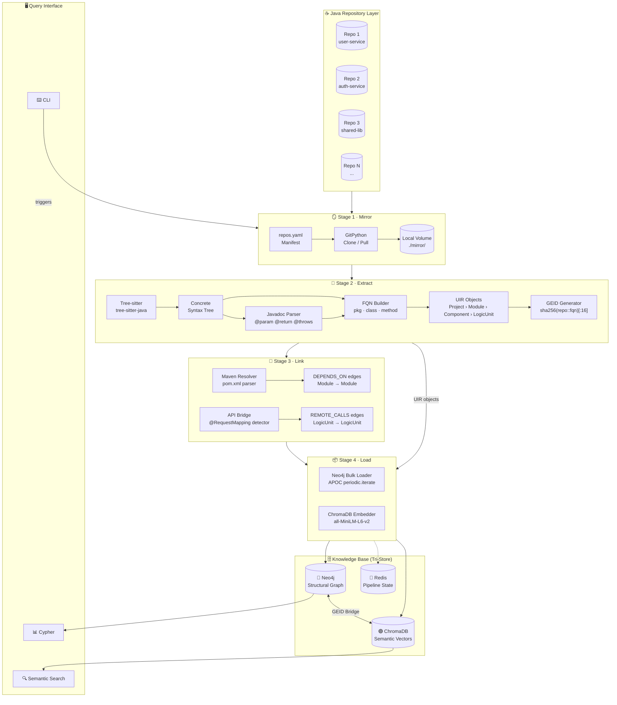

# CodeNexus Phase 01 — Architecture Diagram Explained

> **Document Version**: 1.0  
> **Date**: February 27, 2026  
> **Purpose**: A plain-English walkthrough of every component in the Phase 01 system architecture diagram

---

## The Diagram



---

## Layer-by-Layer Explanation

---

### ☕ Java Repository Layer — "The Input"

```
R1: Repo 1 (user-service)
R2: Repo 2 (auth-service)
R3: Repo 3 (shared-lib)
RN: Repo N  (...)
```

**What it is:**  
These are your actual Java microservices and libraries hosted on GitHub, GitLab, or any Git server. They are the **raw input** to the system. Nothing has been analyzed yet at this point.

**Why multiple repos:**  
Enterprise systems don't live in one repo. `user-service` might call `auth-service`, which uses classes from `shared-lib`. Understanding how they connect is the whole point of Phase 01.

**What does NOT happen here:**  
The system does not scan GitHub live. It pulls a local copy first (Stage 1). This ensures the pipeline runs on a stable snapshot.

---

### 🪞 Stage 1 — Mirror: "Get the Code Locally"

```
repos.yaml → GitPython (Clone/Pull) → Local Volume ./mirror/
```

**What it is:**  
The Mirror stage creates and maintains a **local copy of every repository** on disk.

**Components:**

| Component | What it does |
|-----------|-------------|
| `repos.yaml` | A manifest file listing every repo URL, branch, and name to index |
| `GitPython` | Python library that runs `git clone` (first time) or `git pull` (subsequent runs) |
| `Local Volume ./mirror/` | The disk location where all repos are stored: `./mirror/user-service/`, `./mirror/auth-service/` etc. |

**Example repos.yaml:**
```yaml
repositories:
  - name: user-service
    url: https://github.com/org/user-service
    branch: main
  - name: auth-service
    url: https://github.com/org/auth-service
    branch: main
  - name: shared-lib
    url: https://github.com/org/shared-lib
    branch: main
```

**Key design choice:** Shallow clones (`depth=1`) are used for speed. Only the latest commit snapshot is needed — full git history is irrelevant for code indexing.

**Output of this stage:** All `.java` files from all repos are now accessible locally.

---

### 🔬 Stage 2 — Extract: "Understand the Code"

```
Tree-sitter → AST → FQN Builder
                ↘
             Javadoc Parser → FQN Builder → UIR Objects → GEID
```

This is the most complex stage. It has **two parallel parsing paths** that both feed into the FQN Builder.

---

#### Component: Tree-sitter (`tree-sitter-java`)

**What it is:** A fast, error-tolerant parser that reads raw `.java` source files and converts them into a **Concrete Syntax Tree (CST/AST)** — a precise tree structure representing every token and construct in the file.

**What it extracts from the tree:**
- Class declarations
- Interface declarations
- Method declarations
- Method invocations (who calls who)
- Import statements
- Package declarations
- Annotations (`@Override`, `@RequestMapping`, etc.)

**Example:**  
For this Java code:
```java
package com.example.auth;

public class UserService {
    public User getUser(Long id) {
        return userRepo.findById(id);
    }
}
```
Tree-sitter produces a structured tree like:
```
(compilation_unit
  (package_declaration "com.example.auth")
  (class_declaration
    name: (identifier) "UserService"
    body: (class_body
      (method_declaration
        type: (type_identifier) "User"
        name: (identifier) "getUser"
        parameters: (formal_parameters
          (formal_parameter type: "Long" name: "id"))
        body: (block
          (return_statement
            (method_invocation
              object: "userRepo"
              name: "findById")))))))
```

---

#### Component: Javadoc Parser

**What it is:** A secondary parser that runs on the **same AST** but looks specifically for `/** ... */` block comments immediately before class and method declarations.

**What it extracts:**

| Tag | Example | Stored As |
|-----|---------|-----------|
| Description | `/** Retrieves a user by ID */` | `LogicUnit.docstring` |
| `@param` | `@param id The user's unique identifier` | `Parameter.doc` |
| `@return` | `@return The matching User object` | `LogicUnit.return_doc` |
| `@throws` | `@throws NotFoundException if user not found` | `LogicUnit.throws_doc[]` |
| `@see` | `@see UserRepository#findById` | Cross-reference hint |
| `@deprecated` | `@deprecated Use getUserById instead` | `LogicUnit.deprecated = true` |

**Why this matters:**  
The docstring is stored separately from the code body. This allows ChromaDB to create two different vectors:
1. One for **what the code does** (body text)
2. One for **what the developer intended** (Javadoc)

This enables natural language queries like *"where is the user lookup logic?"* — which finds the method through its Javadoc even if the word "lookup" never appears in the code.

---

#### Component: FQN Builder — "The Address Builder"

**What it is:** Takes the class name, package name, and method name from the AST and combines them into a **Fully Qualified Name (FQN)** — the globally unique address of every entity in the codebase.

**How FQN is built:**
```
Package:   com.example.auth
Class:     UserService
Method:    getUser
──────────────────────────────
FQN:       com.example.auth.UserService.getUser
```

**Why FQN is necessary:**  
Without it, 100 repos might all have a class named `UserService`. FQN makes every entity globally unique across all repositories.

| Short name | Problem | FQN | Unique? |
|------------|---------|-----|---------|
| `getUser` | 47 repos have this | `com.example.auth.UserService.getUser` | ✅ Yes |
| `UserService` | 23 repos have this | `com.example.auth.UserService` | ✅ Yes |

---

#### Component: UIR Objects — "The Structured Summary"

**What it is:** The UIR (Universal Intermediate Representation) is a clean Python data object that represents every parsed entity. It is the **output format of Stage 2** and the **input format for Stage 3 and Stage 4**.

**UIR hierarchy:**
```
Project
 └── Module (Maven artifact = one pom.xml)
      └── Component (Java class or interface)
           └── LogicUnit (method or constructor)
```

**Example UIR for `UserService.getUser()`:**
```json
{
  "geid": "e7d2c8a1f3b50942",
  "fqn": "com.example.auth.UserService.getUser",
  "kind": "method",
  "parameters": [
    { "name": "id", "type_name": "Long" }
  ],
  "return_type": "User",
  "body_text": "return userRepo.findById(id).orElseThrow(...);",
  "docstring": "Retrieves a user by their unique ID.",
  "return_doc": "The matching User object",
  "calls": [
    "com.example.repo.UserRepository.findById"
  ],
  "file_path": "src/main/java/com/example/auth/UserService.java",
  "start_line": 8,
  "end_line": 10
}
```

**What is NOT stored:** The complete file. Only the metadata about the method is kept.

---

#### Component: GEID Generator — "The Universal Key"

**What it is:** A deterministic function that converts an FQN into a short, unique 16-character identifier used as the primary key in both Neo4j and ChromaDB.

**Formula:**
```python
geid = sha256(f"{repo_name}::{fqn}")[:16]
# Example:
geid = sha256("user-service::com.example.auth.UserService.getUser")[:16]
# Result: "e7d2c8a1f3b50942"
```

**Why not just use the FQN directly as a key?**

| | FQN as key | GEID as key |
|--|------------|-------------|
| Length | 50–80 chars | 16 chars always |
| DB index speed | Slower | Fast |
| Consistent across re-runs | ✅ Yes | ✅ Yes |
| Safe in all DB constraints | Sometimes fails | ✅ Always safe |

**The critical property:** Running the same FQN through this formula always produces the same GEID. So if you re-index the codebase tomorrow, `getUser` gets the same GEID — enabling safe `MERGE` (upsert) operations in Neo4j and ChromaDB.

---

### 🔗 Stage 3 — Link: "Connect the Repos"

```
pom.xml → Maven Resolver → DEPENDS_ON edges
@RequestMapping → API Bridge → REMOTE_CALLS edges
```

**What it is:** Stage 3 resolves **cross-repository relationships** that Stage 2 couldn't detect (because Stage 2 only looks at one file at a time).

---

#### Component: Maven Resolver

**What it is:** Parses every `pom.xml` file in every repo and creates **DEPENDS_ON** graph edges between Maven modules.

**Example:**  
`user-service/pom.xml` contains:
```xml
<dependency>
    <groupId>com.example</groupId>
    <artifactId>shared-lib</artifactId>
    <version>2.1.0</version>
</dependency>
```

Maven Resolver:
1. Reads this dependency declaration
2. Looks up `shared-lib` in the module registry (built from all indexed repos)
3. Creates the edge: `(user-service) -[:DEPENDS_ON {scope:"compile", version:"2.1.0"}]-> (shared-lib)`

This means the graph now knows that if `shared-lib` changes a public API, `user-service` is potentially broken.

---

#### Component: API Bridge Detector

**What it is:** Detects when one Java service makes an HTTP call to an endpoint defined in another Java service, and records this as a `REMOTE_CALLS` relationship.

**Two-pass process:**

**Pass 1 — Register endpoints** (scan all Java files for Spring annotations):
```java
@RestController
public class UserController {
    @GetMapping("/api/users/{id}")      ← REGISTERED: GET /api/users/{id}
    public User getUser(@PathVariable Long id) { ... }
}
```

**Pass 2 — Detect calls** (scan for RestTemplate/FeignClient/WebClient usage):
```java
// In OrderService:
User user = restTemplate.getForObject(
    "http://user-svc/api/users/" + userId, User.class
);                  ← DETECTED: GET /api/users/{id}
```

**Matching:**  
`/api/users/{id}` == `/api/users/{id}` → match found!

**Edge created:**
```
(OrderService.placeOrder) -[:REMOTE_CALLS {
    protocol: "REST",
    method: "GET",
    path: "/api/users/{id}"
}]-> (UserController.getUser)
```

**Why this matters:**  
Now the graph knows that `OrderService` depends on `UserController.getUser()` at runtime — even though there's no compile-time import linking them. This is cross-service blast radius detection.

---

### 📦 Stage 4 — Load: "Write to the Knowledge Base"

```
Neo4j Bulk Loader ──→ Neo4j
ChromaDB Embedder ──→ ChromaDB
                 ··→ Redis (state)
```

**What it is:** Takes all UIR objects from Stage 2 and all edges from Stage 3, and persists them into the permanent knowledge stores.

---

#### Component: Neo4j Bulk Loader (APOC periodic.iterate)

**What it is:** Writes all nodes and relationships into Neo4j using APOC's batch processing to handle millions of records without running out of memory.

**Three sub-phases:**

**Phase 1 — Nodes** (idempotent upsert):
```cypher
UNWIND $batch AS item
MERGE (n:LogicUnit {geid: item.geid})
SET n.fqn = item.fqn,
    n.kind = item.kind,
    n.file_path = item.file_path,
    n.start_line = item.start_line,
    n.end_line = item.end_line
```
`MERGE` = create if not exists, update if exists. Safe to re-run.

**Phase 2 — Hierarchy edges:**
```cypher
-- Component → LogicUnit
MATCH (c:Component {geid: $comp_geid})
MATCH (l:LogicUnit {geid: $lu_geid})
MERGE (c)-[:HAS_METHOD]->(l)
```

**Phase 3 — Call graph edges** (APOC batch):
```cypher
CALL apoc.periodic.iterate(
  'MATCH (a:LogicUnit) WHERE size(a._calls_fqn) > 0 RETURN a',
  'UNWIND a._calls_fqn AS target_fqn
   MATCH (b:LogicUnit {fqn: target_fqn})
   MERGE (a)-[:CALLS]->(b)',
  {batchSize: 500}
)
```

---

#### Component: ChromaDB Embedder (all-MiniLM-L6-v2)

**What it is:** Converts method bodies and Javadoc text into mathematical vectors and stores them in ChromaDB for semantic search.

**Two collections created:**

| Collection | Input text | Purpose |
|------------|-----------|---------|
| `code_logic` | Full method body | "Find code that does X" |
| `code_intent` | Javadoc description | "Find code that means X" |

**Embedding process:**
```
"Retrieves a user by their unique ID."
         ↓  (all-MiniLM-L6-v2 model)
[0.023, -0.147, 0.891, 0.034, ... ]   ← 384 numbers
         ↓
Stored in ChromaDB with metadata:
{
  "geid": "e7d2c8a1f3b50942",
  "fqn": "com.example.auth.UserService.getUser",
  "chunk_type": "intent_chunk",
  "language": "java",
  "file_path": "...",
  "start_line": 8
}
```

The model converts natural language (or code) into numbers that capture **meaning** — similar concepts end up near each other in this 384-dimensional space.

---

### 🗄️ Knowledge Base — "The Tri-Store"

The three permanent storage systems that power the knowledge base:

---

#### 🔷 Neo4j — Structural Graph

**What it stores:**  
The complete structural map of all Java code as a property graph:

```
Nodes:         Project, Module, Component, LogicUnit
Relationships: CALLS, IMPLEMENTS, EXTENDS, DEPENDS_ON, REMOTE_CALLS
```

**Example graph for user-service:**
```
(user-service:Project)
    └─[:CONTAINS]→ (user.auth:Module)
         └─[:DECLARES]→ (UserService:Component)
              └─[:HAS_METHOD]→ (getUser:LogicUnit)
                   └─[:CALLS]→ (UserRepository.findById:LogicUnit)

(UserService)-[:IMPLEMENTS]→ (IUserService:Component)
(user-service)-[:DEPENDS_ON]→ (shared-lib:Module)
```

**What you can query:**
```cypher
-- "What breaks if getUser() changes?"
MATCH (changed:LogicUnit {fqn:"com.example.auth.UserService.getUser"})
      <-[:CALLS*1..5]-(caller:LogicUnit)
RETURN caller.fqn, caller.file_path

-- "What does user-service depend on?"
MATCH path = (m:Module {name:"user-service"})-[:DEPENDS_ON*1..3]->(dep)
RETURN path

-- "Who implements IUserService?"
MATCH (c:Component)-[:IMPLEMENTS]->(:Component {fqn:"com.example.IUserService"})
RETURN c.fqn
```

---

#### 🟣 ChromaDB — Semantic Vectors

**What it stores:**  
384-dimensional vector embeddings of every method body and Javadoc comment.

**What you can query:**
```python
# "Where is the token validation logic?"
results = collection.query(
    query_texts=["validate JWT token and check expiry"],
    n_results=5
)
# Returns: TokenValidator.validate(), JwtFilter.doFilter(), etc.
```

**The result includes the GEID** — so you instantly know which Neo4j node to jump to next.

---

#### 🔴 Redis — Pipeline State

**What it stores:**  
Temporary job state while the pipeline is running:
```
{stage: "extract", repo: "auth-service", status: "running", started_at: 1234567890}
{stage: "load", repo: "user-service", status: "done", duration_ms: 4230}
```

**What it does NOT do:**  
Redis is NOT used for permanent storage. It's a scratchpad — cleared after each pipeline run. In Phase 02, it becomes the communication channel between autonomous AI agents.

---

#### ↔ The GEID Bridge

The double-headed arrow between Neo4j and ChromaDB represents the most important design feature: **every entity in both stores shares the same 16-character GEID**.

```
Semantic search in ChromaDB:
  "token validation logic" → returns vector → metadata.geid = "e7d2c8a1"

Immediately query Neo4j:
  MATCH (n {geid: "e7d2c8a1"})<-[:CALLS*1..5]-(caller) RETURN caller

Result: Every method that transitively calls the token validator
```

No join tables. No string matching. Just one GEID.

---

### 🖥️ Query Interface — "How You Use the Knowledge Base"

Three ways to interact with the populated knowledge base:

| Interface | Command / Usage | Best For |
|-----------|----------------|----------|
| **⌨️ CLI** | `nexus ingest`, `nexus validate`, `nexus stats` | Running/managing the pipeline |
| **📊 Cypher** | Graph pattern queries via Neo4j Browser or API | Structural analysis (blast radius, deps) |
| **🔍 Semantic Search** | Natural language queries via ChromaDB Python client | Intent-based code discovery |

The **CLI** is also the trigger for the entire pipeline — running `nexus ingest` is what kicks off Stage 1.

---

## The Complete Data Flow — End to End

```
Developer runs:
  nexus ingest --config repos.yaml
          │
          ▼
┌─────────────────────────────────────────────┐
│ Stage 1: Mirror                             │
│  repos.yaml → git clone/pull → ./mirror/   │
└──────────────────────┬──────────────────────┘
                       │ .java files
                       ▼
┌─────────────────────────────────────────────┐
│ Stage 2: Extract                            │
│  Tree-sitter → AST → FQN → UIR → GEID      │
│  Javadoc Parser → docstrings → UIR          │
└──────────┬──────────────────────────────────┘
           │ UIR objects (in memory)
           ▼
┌─────────────────────────────────────────────┐
│ Stage 3: Link                               │
│  pom.xml → DEPENDS_ON edges                 │
│  @RequestMapping → REMOTE_CALLS edges       │
└──────────┬──────────────────────────────────┘
           │ Enriched UIR + edge definitions
           ▼
┌─────────────────────────────────────────────┐
│ Stage 4: Load                               │
│  Neo4j Bulk Loader → Nodes + Relationships  │
│  ChromaDB Embedder → Vectors (384-dim)      │
│  Redis → Job state (transient)              │
└──────────┬──────────────────────────────────┘
           │
     ┌─────┴──────┐
     ▼            ▼
  Neo4j        ChromaDB
  Graph        Vectors
  (GEID) ←──→ (GEID)
     │            │
     ▼            ▼
  Cypher      Semantic
  Queries     Search
```

**Total pipeline time for 10 Java repos:** ~3–5 minutes (first full index)  
**Incremental update (1 repo changed):** ~15–30 seconds

---

## Summary Table

| Component | Layer | Technology | Stores | Purpose |
|-----------|-------|-----------|--------|---------|
| `repos.yaml` | Input | YAML | — | Repo manifest |
| `GitPython` | Stage 1 | Python | `./mirror/` | Clone/pull repos |
| `tree-sitter-java` | Stage 2 | C + Python | — | Parse .java → AST |
| Javadoc Parser | Stage 2 | Python + regex | — | Extract doc comments |
| FQN Builder | Stage 2 | Python | — | Build unique method addresses |
| UIR Objects | Stage 2 | Pydantic models | Memory | Structured code summary |
| GEID Generator | Stage 2 | SHA-256 hash | — | Unique 16-char key |
| Maven Resolver | Stage 3 | lxml | — | Cross-repo build deps |
| API Bridge | Stage 3 | Python + regex | — | REST call detection |
| APOC Loader | Stage 4 | Neo4j APOC | Neo4j | Bulk graph insert |
| HuggingFace Embedder | Stage 4 | sentence-transformers | ChromaDB | Semantic vector insert |
| **Neo4j** | Knowledge Base | Graph DB | Permanent | Structural relationships |
| **ChromaDB** | Knowledge Base | Vector DB | Permanent | Semantic meaning |
| **Redis** | Knowledge Base | Key-Value | Transient | Pipeline job state |
| CLI | Query | Click (Python) | — | Pipeline trigger + validation |
| Cypher | Query | Neo4j query language | — | Structural graph queries |
| Semantic Search | Query | ChromaDB Python client | — | Natural language code discovery |
