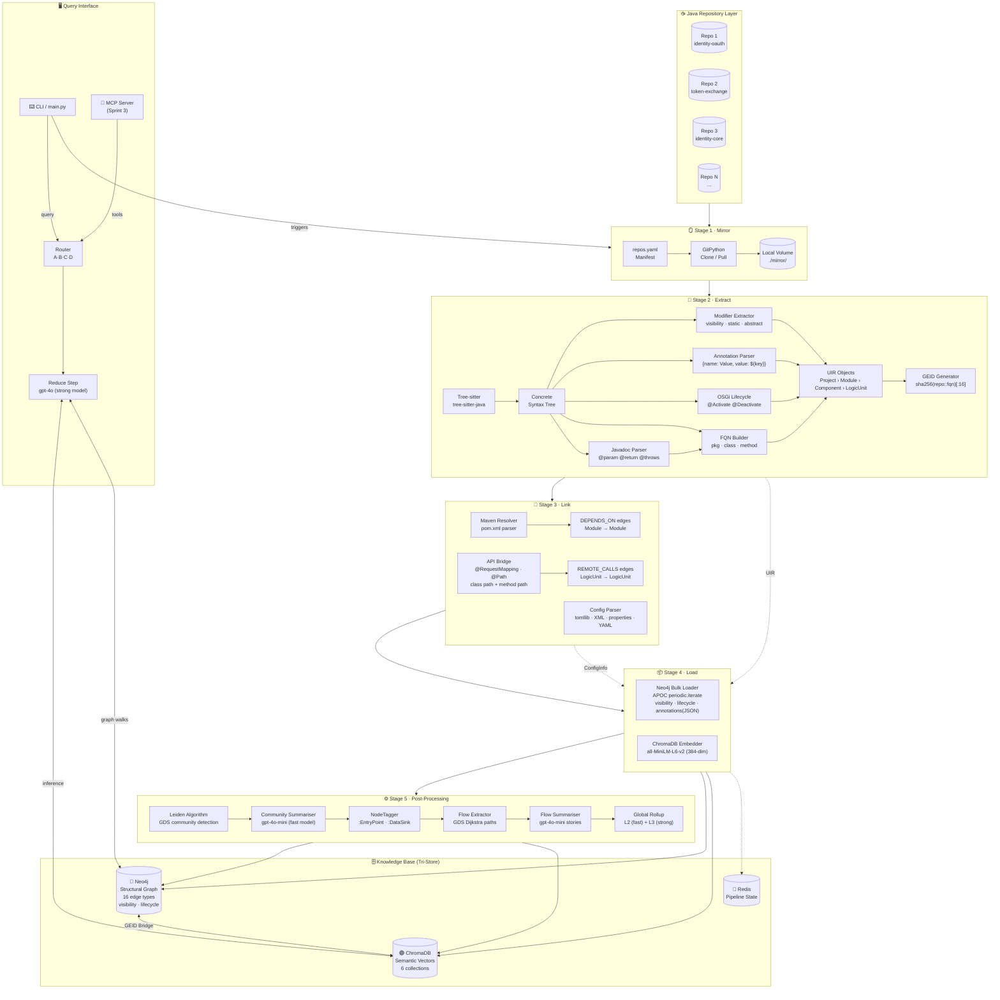

# CodeNexus — Architecture Diagram Explained

> **Document Version**: 2.0
> **Last Updated**: March 2026
> **Purpose**: A plain-English walkthrough of every component in the system architecture

---

## The Full Pipeline Diagram



---

## Layer-by-Layer Explanation

---

### ☕ Java Repository Layer — "The Input"

These are your actual Java microservices hosted on GitHub or GitLab. Nothing has been
analyzed yet at this point. The system does not scan GitHub live — it pulls a local copy
first (Stage 1) to ensure a stable snapshot.

---

### 🪞 Stage 1 — Mirror: "Get the Code Locally"

```
repos.yaml → GitPython (Clone/Pull) → Local Volume ./mirror/
```

| Component | What it does |
|---|---|
| `repos.yaml` | Manifest listing every repo URL, branch, and name |
| `GitPython` | Runs `git clone` (first time) or `git pull` (subsequent) |
| `./mirror/` | Local disk location: `./mirror/identity-oauth/`, `./mirror/token-exchange/`, etc. |

**Output:** All `.java` files from all repos accessible locally.

---

### 🔬 Stage 2 — Extract: "Understand the Code"

This is the most complex stage. Multiple extraction passes run on the same Tree-sitter AST.

---

#### Component: Tree-sitter (`tree-sitter-java`)

Reads raw `.java` source files → **Concrete Syntax Tree (CST/AST)** representing every
token and construct.

**v2 Sprint 1 extracts additionally:**

| Extraction | What it finds | UIR field |
|---|---|---|
| `modifiers` child node | `public`, `private`, `static`, `abstract`, `final`, `synchronized` | `visibility`, `is_static`, etc. |
| `marker_annotation` / `annotation` nodes | Structured annotation dicts: `{"name": "Value", "value": "${key}"}` | `annotations: list[dict]` |
| `formal_parameter` annotations | `@QueryParam("client_id")`, `@PathVariable` | `Parameter.annotations` |
| OSGi annotations | `@Activate`, `@Deactivate`, `@Modified` | `lifecycle_role` |
| `lambda_expression` bodies | Calls inside `.stream().filter(x -> x.method())` | `calls[]` (previously invisible) |
| `generic_type` nodes | `List<User>`, `Map<String, Object>` | Preserved in `type_name` |

**Example Tree-sitter extraction for a public static method:**
```
(method_declaration
  (modifiers "public" "static")              ← visibility="public", is_static=True
  type: (type_identifier) "List"
  name: (identifier) "getTokens"
  parameters: (formal_parameters
    (formal_parameter
      (marker_annotation name: "QueryParam") ← annotations=[{"name":"QueryParam","value":"type"}]
      type: "String"
      name: "type"))
  body: ...)
```

---

#### Component: Javadoc Parser

Runs on the same AST, looks for `/** ... */` blocks before class/method declarations.

| Tag | Example | Stored As |
|---|---|---|
| Description | `/** Retrieves tokens by type */` | `LogicUnit.docstring` |
| `@param` | `@param type The token type filter` | `Parameter.doc` |
| `@return` | `@return List of matching access tokens` | `LogicUnit.return_doc` |
| `@throws` | `@throws OAuthSystemException if invalid type` | `LogicUnit.throws_doc[]` |

---

#### Component: Annotation Parser (`_parse_annotation`)

**New in v2 Sprint 1.** Converts tree-sitter annotation nodes into structured dicts instead
of raw strings.

| Annotation Java | Old format | New format |
|---|---|---|
| `@Override` | `"@Override"` | `{"name": "Override"}` |
| `@Value("${key}")` | `'@Value("${key}")'` | `{"name": "Value", "value": "${key}"}` |
| `@QueryParam("id")` | `'@QueryParam("id")'` | `{"name": "QueryParam", "value": "id"}` |
| `@Reference(cardinality=MANDATORY)` | `'@Reference(...)'` | `{"name": "Reference", "cardinality": "MANDATORY"}` |

This enables specific queries:
- "Find all public endpoints that accept `client_id` as a query parameter"
- "Find all OSGi @Reference dependencies with MANDATORY cardinality"
- "Find all Spring @Value injections reading the `oauth.token.lifetime` config key"

---

#### Component: OSGi Lifecycle Detector

**New in v2 Sprint 1.** Detects WSO2/OSGi lifecycle methods:

| Annotation | `lifecycle_role` set to |
|---|---|
| `@Activate` | `"activate"` |
| `@Deactivate` | `"deactivate"` |
| `@Modified` | `"modified"` |

Enables: `MATCH (n:LogicUnit {lifecycle_role: 'activate'}) RETURN n.fqn` to find all
OSGi component initialisation methods.

---

#### Component: FQN Builder — "The Address Builder"

Combines package + class + method name into a globally unique Fully Qualified Name:

```
Package:   com.wso2.carbon.identity.oauth2
Class:     OAuth2Service
Method:    getAccessToken
──────────────────────────────────────────────────────
FQN:       com.wso2.carbon.identity.oauth2.OAuth2Service.getAccessToken
```

Without FQN, 100 repos might all have a class named `OAuth2Service`. FQN makes every entity
globally unique across all repositories.

---

#### Component: UIR Objects — "The Structured Summary"

The UIR (Universal Intermediate Representation) is the output of Stage 2 and the input for
Stages 3 and 4. All parsed information flows through these Pydantic models.

**v2 UIR hierarchy:**
```
Project
 └── Module (Maven artifact = one pom.xml)
      └── Component (Java class or interface)
           │  fields: visibility, is_abstract, is_final, annotations: list[dict]
           └── LogicUnit (method or constructor)
                    fields: visibility, is_static, is_abstract, is_final,
                            is_synchronized, lifecycle_role,
                            annotations: list[dict]
                            parameters: [Parameter(annotations: list[dict])]
```

---

#### Component: GEID Generator — "The Universal Key"

```python
geid = sha256(f"{repo_name}::{fqn}")[:16]
# "identity-oauth::com.wso2.carbon.identity.oauth2.OAuth2Service.getAccessToken"
# → "a3f7b2c91e804d6a"
```

The same 16-character GEID appears in both Neo4j nodes and ChromaDB metadata.
This is the bridge between structural (graph) and semantic (vector) queries.

---

### 🔗 Stage 3 — Link: "Connect the Repos"

#### Maven Resolver

Parses every `pom.xml` → creates `DEPENDS_ON` edges between Maven modules.

```xml
<!-- identity-oauth/pom.xml -->
<dependency>
    <groupId>org.wso2.carbon.identity</groupId>
    <artifactId>identity-core</artifactId>
</dependency>
```

→ `(identity-oauth:Module)-[:DEPENDS_ON]->(identity-core:Module)`

#### API Bridge Detector

**v2 Sprint 1 improvement:** Now correctly handles JAX-RS class-level + method-level path composition.

**Old behavior (v1):** Only extracted the method-level `@Path`:
```java
@Path("/oauth2")              // class-level — was IGNORED
public class OAuth2Endpoint {
    @GET
    @Path("/token")           // method-level — was the ONLY path registered
    public Response getToken() { ... }
}
// v1 registered path: "/token"  ← WRONG
```

**New behavior (v2):** Merges class + method paths:
```
effective_path = normalize("/oauth2" + "/" + "/token")
             = "/oauth2/token"    ← CORRECT
```

Now also extracts `@Consumes(MediaType.APPLICATION_FORM_URLENCODED)` and
`@Produces(MediaType.APPLICATION_JSON)` into the endpoint registration.

#### Configuration Parser

**v2 Sprint 1 addition:** `*.properties` files now supported.
**v2 improvement:** `deployment.toml` now uses `tomllib` (Python 3.11+ stdlib) for
accurate nested table handling instead of regex.

Before (v1 regex):
```toml
[transport.https]              # was read as section "[transport.https]"
port = 9443                    # but nested tables were lost or mislabeled
```

After (v2 tomllib):
```python
data = tomllib.load(f)
# data = {"transport": {"https": {"port": 9443}}}
# → config_key = "transport.https.port"  ← correct
```

---

### 📦 Stage 4 — Load: "Write to the Knowledge Base"

#### Neo4j Bulk Loader (v2 additions)

**New properties on LogicUnit nodes:**
```cypher
MERGE (n:LogicUnit {geid: item.geid})
SET n.fqn = item.fqn,
    n.visibility = item.visibility,          -- "public"/"private"/"protected"/"package"
    n.is_static = item.is_static,            -- true/false
    n.is_abstract = item.is_abstract,
    n.is_final = item.is_final,
    n.is_synchronized = item.is_synchronized,
    n.lifecycle_role = item.lifecycle_role,  -- "activate"/"deactivate"/"modified"/""
    n.annotations = item.annotations         -- JSON string: '[{"name":"Value","value":"${key}"}]'
```

**Annotation storage:** `list[dict]` → `json.dumps()` → stored as JSON string in Neo4j property.
Query with APOC: `apoc.convert.fromJsonList(n.annotations)`.

#### ChromaDB Embedder

Two collections with 384-dimensional vectors (unchanged from v1):
- `code_logic` — method body text → "Find code that does X"
- `code_intent` — Javadoc text → "Find code intended for X"

---

### ⚙️ Stage 5 — Post-Processing

```
Leiden (GDS) → Community summaries (fast model) → EntryPoint/DataSink tagging
→ Flow extraction (GDS Dijkstra) → Flow narratives (fast model)
→ Global rollup: L2 (fast model) + L3 (strong model)
```

All LLM calls in Stage 5 use the **fast model** (gpt-4o-mini) except the L3 Global
Architecture Document which uses the **strong model** (gpt-4o) for maximum quality.

---

### 🗄️ Knowledge Base — "The Tri-Store"

#### 🔷 Neo4j — Structural Graph

Now stores the full semantic model for every Java entity:

```
(user-service:Project)
    └─[:CONTAINS]→ (identity.oauth:Module)
         └─[:DECLARES]→ (OAuth2Service:Component {visibility:"public", is_abstract:false})
              └─[:HAS_METHOD]→ (getToken:LogicUnit {
                    visibility: "public",
                    is_static: false,
                    lifecycle_role: null,
                    annotations: '[{"name":"GET"},{"name":"Path","value":"/token"}]'
                })
                   └─[:CALLS]→ (TokenIssuer.issue:LogicUnit)
```

**New security queries enabled by v2:**
```cypher
-- All public methods with @Value config injection (potential config exposure)
MATCH (n:LogicUnit {visibility: "public"})
WHERE n.annotations CONTAINS '"name": "Value"'
RETURN n.fqn LIMIT 20

-- All OSGi activation methods
MATCH (n:LogicUnit {lifecycle_role: "activate"}) RETURN n.fqn

-- All synchronized methods (concurrency-critical code)
MATCH (n:LogicUnit {is_synchronized: true}) RETURN n.fqn

-- All abstract methods that must be overridden
MATCH (c:Component {is_abstract: true})-[:HAS_METHOD]->(n:LogicUnit {is_abstract: true})
RETURN c.fqn, n.fqn
```

#### 🟣 ChromaDB — Semantic Vectors

Six collections (unchanged from v1):
- `code_logic`, `code_intent` — per-method vectors
- `community_summaries` — Leiden community summaries (fast model)
- `flow_narratives` — API→DB execution path stories (fast model)
- `l2_subsystem_summaries` — domain sub-system summaries (fast model)
- `l3_global_architecture` — single master document (strong model)

#### 🔴 Redis — Pipeline State

Tracks current pipeline stage (`nexus:pipeline:stage`). Temporary — not used for permanent storage.

#### ↔ The GEID Bridge

```
ChromaDB semantic search:
  "token validation logic" → vector match → metadata.geid = "a3f7b2c9"

Immediately query Neo4j:
  MATCH (n {geid: "a3f7b2c9"})<-[:CALLS*1..5]-(caller) RETURN caller.fqn

Result: Every method that transitively calls the token validator
```

No join tables. No string matching. Just one 16-character GEID.

---

### 🖥️ Query Interface

#### CLI / main.py

```bash
py main.py ingest                         # triggers Stage 1
py main.py query "does this support...?"  # triggers Router → Map → Reduce
py main.py blast_radius TokenValidator    # triggers GraphRetriever (0 LLM calls)
```

#### Four Query Routes

| Route | Trigger | LLM | How |
|---|---|---|---|
| **A — Symbolic** | Exact symbol name | 0 | ripgrep → Neo4j FQN lookup |
| **B — Entity** | Named class/method | 0 | Neo4j MATCH by name |
| **C — Semantic** | Conceptual question | 1 (strong model) | ChromaDB → Map (0 LLM) → Reduce |
| **D — Global** | "architecture overview" | 0 | Return pre-computed L3 document |

#### MCP Server (Sprint 3)

Four tools for Cursor / Claude Desktop integration:
- `query_codebase(question)` — full GraphRAG pipeline
- `blast_radius(fqn, depth)` — zero LLM, pure graph
- `audit_spec_compliance(fqn)` — RFC compliance with citation
- `recall_session(files_touched)` — orientation for dev sessions

---

## Complete Data Flow — End to End

```
py main.py ingest
          │
          ▼
┌─────────────────────────────────────────────┐
│ Stage 1: Mirror                             │
│  repos.yaml → git clone/pull → ./mirror/   │
└──────────────────────┬──────────────────────┘
                       │ .java files
                       ▼
┌─────────────────────────────────────────────┐
│ Stage 2: Extract                            │
│  Tree-sitter → AST                          │
│  → modifiers (visibility, static, abstract) │
│  → annotations as structured dicts          │
│  → OSGi lifecycle roles                     │
│  → parameter annotations                   │
│  → generic types preserved                 │
│  → lambda call extraction                  │
│  → Javadoc → docstrings                    │
│  → FQN Builder → UIR → GEID                │
└──────────┬──────────────────────────────────┘
           │ UIR objects (in memory)
           ▼
┌─────────────────────────────────────────────┐
│ Stage 3: Link                               │
│  pom.xml → DEPENDS_ON edges                 │
│  @Path (class) + @Path (method) → effective │
│  @RequestMapping → REMOTE_CALLS edges       │
│  deployment.toml (tomllib) → ConfigInfo     │
│  *.xml, *.properties, *.yml → ConfigInfo    │
└──────────┬──────────────────────────────────┘
           │ Enriched UIR + edge definitions + ConfigInfo
           ▼
┌─────────────────────────────────────────────┐
│ Stage 4: Load                               │
│  Neo4j Bulk Loader → nodes with:            │
│    visibility, is_static, is_abstract,      │
│    lifecycle_role, annotations (JSON)       │
│  Neo4j → 16 relationship type edges         │
│  ChromaDB Embedder → 384-dim vectors        │
│  Redis → stage tracking                     │
└──────────┬──────────────────────────────────┘
           │
           ▼
┌─────────────────────────────────────────────┐
│ Stage 5: Post-Processing                    │
│  GDS Leiden → community_id on each node     │
│  CommunitySummarizer → fast model summaries │
│  NodeTagger → :EntryPoint / :DataSink       │
│  FlowExtractor → GDS Dijkstra paths         │
│  FlowSummarizer → fast model narratives     │
│  GlobalRollup → L2 (fast) + L3 (strong)    │
└──────────┬──────────────────────────────────┘
           │
     ┌─────┴──────┐
     ▼            ▼
  Neo4j        ChromaDB
  Graph        Vectors
  (GEID) ←──→ (GEID)
     │            │
     ▼            ▼
  Cypher      Semantic
  Queries     Search → Router → Reduce (strong model)
```

---

## Summary Table

| Component | Stage | Technology | Stores | Purpose |
|---|---|---|---|---|
| `repos.yaml` | Input | YAML | — | Repo manifest |
| `GitPython` | Stage 1 | Python | `./mirror/` | Clone/pull repos |
| `tree-sitter-java` | Stage 2 | C + Python | — | Parse .java → AST |
| Modifier Extractor | Stage 2 | Python | — | visibility, static, abstract, final |
| Annotation Parser | Stage 2 | Python | — | Structured `{name, value}` dicts |
| OSGi Lifecycle Detector | Stage 2 | Python | — | @Activate/@Deactivate/@Modified |
| Javadoc Parser | Stage 2 | Python + regex | — | @param, @return, @throws |
| FQN Builder | Stage 2 | Python | — | Unique method addresses |
| UIR Objects | Stage 2 | Pydantic models | Memory | Structured code summary |
| GEID Generator | Stage 2 | SHA-256 hash | — | 16-char cross-DB key |
| Maven Resolver | Stage 3 | lxml | — | Cross-repo build deps |
| API Bridge | Stage 3 | Python + regex | — | REST call detection + path composition |
| Config Parser | Stage 3 | tomllib + regex | — | TOML/XML/properties/YAML |
| APOC Loader | Stage 4 | Neo4j APOC | Neo4j | Bulk graph insert with new properties |
| HuggingFace Embedder | Stage 4 | sentence-transformers | ChromaDB | 384-dim vector insert |
| **Neo4j** | KB | Graph DB | Permanent | Structural relationships + visibility + lifecycle |
| **ChromaDB** | KB | Vector DB | Permanent | Semantic meaning (6 collections) |
| **Redis** | KB | Key-Value | Transient | Pipeline stage state |
| Leiden GDS | Stage 5 | Neo4j GDS | Neo4j | Community detection |
| CommunitySummarizer | Stage 5 | gpt-4o-mini | ChromaDB | Community summaries |
| NodeTagger | Stage 5 | Cypher | Neo4j | :EntryPoint / :DataSink labels |
| FlowExtractor | Stage 5 | Neo4j GDS Dijkstra | — | API→DB paths |
| FlowSummarizer | Stage 5 | gpt-4o-mini | ChromaDB | Flow narratives |
| GlobalRollup | Stage 5 | gpt-4o-mini / gpt-4o | ChromaDB | L2/L3 architecture docs |
| CLI | Query | Click | — | Pipeline trigger |
| Query Router | Query | Python + regex | — | Route A/B/C/D |
| Reduce Step | Query | gpt-4o (strong) | — | Final answer synthesis |
