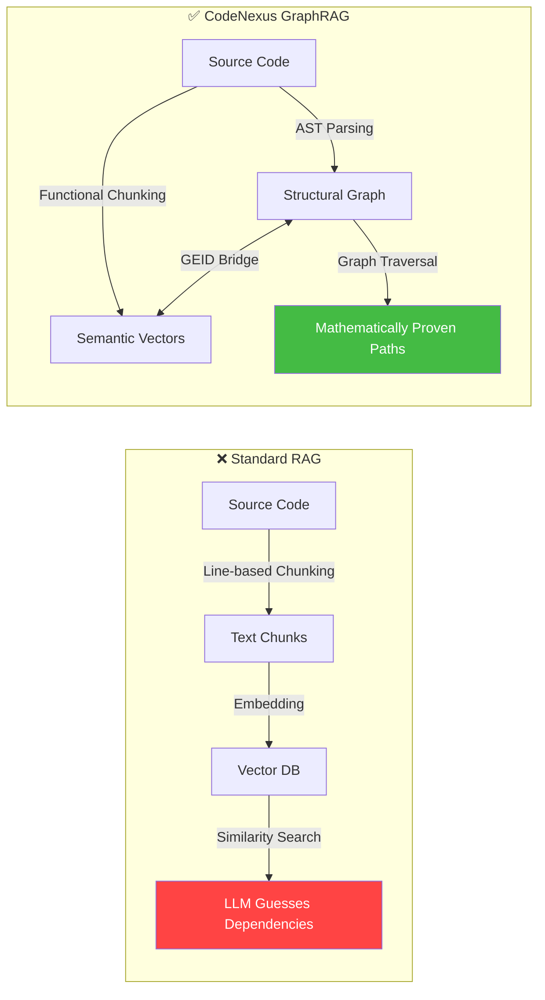
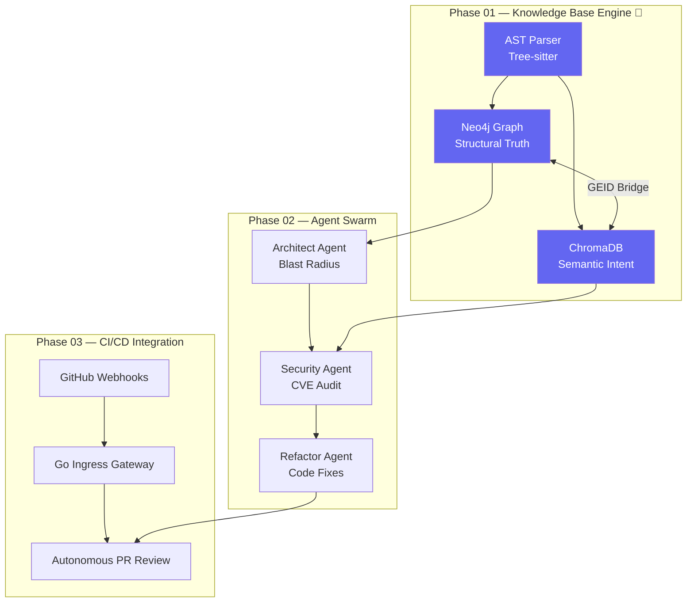
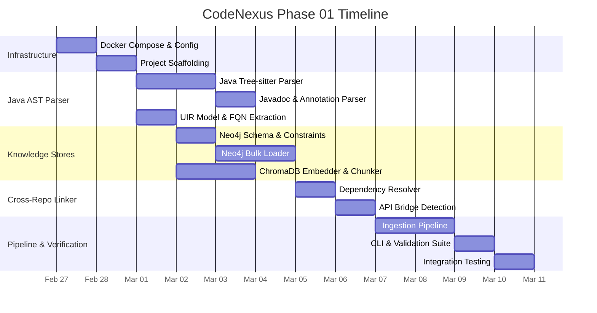

# CodeNexus — Autonomous Multi-Agent CI/CD Graph Pipeline
## Project Proposal (Phase 01: Knowledge Base Engine)

> **Document Version**: 1.0  
> **Date**: February 27, 2026  
> **Phase**: 01 — Deterministic GraphRAG & Java Codebase Indexing

---

## 1. Executive Summary

In massive enterprise ecosystems spanning 100+ repositories, **no single developer understands the entire system**. Standard AI coding tools rely on chat interfaces and probabilistic text chunking — destroying code structure and hallucinating dependencies.

**CodeNexus** is a **headless, autonomous multi-agent system** that lives transparently inside the CI/CD pipeline. It is built on a massive, **Deterministic Knowledge Base (GraphRAG)** that compiles raw source code into a Neo4j Knowledge Graph and ChromaDB Vector Store — creating a "Digital Twin" of the entire codebase.

**Phase 01** focuses exclusively on building this foundational Knowledge Base Engine — the "World Model" that enables future autonomous agents to navigate code with **mathematical certainty**.

---

## 2. Problem Statement

### The Context Blindness Crisis

| Problem | Impact |
|---------|--------|
| **Fragmented Knowledge** | No developer holds a complete mental model of 100+ repos |
| **Probabilistic RAG Failures** | Text-chunking destroys inheritance hierarchies and call graphs |
| **Dependency Hallucination** | Standard LLMs guess how code connects instead of tracing actual paths |
| **Cross-Repo Blindness** | Changes in Repo A silently break Repo C through transitive dependencies |
| **Onboarding Bottleneck** | New engineers take months to understand the architectural topology |

### Why Existing Tools Fail

---

## 3. Project Vision

### The Full CodeNexus Pipeline (All Phases)

> [!IMPORTANT]
> Phase 01 is the **foundation** — without a reliable Knowledge Base, the autonomous agents in later phases would hallucinate and produce unreliable results.

---

## 4. Phase 01 Scope & Objectives

### In-Scope

| # | Objective | Deliverable |
|---|-----------|-------------|
| 1 | **Java AST Parsing** | Tree-sitter parser for Java producing UIR (classes, methods, interfaces) |
| 2 | **Javadoc & Documentation Parsing** | Extract and index Javadoc comments, annotations, and inline documentation |
| 3 | **Multi-Repo Dependency Graph** | Neo4j graph: inheritance, call graphs, Maven module deps |
| 4 | **Semantic Intent Search** | ChromaDB: functional chunking + Javadoc intent indexing |
| 5 | **Bi-Directional Linkage** | GEID bridge connecting graph nodes ↔ vector embeddings |
| 6 | **Cross-Repo Linker** | `pom.xml` Maven resolver + REST API endpoint detection |
| 7 | **Ingestion Pipeline** | 4-stage Data Factory with CLI validation |

### Explicitly Out-of-Scope (Phase 02+)

- LLM-powered autonomous agents
- GitHub webhook integration
- Automated PR commenting
- Redis short-term agent memory
- CI/CD pipeline deployment

---

## 5. Technology Stack

| Layer | Technology | Justification |
|-------|-----------|--------------|
| **AST Parsing** | Tree-sitter (Python bindings) + `tree-sitter-java` | Incremental parsing, error-resilient, full Java grammar support |
| **Graph Database** | Neo4j 5.x + APOC | Industry-standard property graph, Cypher query language, bulk loading |
| **Vector Database** | ChromaDB | Lightweight, Python-native, metadata filtering, easy deployment |
| **Embeddings** | HuggingFace `all-MiniLM-L6-v2` | Fast CPU inference, 384-dim, excellent for code+NL tasks |
| **Orchestration** | Python 3.11+ | Rich ecosystem for all three stores, type hints, async support |
| **Build File Parsing** | `lxml` (XML) | Robust Maven POM/`pom.xml` dependency parsing |
| **Javadoc Parsing** | Tree-sitter block comments + regex | Extracts `@param`, `@return`, `@throws` tags from Javadoc |
| **Infrastructure** | Docker Compose | Single-command deployment of all microservices |
| **Git Integration** | GitPython | Programmatic clone/pull for repository mirroring |

---

## 6. Key Innovations

### 6.1 Deterministic Over Probabilistic
Unlike standard RAG that guesses how code connects, CodeNexus **compiles** dependencies into graph edges. A query like "What breaks if I change `UserService.getUser()`?" returns a **mathematically proven** blast radius — not an LLM guess.

### 6.2 The GEID Bridge
Every entity in the system (class, method, function) receives a **Global Entity Identifier** — a deterministic hash of `repo_name::fully_qualified_name`. This single ID appears in both Neo4j nodes and ChromaDB metadata, enabling seamless jumps between structural and semantic queries.

### 6.3 Functional Chunking
Standard RAG chunks code by character count (500-1000 chars), destroying function boundaries. CodeNexus chunks by **LogicUnit** — each function/method is one atomic chunk. Comments and docstrings are embedded separately for natural language intent search.

### 6.4 Javadoc-Aware Semantic Search
Unlike standard code search, CodeNexus separately embeds Javadoc comments (`@param`, `@return`, `@throws`, description blocks) into a dedicated ChromaDB `code_intent` collection. This means a search for "validate JWT tokens" directly finds the `TokenValidator.validate()` method — even if the function body never mentions "JWT" directly.

---

## 7. Success Criteria

| Metric | Target |
|--------|--------|
| Java classes correctly parsed to graph nodes | ≥ 95% accuracy |
| Java interfaces/enums correctly parsed | ≥ 95% accuracy |
| Javadoc comments extracted and indexed | ≥ 90% coverage |
| Maven cross-repo dependencies resolved | ≥ 90% of declared deps |
| Semantic search returns relevant methods | Top-5 recall ≥ 80% |
| Graph query latency (3-hop traversal) | < 200ms |
| Full pipeline ingestion (10 Java repos) | < 5 minutes |
| Zero dangling calls in controlled test set | 100% referential integrity |

---

## 8. Risk Assessment

| Risk | Likelihood | Impact | Mitigation |
|------|-----------|--------|------------|
| Tree-sitter Java grammar gaps for edge-case syntax | Medium | Medium | Fallback to regex extraction for unsupported constructs |
| Neo4j memory pressure at scale (1M+ nodes) | Low | High | APOC batch loading, index tuning, pagination |
| Incomplete Javadoc extraction (missing tags) | Medium | Low | Regex fallback for malformed Javadoc blocks |
| GEID collisions | Very Low | High | SHA-256 with 16-char truncation (2^64 namespace) |
| Docker resource constraints on dev machines | Medium | Low | Configurable memory limits, lightweight ChromaDB |

---

## 9. Hackathon Judging Criteria Alignment

| Criterion | Status | How We Satisfy It |
|-----------|--------|-------------------|
| **Multi-Agent System** | ✅ Planned (Phase 02) | Architect, Security, Refactor agents on LangGraph |
| **Minimum 6 Nodes** | ✅ Designed | Go Ingress, Go State, Java Parser, 3x Python Agents |
| **3 External APIs** | ✅ Designed | GitHub, Snyk/SonarQube, LLM Inference |
| **Memory Layer** | ✅ **Built in Phase 01** | Redis (short-term), ChromaDB + Neo4j (long-term) |
| **Deployment Plan** | ✅ **Built in Phase 01** | Docker Compose MVP → Kubernetes prod |
| **No Chatbots** | ✅ Core Design | 100% headless CI/CD pipeline |

---

## 10. Timeline (Phase 01)

---

## 11. Deliverables Summary

| # | Deliverable | Format |
|---|-------------|--------|
| 1 | Running Dockerized Knowledge Base | `docker-compose.yml` |
| 2 | Java AST & Javadoc Parser | Python package (`parsers/`) |
| 3 | Neo4j Graph with GEID constraints | Cypher schema + Python loader |
| 4 | ChromaDB Semantic Collections | Python embedder + chunker |
| 5 | Cross-Repo Linker | Python package (`linker/`) |
| 6 | Ingestion Pipeline CLI | Click-based CLI (`pipeline/cli.py`) |
| 7 | Validation & Test Suite | `pytest` + CLI commands |
| 8 | Project Documentation | Proposal + Architecture + Implementation Plan |
