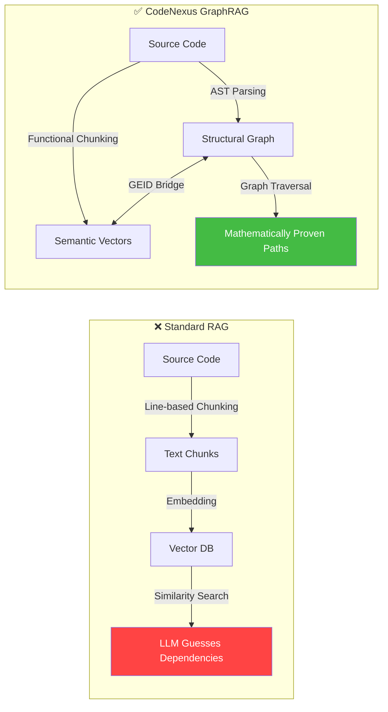
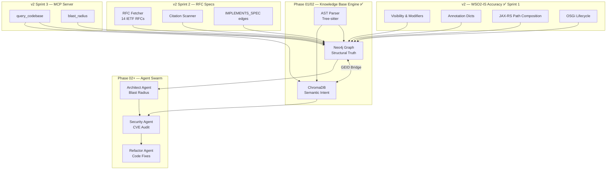

# CodeNexus — Autonomous Multi-Agent CI/CD Graph Pipeline
## Project Proposal (v2: High-Fidelity WSO2-IS Knowledge Graph)

> **Document Version**: 2.0
> **Last Updated**: March 2026
> **Phase**: v1 Complete + v2 Sprint 1 Complete + v2 Sprint 2-4 Planned

---

## 1. Executive Summary

In massive enterprise ecosystems spanning 100+ repositories, **no single developer understands
the entire system**. Standard AI coding tools rely on chat interfaces and probabilistic text
chunking — destroying code structure and hallucinating dependencies.

**CodeNexus** is a **headless, deterministic GraphRAG knowledge base** that compiles raw Java
source code into a Neo4j Knowledge Graph and ChromaDB Vector Store — creating a "Digital Twin"
of the entire codebase.

**Phase 01** built the foundational Knowledge Base Engine. **Phase 02** added end-to-end
execution flow extraction and the Microsoft GraphRAG global rollup. **v2** improves parser
accuracy for WSO2 Identity Server — the primary target codebase — adding method visibility,
structured annotation values, JAX-RS path composition, OSGi lifecycle detection, and accurate
TOML configuration parsing.

---

## 2. Problem Statement

### The Context Blindness Crisis

| Problem | Impact |
|---|---|
| **Fragmented Knowledge** | No developer holds a complete mental model of 100+ repos |
| **Probabilistic RAG Failures** | Text-chunking destroys inheritance hierarchies and call graphs |
| **Dependency Hallucination** | Standard LLMs guess how code connects instead of tracing actual paths |
| **Cross-Repo Blindness** | Changes in Repo A silently break Repo C through transitive dependencies |
| **WSO2-IS Specifics** | v1 missed ~40% of WSO2-IS architecture: method visibility invisible, annotations unparsed, JAX-RS paths broken, OSGi lifecycle unmapped |

### Why Existing Tools Fail

---

## 3. Project Vision

### The Full CodeNexus Pipeline

---

## 4. Current Status

### ✅ Completed

| Component | Status | Notes |
|---|---|---|
| Java AST Parser (Tree-sitter) | ✅ Complete | UIR: Project → Module → Component → LogicUnit |
| Neo4j Schema + Loader | ✅ Complete | 16 relationship types, 14 indexes, APOC batch |
| ChromaDB Embedder + Chunker | ✅ Complete | `code_logic` + `code_intent` collections, 384-dim |
| Maven Dependency Resolver | ✅ Complete | pom.xml → DEPENDS_ON edges |
| REST API Bridge | ✅ Complete | Spring + JAX-RS (with v2 path composition) |
| Ingestion Pipeline | ✅ Complete | Mirror → Extract → Link → Load → Post |
| Leiden Community Detection | ✅ Complete | Dynamic GDS projection, resilient to partial ingests |
| Community Summarisation | ✅ Complete | Fast model (gpt-4o-mini), ThreadPoolExecutor |
| SQL Schema Parser | ✅ Complete | DatabaseTable nodes + QUERIES_TABLE edges |
| Config Parser | ✅ Complete | tomllib, XML, properties, YAML |
| EntryPoint / DataSink Tagger | ✅ Complete | Spring + JAX-RS + Servlet patterns |
| GDS Dijkstra Flow Extractor | ✅ Complete | API→DB shortest paths |
| Flow Narrative Summariser | ✅ Complete | Fast model, flow_narratives collection |
| Global GraphRAG Rollup | ✅ Complete | L2 (fast) + L3 (strong), 11 domains |
| Three-Tier Query Router | ✅ Complete | Routes A/B/C/D, 100% deterministic for A/B/D |
| Map Step | ✅ Complete | 0-LLM question mode + LLM PR mode |
| Reduce Step | ✅ Complete | Strong model, 6 intents, intent-adaptive tokens |
| Two-Tier LLM Strategy | ✅ Complete | `llm_fast_model` + `llm_strong_model` in settings |
| **v2 Method Visibility/Modifiers** | ✅ Complete | visibility, is_static, is_abstract, is_final, is_synchronized |
| **v2 Annotation Dicts** | ✅ Complete | `list[dict]` with name + value fields |
| **v2 Parameter Annotations** | ✅ Complete | @QueryParam, @PathVariable on parameters |
| **v2 Generic Type Preservation** | ✅ Complete | `List<User>` preserved in type fields |
| **v2 Lambda Call Extraction** | ✅ Complete | Recursion into lambda/stream bodies |
| **v2 JAX-RS Path Composition** | ✅ Complete | Class @Path + method @Path merged |
| **v2 OSGi Lifecycle** | ✅ Complete | @Activate/@Deactivate/@Modified → lifecycle_role |
| **v2 tomllib Config Parser** | ✅ Complete | Accurate nested TOML tables |
| **v2 Properties Files** | ✅ Complete | *.properties → Configuration nodes |

### Planned

| Sprint | Focus | Target |
|---|---|---|
| Sprint 2 | RFC Specification Knowledge Base | IETF RFC nodes + IMPLEMENTS_SPEC edges |
| Sprint 3 | MCP Server | Cursor/Claude Desktop integration |
| Sprint 4 | Query intelligence + performance | Re-ranking, query expansion, multiprocessing |

---

## 5. Technology Stack

| Layer | Technology | Justification |
|---|---|---|
| **AST Parsing** | Tree-sitter + `tree-sitter-java` | Incremental, error-resilient, full Java grammar |
| **Graph Database** | Neo4j 5.x + APOC + GDS | Property graph, Cypher, bulk loading, Leiden, Dijkstra |
| **Vector Database** | ChromaDB | Lightweight, Python-native, 6 collections |
| **Embeddings** | `all-MiniLM-L6-v2` | CPU-only, 384-dim, no API key |
| **LLM (bulk)** | OpenAI `gpt-4o-mini` | 90% cost saving vs gpt-4o for bulk ops |
| **LLM (quality)** | OpenAI `gpt-4o` | Best quality for final user-facing answers |
| **Cache/State** | Redis | Pipeline stage tracking |
| **Build Parsing** | `lxml` | Robust Maven pom.xml parsing |
| **Config Parsing** | `tomllib` (Python 3.11+) | Accurate TOML nested tables |
| **Infrastructure** | Docker Compose | One-command deployment |
| **Git Integration** | GitPython | Programmatic clone/pull |
| **Retry** | tenacity | Resilient against transient failures |
| **Token Budget** | tiktoken | Enforce 8K context ceiling |
| **IDE Integration** | MCP (Sprint 3) | Cursor + Claude Desktop tools |

---

## 6. Key Innovations

### 6.1 Deterministic Over Probabilistic

Unlike standard RAG that guesses how code connects, CodeNexus **compiles** dependencies into
graph edges. "What breaks if I change `UserService.getUser()`?" returns a **mathematically
proven** blast radius — not an LLM guess.

### 6.2 The GEID Bridge

Every entity receives a `SHA256(repo::fqn)[:16]` GEID. This appears in both Neo4j nodes and
ChromaDB metadata — enabling seamless jumps between structural and semantic queries.

### 6.3 Functional Chunking

Standard RAG chunks code by character count, destroying function boundaries. CodeNexus
chunks by **LogicUnit** — each function/method is one atomic chunk.

### 6.4 High-Fidelity Java Model (v2)

v1 stored methods as names + FQNs. v2 stores the full Java semantic model:
- **Visibility** + **modifiers**: enables security analysis (`public static` methods, `synchronized` critical sections)
- **Annotation dicts**: enables config extraction (`@Value("${key}")`), JAX-RS parameter mapping (`@QueryParam("client_id")`), OSGi wiring (`@Reference(cardinality=MANDATORY)`)
- **OSGi lifecycle**: maps WSO2 component startup/shutdown/reconfiguration
- **Generic types**: `List<AccessToken>` vs `List<String>` are now distinct

### 6.5 Two-Tier Cost Strategy

90% of LLM operations use `gpt-4o-mini` (community summarisation, map scoring, L2 rollup).
Only the final user-facing answer uses `gpt-4o` (reduce step, L3 global rollup).
A full ingest of 100 repos costs ~$0.50 vs ~$5+ if everything used gpt-4o.

### 6.6 Dynamic GDS Projection

The Leiden community detection dynamically detects which relationship types exist in the
database and projects only those. This prevents pipeline crashes on partial ingests where
some edge types haven't been populated yet.

---

## 7. Cost Estimate

### Per full ingest of 100 repos

| Operation | Model | Est. Calls | Est. Cost |
|---|---|---|---|
| Community summarisation (~2000 communities) | gpt-4o-mini (fast) | 2000 | ~$0.40 |
| Map step LLM scoring (PR mode only) | gpt-4o-mini (fast) | ~200/PR | ~$0.02/PR |
| L2 domain rollup (~10 domains) | gpt-4o-mini (fast) | 10 | ~$0.01 |
| L3 global rollup (1 call) | gpt-4o (strong) | 1 | ~$0.05 |
| Query answers (reduce step) | gpt-4o (strong) | per query | ~$0.01/query |
| RFC fetching (Sprint 2) | network only | 14 RFCs | free after cache |
| Re-ingest (unchanged files) | — | 0 (cached, Sprint 4) | **$0** |
| Cross-encoder re-ranking (Sprint 4) | local CPU | — | **$0** |

**Estimated total**: ~$0.50 per 100-repo ingest (vs ~$5+ without two-tier strategy).

---

## 8. Success Criteria

| Metric | Target | Status |
|---|---|---|
| Java classes correctly parsed | ≥ 95% | ✅ Achieved |
| Method visibility extracted | 100% for tree-sitter-parsed methods | ✅ v2 Sprint 1 |
| Annotation structured format | All annotations as list[dict] | ✅ v2 Sprint 1 |
| JAX-RS effective paths | Class + method path merged | ✅ v2 Sprint 1 |
| OSGi lifecycle detected | @Activate/@Deactivate/@Modified | ✅ v2 Sprint 1 |
| Config key accuracy | Nested TOML tables correct | ✅ v2 Sprint 1 |
| Zero-LLM question mode | Map step: 0 LLM calls | ✅ Achieved |
| Graph query latency (3-hop) | < 200ms | ✅ Achieved |
| RFC compliance queries (Sprint 2) | Answer cites actual RFC text | Planned |
| MCP tool response (Sprint 3) | < 3 seconds for blast_radius | Planned |
| Re-ingest cost (Sprint 4) | ~$0 for unchanged communities | Planned |

---

## 9. Risk Assessment

| Risk | Likelihood | Impact | Mitigation |
|---|---|---|---|
| Tree-sitter Java grammar gaps | Medium | Medium | Fallback to regex for unsupported constructs |
| Neo4j memory at scale (1M+ nodes) | Low | High | APOC batch loading, index tuning |
| OpenAI rate limits | Medium | Low | `SUMMARIZER_MAX_WORKERS` cap, fast model reduces volume |
| GEID collisions | Very Low | High | SHA-256 with 16-char truncation (2^64 namespace) |
| Docker resource constraints | Medium | Low | Configurable memory limits |
| tomllib Python version requirement | Low | Low | Regex fallback already implemented |

---

## 10. Deliverables Summary

| # | Deliverable | Status |
|---|---|---|
| 1 | Running Dockerized Knowledge Base | ✅ `docker-compose.yml` |
| 2 | High-fidelity Java AST Parser | ✅ `parsers/java_parser.py` (v2) |
| 3 | Neo4j Graph (16 edge types, visibility, lifecycle) | ✅ `graph/` |
| 4 | ChromaDB Semantic Collections (6) | ✅ `vectorstore/` |
| 5 | Cross-Repo Linker (Maven + REST + JAX-RS) | ✅ `linker/` |
| 6 | Configuration Parser (TOML + XML + Properties + YAML) | ✅ `parsers/config_parser.py` |
| 7 | Two-Tier LLM Strategy | ✅ `config/settings.py` |
| 8 | GraphRAG Query Pipeline (4 routes, 6 intents) | ✅ `reasoning/` |
| 9 | Ingestion Pipeline CLI | ✅ `pipeline/cli.py` |
| 10 | RFC Specification Knowledge Base | ⏳ Sprint 2 |
| 11 | MCP Server (Cursor/Claude Desktop) | ⏳ Sprint 3 |
| 12 | Query Expansion + Re-Ranking | ⏳ Sprint 4 |
| 13 | Comprehensive Documentation | ✅ `docs/` (v2) |
